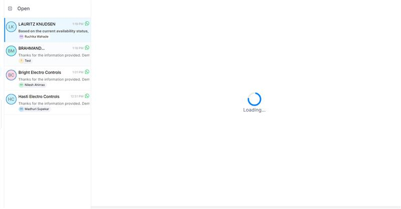

# Ticket Report

## Ticket ID
98595000042999230

## Subject
Assignment pop-up not appearing in conversation tab and sometimes bot not assigning conversations to agents

## Description
assignment pop up is not showing in the conversation tab side

bot is not assigning to the agent. session log id: 69e1c753bda698f3aadf844a
Nowadays, Gallabox is so slow, not refreshing properly, taking time to load, and pls refer above screenshot

Above screenshots showing the discrepancy in google sheet. This is one of the cases it happens frequently, kindly let us know once this fixed. and if any information needed.    

Regards

Ruchika

## Full Conversation

**From:** Ruchika Wahade  
**Time:** 2026-04-17T06:51:25.000Z

assignment pop up is not showing in the conversation tab side

bot is not assigning to the agent. session log id: 69e1c753bda698f3aadf844a
Nowadays, Gallabox is so slow, not refreshing properly, taking time to load, and pls refer above screenshot

Above screenshots showing the discrepancy in google sheet. This is one of the cases it happens frequently, kindly let us know once this fixed. and if any information needed.    

Regards

Ruchika

---

**From:** Kishorekumar K  
**Time:** 2026-04-17T09:40:24.893Z

Hi Team,
The issue is occurring because the conversation is being resolved within the bot before assigning it to an agent. Once a conversation is marked as resolved, it cannot be opened unless the user sends a new message to reopen it.
To resolve this, please remove the “Resolve Conversation” card and directly connect the flow to the assignment card. This is why the bot was not assigning the conversation to the agent.
The other reported issues have been fixed from our end. If you continue to face the same issue, kindly share screenshots and raise a new ticket so that we can assist you further.
Thank you.

Best Regards,
Kishore,
Technical Solutions Specialist.

kishorekumar.k@gallabox.com || https://gallabox.com || Mobile: +91-8069336429

Gallabox India Private Limited 
IndiQube - Brigade Vantage, Old Mahabalipuram Road, 
Perungudi, Chennai, Tamilnadu - 600096

    

---- on Fri, 17 Apr 2026 12:21:25 +0530  Ruchika Wahade<ruchika.wahade@lk-ea.com>  wrote ---- 

assignment pop up is not showing in the conversation tab side

bot is not assigning to the agent. session log id: 69e1c753bda698f3aadf844a
Nowadays, Gallabox is so slow, not refreshing properly, taking time to load, and pls refer above screenshot

Above screenshots showing the discrepancy in google sheet. This is one of the cases it happens frequently, kindly let us know once this fixed. and if any information needed.    

Regards

Ruchika

---

**From:** Ruchika Wahade  
**Time:** 2026-04-17T11:55:28.000Z

Hii , Can u see this that I have marked in screenshot, If this query is assigned to deep shah, then it should reflect there right. but still, it is showing test after Page refreshing also.

Regards,

Ruchika

From: Gallabox Support <support@gallabox.com>

Sent: 17 April 2026 15:10

To: RUCHIKA WAHADE <ruchika.wahade@lk-ea.com>

Cc: support@gallabox.com <support@gallabox.com>

Subject: Re:[## 59605 ##] Assignment pop-up not appearing in conversation tab and sometimes bot not assigning conversations to agents

 

[External email: Use caution with links and attachments]

 

Hi Team,

The issue is occurring because the conversation is being resolved within the bot before assigning it to an agent. Once
 a conversation is marked as resolved, it cannot be opened unless the user sends a new message to reopen it.

To resolve this, please remove the “Resolve Conversation” card and directly connect the flow to the assignment card. This
 is why the bot was not assigning the conversation to the agent.

The other reported issues have been fixed from our end. If you continue to face the same issue, kindly share screenshots
 and raise a new ticket so that we can assist you further.

Thank you.

Best Regards,

Kishore,

Technical Solutions Specialist.

kishorekumar.k@gallabox.com ||
https://gallabox.com ||
 Mobile: +91-8069336429

Gallabox India Private Limited 

IndiQube - Brigade Vantage, Old Mahabalipuram Road, 

Perungudi, Chennai, Tamilnadu - 600096

    

---- on Fri, 17 Apr 2026 12:21:25 +0530 Ruchika Wahade<ruchika.wahade@lk-ea.com>
wrote ----

assignment pop up is not showing in the conversation tab side

bot is not assigning to the agent. session log id: 69e1c753bda698f3aadf844a

Nowadays, Gallabox is so slow, not refreshing properly, taking time to load, and pls refer above screenshot

Above screenshots showing the discrepancy in google sheet. This is one of the cases it happens frequently, kindly let us know once this fixed. and if any information needed.    

Regards

Ruchika

General

---

**From:** Ruchika Wahade  
**Time:** 2026-04-20T09:57:28.000Z

Kindly Update on the status of ticket?

Regards,

Ruchika

General

From: RUCHIKA WAHADE <ruchika.wahade@lk-ea.com>

Sent: 17 April 2026 17:25

To: support@gallabox.com <support@gallabox.com>

Cc: Dhaneswari Shende <dhaneshwari.shende@nonlklogistics.com>; Vivekkumar M <vivekkumar.m@gallabox.com>

Subject: Re: Re:[## 59605 ##] Assignment pop-up not appearing in conversation tab and sometimes bot not assigning conversations to agents
 

Hii , Can u see this that I have marked in screenshot, If this query is assigned to deep shah, then it should reflect there right. but still, it is showing test after Page refreshing also.

Regards,

Ruchika

From: Gallabox Support <support@gallabox.com>

Sent: 17 April 2026 15:10

To: RUCHIKA WAHADE <ruchika.wahade@lk-ea.com>

Cc: support@gallabox.com <support@gallabox.com>

Subject: Re:[## 59605 ##] Assignment pop-up not appearing in conversation tab and sometimes bot not assigning conversations to agents

 

[External email: Use caution with links and attachments]

 

Hi Team,

The issue is occurring because the conversation is being resolved within the bot before assigning it to an agent. Once a conversation
 is marked as resolved, it cannot be opened unless the user sends a new message to reopen it.

To resolve this, please remove the “Resolve Conversation” card and directly connect the flow to the assignment card. This is why
 the bot was not assigning the conversation to the agent.

The other reported issues have been fixed from our end. If you continue to face the same issue, kindly share screenshots and raise
 a new ticket so that we can assist you further.

Thank you.

Best Regards,

Kishore,

Technical Solutions Specialist.

kishorekumar.k@gallabox.com ||
https://gallabox.com ||
 Mobile: +91-8069336429

Gallabox India Private Limited 

IndiQube - Brigade Vantage, Old Mahabalipuram Road, 

Perungudi, Chennai, Tamilnadu - 600096

    

---- on Fri, 17 Apr 2026 12:21:25 +0530 Ruchika Wahade<ruchika.wahade@lk-ea.com>
wrote ----

assignment pop up is not showing in the conversation tab side

bot is not assigning to the agent. session log id: 69e1c753bda698f3aadf844a

Nowadays, Gallabox is so slow, not refreshing properly, taking time to load, and pls refer above screenshot

Above screenshots showing the discrepancy in google sheet. This is one of the cases it happens frequently, kindly let us know once this fixed. and if any information needed.    

Regards

Ruchika

General

## Images
No attachment images
