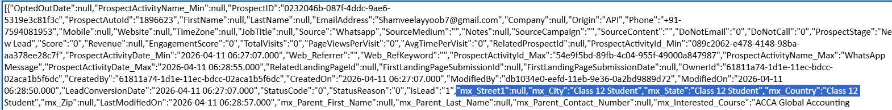
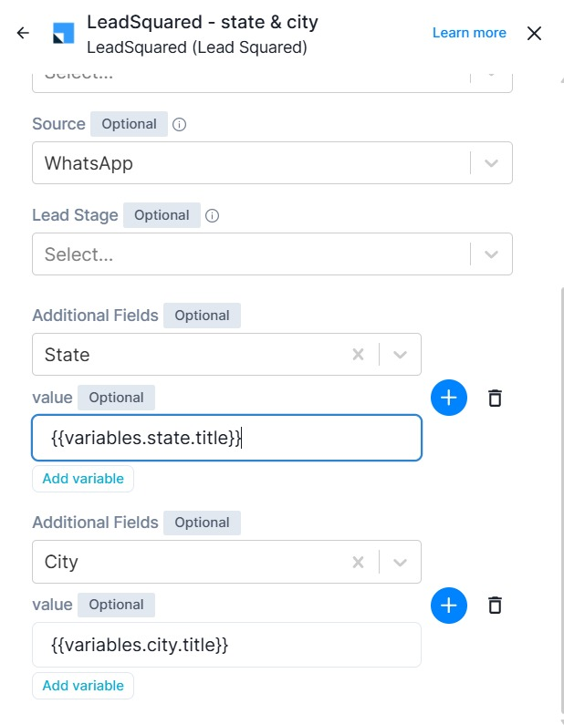

# Ticket Report

## Ticket ID
98595000042822047

## Subject
BOT

## Description
Hi this our leadsquare API Logs where we can see that the state, country and the city is getting updated wrongly with the highest education qualification option selections

This is what gallabox setup and gave us and we didn't make any changes.

## Full Conversation

**From:** IIC Lakshya  
**Time:** 2026-04-13T06:00:50.000Z

Hi this our leadsquare API Logs where we can see that the state, country and the city is getting updated wrongly with the highest education qualification option selections

This is what gallabox setup and gave us and we didn't make any changes.

---

**From:** Teena D  
**Time:** 2026-04-13T09:28:44.742Z

Hi Team,
Kindly share the bot name and the flow name in which the Leadsquared connector card is facing the issue of updating incorrect values for state and city. 

Also, please share any mobile number of the customer for whom the details were updated incorrectly. This will help us check the configuration and investigate the issue further.

Thanks & Regards,
Teena D
Technical Solutions Specialist.
teena.d@gallabox.com || https://gallabox.com || Mobile: +91-8069336419

Gallabox India Private Limited IndiQube - Brigade Vantage, Old Mahabalipuram Road, 
Perungudi, Chennai, Tamilnadu - 600096

    

---- on Mon, 13 Apr 2026 11:30:50 +0530  IIC Lakshya<dm@iiclakshya.com>  wrote ---- 

Hi this our leadsquare API Logs where we can see that the state, country and the city is getting updated wrongly with the highest education qualification option selections

This is what gallabox setup and gave us and we didn't make any changes.

---

**From:** IIC Lakshya  
**Time:** 2026-04-13T10:47:36.000Z

Hi Teena,

Please find the requested details below to help investigate the issue.

  - Bot Name: lakshya_kerala_online/offline
  - Flow Name: Penta7 IIC Lakshya
  - Sample Mobile Numbers: 8891451916, 9047386166, 8304045327

In these examples, the state and city information has been wrongly mapped. Please let us know if you need any further information to resolve this configuration issue.

Best regards,

Digital Marketing

On Mon, Apr 13, 2026 at 2:58 PM Gallabox Support <support@gallabox.com> wrote:

Hi Team,
Kindly share the bot name and the flow name in which the Leadsquared connector card is facing the issue of updating incorrect values for state and city. 

Also, please share any mobile number of the customer for whom the details were updated incorrectly. This will help us check the configuration and investigate the issue further.

Thanks & Regards,
Teena D
Technical Solutions Specialist.
teena.d@gallabox.com || https://gallabox.com || Mobile: +91-8069336419

Gallabox India Private Limited IndiQube - Brigade Vantage, Old Mahabalipuram Road, 
Perungudi, Chennai, Tamilnadu - 600096

    

---- on Mon, 13 Apr 2026 11:30:50 +0530  IIC Lakshya<dm@iiclakshya.com>  wrote ---- 

Hi this our leadsquare API Logs where we can see that the state, country and the city is getting updated wrongly with the highest education qualification option selections

This is what gallabox setup and gave us and we didn't make any changes.

-- 

Adv Easwara Iyer Rd, Behind City Hospital, Pullepady, Kochi, Kerala 682035

  
  DIGITAL MARKETING 

 Admission support: +919061277777
dm@lakshyaca.com
www.lakshyaca.com

---

**From:** Teena D  
**Time:** 2026-04-13T12:27:02.681Z

Hi Team, 

As checked with the backend team, the following details were found in the logs of the Leadsquared connector, and the same values were updated there as well: 

8891451916 – Customer selected Kerala and Kannur 

9047386166 – Customer selected Tamil Nadu and Coimbatore 

8304045327 – Customer selected Kerala and Kozhikode 

Sharing the Leadsquared logs for your reference.

Leadsquared log

Kindly share a screenshot showing where the value has been updated incorrectly compared to what the customer selected. This will help us investigate the issue further.

Thanks & Regards,

Teena D
Technical Solutions Specialist.
teena.d@gallabox.com || https://gallabox.com || Mobile: +91-8069336419

Gallabox India Private Limited IndiQube - Brigade Vantage, Old Mahabalipuram Road, 
Perungudi, Chennai, Tamilnadu - 600096

    

---- on Mon, 13 Apr 2026 16:17:36 +0530  "Digital Marketing"<dm@iiclakshya.com>  wrote ---- 

Hi Teena,

Please find the requested details below to help investigate the issue.

  - Bot Name: lakshya_kerala_online/offline
  - Flow Name: Penta7 IIC Lakshya
  - Sample Mobile Numbers: 8891451916, 9047386166, 8304045327

In these examples, the state and city information has been wrongly mapped. Please let us know if you need any further information to resolve this configuration issue.

Best regards,

Digital Marketing

On Mon, Apr 13, 2026 at 2:58 PM Gallabox Support <support@gallabox.com> wrote:

Hi Team,
Kindly share the bot name and the flow name in which the Leadsquared connector card is facing the issue of updating incorrect values for state and city. 

Also, please share any mobile number of the customer for whom the details were updated incorrectly. This will help us check the configuration and investigate the issue further.

Thanks & Regards,
Teena D
Technical Solutions Specialist.
teena.d@gallabox.com || https://gallabox.com || Mobile: +91-8069336419

Gallabox India Private Limited IndiQube - Brigade Vantage, Old Mahabalipuram Road, 
Perungudi, Chennai, Tamilnadu - 600096

    

---- on Mon, 13 Apr 2026 11:30:50 +0530  IIC Lakshya<dm@iiclakshya.com>  wrote ---- 

Hi this our leadsquare API Logs where we can see that the state, country and the city is getting updated wrongly with the highest education qualification option selections

This is what gallabox setup and gave us and we didn't make any changes.

-- 

Adv Easwara Iyer Rd, Behind City Hospital, Pullepady, Kochi, Kerala 682035

  
  DIGITAL MARKETING 

 Admission support: +919061277777
dm@lakshyaca.com
www.lakshyaca.com

---

**From:** IIC Lakshya  
**Time:** 2026-04-13T12:45:54.000Z

Hi Teena, 

here are the exact leads from our CRM.

On Mon, Apr 13, 2026 at 5:57 PM Gallabox Support <support@gallabox.com> wrote:

Hi Team, 

As checked with the backend team, the following details were found in the logs of the Leadsquared connector, and the same values were updated there as well: 

8891451916 – Customer selected Kerala and Kannur 

9047386166 – Customer selected Tamil Nadu and Coimbatore 

8304045327 – Customer selected Kerala and Kozhikode 

Sharing the Leadsquared logs for your reference.

Leadsquared log

Kindly share a screenshot showing where the value has been updated incorrectly compared to what the customer selected. This will help us investigate the issue further.

Thanks & Regards,

Teena D
Technical Solutions Specialist.
teena.d@gallabox.com || https://gallabox.com || Mobile: +91-8069336419

Gallabox India Private Limited IndiQube - Brigade Vantage, Old Mahabalipuram Road, 
Perungudi, Chennai, Tamilnadu - 600096

    

---- on Mon, 13 Apr 2026 16:17:36 +0530  "Digital Marketing"<dm@iiclakshya.com>  wrote ---- 

Hi Teena,

Please find the requested details below to help investigate the issue.

  - Bot Name: lakshya_kerala_online/offline
  - Flow Name: Penta7 IIC Lakshya
  - Sample Mobile Numbers: 8891451916, 9047386166, 8304045327

In these examples, the state and city information has been wrongly mapped. Please let us know if you need any further information to resolve this configuration issue.

Best regards,

Digital Marketing

On Mon, Apr 13, 2026 at 2:58 PM Gallabox Support <support@gallabox.com> wrote:

Hi Team,
Kindly share the bot name and the flow name in which the Leadsquared connector card is facing the issue of updating incorrect values for state and city. 

Also, please share any mobile number of the customer for whom the details were updated incorrectly. This will help us check the configuration and investigate the issue further.

Thanks & Regards,
Teena D
Technical Solutions Specialist.
teena.d@gallabox.com || https://gallabox.com || Mobile: +91-8069336419

Gallabox India Private Limited IndiQube - Brigade Vantage, Old Mahabalipuram Road, 
Perungudi, Chennai, Tamilnadu - 600096

    

---- on Mon, 13 Apr 2026 11:30:50 +0530  IIC Lakshya<dm@iiclakshya.com>  wrote ---- 

Hi this our leadsquare API Logs where we can see that the state, country and the city is getting updated wrongly with the highest education qualification option selections

This is what gallabox setup and gave us and we didn't make any changes.

-- 

Adv Easwara Iyer Rd, Behind City Hospital, Pullepady, Kochi, Kerala 682035

  
  DIGITAL MARKETING 

 Admission support: +919061277777
dm@lakshyaca.com
www.lakshyaca.com

   
  

-- 

Adv Easwara Iyer Rd, Behind City Hospital, Pullepady, Kochi, Kerala 682035

  
  DIGITAL MARKETING 

 Admission support: +919061277777
dm@lakshyaca.com
www.lakshyaca.com

---

**From:** Teena D  
**Time:** 2026-04-13T12:59:59.506Z

Hi Team,
We have tested the flow in the same way as the customer using the number 9150259868. Kindly check and confirm whether the values were updated correctly from your end.
If the values are still getting updated incorrectly, please share a screenshot or let us know how it appears on your side so that we can investigate further.

Thanks & Regards,
Teena D
Technical Solutions Specialist.
teena.d@gallabox.com || https://gallabox.com || Mobile: +91-8069336419

Gallabox India Private Limited IndiQube - Brigade Vantage, Old Mahabalipuram Road, 
Perungudi, Chennai, Tamilnadu - 600096

    

---- on Mon, 13 Apr 2026 18:15:54 +0530  "Digital Marketing"<dm@iiclakshya.com>  wrote ---- 

Hi Teena, 

here are the exact leads from our CRM.

On Mon, Apr 13, 2026 at 5:57 PM Gallabox Support <support@gallabox.com> wrote:

Hi Team, 

As checked with the backend team, the following details were found in the logs of the Leadsquared connector, and the same values were updated there as well: 

8891451916 – Customer selected Kerala and Kannur 

9047386166 – Customer selected Tamil Nadu and Coimbatore 

8304045327 – Customer selected Kerala and Kozhikode 

Sharing the Leadsquared logs for your reference.

Leadsquared log

Kindly share a screenshot showing where the value has been updated incorrectly compared to what the customer selected. This will help us investigate the issue further.

Thanks & Regards,

Teena D
Technical Solutions Specialist.
teena.d@gallabox.com || https://gallabox.com || Mobile: +91-8069336419

Gallabox India Private Limited IndiQube - Brigade Vantage, Old Mahabalipuram Road, 
Perungudi, Chennai, Tamilnadu - 600096

    

---- on Mon, 13 Apr 2026 16:17:36 +0530  "Digital Marketing"<dm@iiclakshya.com>  wrote ---- 

Hi Teena,

Please find the requested details below to help investigate the issue.

  - Bot Name: lakshya_kerala_online/offline
  - Flow Name: Penta7 IIC Lakshya
  - Sample Mobile Numbers: 8891451916, 9047386166, 8304045327

In these examples, the state and city information has been wrongly mapped. Please let us know if you need any further information to resolve this configuration issue.

Best regards,

Digital Marketing

On Mon, Apr 13, 2026 at 2:58 PM Gallabox Support <support@gallabox.com> wrote:

Hi Team,
Kindly share the bot name and the flow name in which the Leadsquared connector card is facing the issue of updating incorrect values for state and city. 

Also, please share any mobile number of the customer for whom the details were updated incorrectly. This will help us check the configuration and investigate the issue further.

Thanks & Regards,
Teena D
Technical Solutions Specialist.
teena.d@gallabox.com || https://gallabox.com || Mobile: +91-8069336419

Gallabox India Private Limited IndiQube - Brigade Vantage, Old Mahabalipuram Road, 
Perungudi, Chennai, Tamilnadu - 600096

    

---- on Mon, 13 Apr 2026 11:30:50 +0530  IIC Lakshya<dm@iiclakshya.com>  wrote ---- 

Hi this our leadsquare API Logs where we can see that the state, country and the city is getting updated wrongly with the highest education qualification option selections

This is what gallabox setup and gave us and we didn't make any changes.

-- 

Adv Easwara Iyer Rd, Behind City Hospital, Pullepady, Kochi, Kerala 682035

  
  DIGITAL MARKETING 

 Admission support: +919061277777
dm@lakshyaca.com
www.lakshyaca.com

   
  

-- 

Adv Easwara Iyer Rd, Behind City Hospital, Pullepady, Kochi, Kerala 682035

  
  DIGITAL MARKETING 

 Admission support: +919061277777
dm@lakshyaca.com
www.lakshyaca.com

---

**From:** IIC Lakshya  
**Time:** 2026-04-13T13:32:39.000Z

Hi Team,

The data is getting captured correctly; however, we are still facing an issue where fields are being incorrectly mapped.

Could you please check this lead: 9606856323? The lead was created at 5:52, and the mapping appears to be incorrect.

Additionally, we are observing an issue where the interested course field is getting mapped into the state or city fields, as shown in the screenshot below.

On Mon, Apr 13, 2026 at 6:30 PM Gallabox Support <support@gallabox.com> wrote:

Hi Team,
We have tested the flow in the same way as the customer using the number 9150259868. Kindly check and confirm whether the values were updated correctly from your end.
If the values are still getting updated incorrectly, please share a screenshot or let us know how it appears on your side so that we can investigate further.

Thanks & Regards,
Teena D
Technical Solutions Specialist.
teena.d@gallabox.com || https://gallabox.com || Mobile: +91-8069336419

Gallabox India Private Limited IndiQube - Brigade Vantage, Old Mahabalipuram Road, 
Perungudi, Chennai, Tamilnadu - 600096

    

---- on Mon, 13 Apr 2026 18:15:54 +0530  "Digital Marketing"<dm@iiclakshya.com>  wrote ---- 

Hi Teena, 

here are the exact leads from our CRM.

On Mon, Apr 13, 2026 at 5:57 PM Gallabox Support <support@gallabox.com> wrote:

Hi Team, 

As checked with the backend team, the following details were found in the logs of the Leadsquared connector, and the same values were updated there as well: 

8891451916 – Customer selected Kerala and Kannur 

9047386166 – Customer selected Tamil Nadu and Coimbatore 

8304045327 – Customer selected Kerala and Kozhikode 

Sharing the Leadsquared logs for your reference.

Leadsquared log

Kindly share a screenshot showing where the value has been updated incorrectly compared to what the customer selected. This will help us investigate the issue further.

Thanks & Regards,

Teena D
Technical Solutions Specialist.
teena.d@gallabox.com || https://gallabox.com || Mobile: +91-8069336419

Gallabox India Private Limited IndiQube - Brigade Vantage, Old Mahabalipuram Road, 
Perungudi, Chennai, Tamilnadu - 600096

    

---- on Mon, 13 Apr 2026 16:17:36 +0530  "Digital Marketing"<dm@iiclakshya.com>  wrote ---- 

Hi Teena,

Please find the requested details below to help investigate the issue.

  - Bot Name: lakshya_kerala_online/offline
  - Flow Name: Penta7 IIC Lakshya
  - Sample Mobile Numbers: 8891451916, 9047386166, 8304045327

In these examples, the state and city information has been wrongly mapped. Please let us know if you need any further information to resolve this configuration issue.

Best regards,

Digital Marketing

On Mon, Apr 13, 2026 at 2:58 PM Gallabox Support <support@gallabox.com> wrote:

Hi Team,
Kindly share the bot name and the flow name in which the Leadsquared connector card is facing the issue of updating incorrect values for state and city. 

Also, please share any mobile number of the customer for whom the details were updated incorrectly. This will help us check the configuration and investigate the issue further.

Thanks & Regards,
Teena D
Technical Solutions Specialist.
teena.d@gallabox.com || https://gallabox.com || Mobile: +91-8069336419

Gallabox India Private Limited IndiQube - Brigade Vantage, Old Mahabalipuram Road, 
Perungudi, Chennai, Tamilnadu - 600096

    

---- on Mon, 13 Apr 2026 11:30:50 +0530  IIC Lakshya<dm@iiclakshya.com>  wrote ---- 

Hi this our leadsquare API Logs where we can see that the state, country and the city is getting updated wrongly with the highest education qualification option selections

This is what gallabox setup and gave us and we didn't make any changes.

-- 

Adv Easwara Iyer Rd, Behind City Hospital, Pullepady, Kochi, Kerala 682035

  
  DIGITAL MARKETING 

 Admission support: +919061277777
dm@lakshyaca.com
www.lakshyaca.com

   
  

-- 

Adv Easwara Iyer Rd, Behind City Hospital, Pullepady, Kochi, Kerala 682035

  
  DIGITAL MARKETING 

 Admission support: +919061277777
dm@lakshyaca.com
www.lakshyaca.com

   
  

-- 

Adv Easwara Iyer Rd, Behind City Hospital, Pullepady, Kochi, Kerala 682035

  
  DIGITAL MARKETING 

 Admission support: +919061277777
dm@lakshyaca.com
www.lakshyaca.com

---

**From:** Teena D  
**Time:** 2026-04-13T13:45:15.360Z

Hi Team,

Kindly allow us some time; we will get back to you.

Thanks & Regards,
Teena D
Technical Solutions Specialist.
teena.d@gallabox.com || https://gallabox.com || Mobile: +91-8069336419

Gallabox India Private Limited IndiQube - Brigade Vantage, Old Mahabalipuram Road, 
Perungudi, Chennai, Tamilnadu - 600096

    

 ---- On Mon, 13 Apr 2026 19:02:39 +0530 "Digital Marketing"<dm@iiclakshya.com> wrote ----

 

Hi Team,

The data is getting captured correctly; however, we are still facing an issue where fields are being incorrectly mapped.

Could you please check this lead: 9606856323? The lead was created at 5:52, and the mapping appears to be incorrect.

Additionally, we are observing an issue where the interested course field is getting mapped into the state or city fields, as shown in the screenshot below.

On Mon, Apr 13, 2026 at 6:30 PM Gallabox Support <support@gallabox.com> wrote:

Hi Team,
We have tested the flow in the same way as the customer using the number 9150259868. Kindly check and confirm whether the values were updated correctly from your end.
If the values are still getting updated incorrectly, please share a screenshot or let us know how it appears on your side so that we can investigate further.

Thanks & Regards,
Teena D
Technical Solutions Specialist.
teena.d@gallabox.com || https://gallabox.com || Mobile: +91-8069336419

Gallabox India Private Limited IndiQube - Brigade Vantage, Old Mahabalipuram Road, 
Perungudi, Chennai, Tamilnadu - 600096

    

---- on Mon, 13 Apr 2026 18:15:54 +0530  "Digital Marketing"<dm@iiclakshya.com>  wrote ---- 

Hi Teena, 

here are the exact leads from our CRM.

On Mon, Apr 13, 2026 at 5:57 PM Gallabox Support <support@gallabox.com> wrote:

Hi Team, 

As checked with the backend team, the following details were found in the logs of the Leadsquared connector, and the same values were updated there as well: 

8891451916 – Customer selected Kerala and Kannur 

9047386166 – Customer selected Tamil Nadu and Coimbatore 

8304045327 – Customer selected Kerala and Kozhikode 

Sharing the Leadsquared logs for your reference.

Leadsquared log

Kindly share a screenshot showing where the value has been updated incorrectly compared to what the customer selected. This will help us investigate the issue further.

Thanks & Regards,

Teena D
Technical Solutions Specialist.
teena.d@gallabox.com || https://gallabox.com || Mobile: +91-8069336419

Gallabox India Private Limited IndiQube - Brigade Vantage, Old Mahabalipuram Road, 
Perungudi, Chennai, Tamilnadu - 600096

    

---- on Mon, 13 Apr 2026 16:17:36 +0530  "Digital Marketing"<dm@iiclakshya.com>  wrote ---- 

Hi Teena,

Please find the requested details below to help investigate the issue.

  - Bot Name: lakshya_kerala_online/offline
  - Flow Name: Penta7 IIC Lakshya
  - Sample Mobile Numbers: 8891451916, 9047386166, 8304045327

In these examples, the state and city information has been wrongly mapped. Please let us know if you need any further information to resolve this configuration issue.

Best regards,

Digital Marketing

On Mon, Apr 13, 2026 at 2:58 PM Gallabox Support <support@gallabox.com> wrote:

Hi Team,
Kindly share the bot name and the flow name in which the Leadsquared connector card is facing the issue of updating incorrect values for state and city. 

Also, please share any mobile number of the customer for whom the details were updated incorrectly. This will help us check the configuration and investigate the issue further.

Thanks & Regards,
Teena D
Technical Solutions Specialist.
teena.d@gallabox.com || https://gallabox.com || Mobile: +91-8069336419

Gallabox India Private Limited IndiQube - Brigade Vantage, Old Mahabalipuram Road, 
Perungudi, Chennai, Tamilnadu - 600096

    

---- on Mon, 13 Apr 2026 11:30:50 +0530  IIC Lakshya<dm@iiclakshya.com>  wrote ---- 

Hi this our leadsquare API Logs where we can see that the state, country and the city is getting updated wrongly with the highest education qualification option selections

This is what gallabox setup and gave us and we didn't make any changes.

-- 

Adv Easwara Iyer Rd, Behind City Hospital, Pullepady, Kochi, Kerala 682035

  
  DIGITAL MARKETING 

 Admission support: +919061277777
dm@lakshyaca.com
www.lakshyaca.com

   
  

-- 

Adv Easwara Iyer Rd, Behind City Hospital, Pullepady, Kochi, Kerala 682035

  
  DIGITAL MARKETING 

 Admission support: +919061277777
dm@lakshyaca.com
www.lakshyaca.com

   
  

-- 

Adv Easwara Iyer Rd, Behind City Hospital, Pullepady, Kochi, Kerala 682035

  
  DIGITAL MARKETING 

 Admission support: +919061277777
dm@lakshyaca.com
www.lakshyaca.com

---

**From:** IIC Lakshya  
**Time:** 2026-04-14T05:36:40.000Z

Hi team,

Any updates on this?

On Mon, Apr 13, 2026 at 7:15 PM Gallabox Support <support@gallabox.com> wrote:

Hi Team,

Kindly allow us some time; we will get back to you.

Thanks & Regards,
Teena D
Technical Solutions Specialist.
teena.d@gallabox.com || https://gallabox.com || Mobile: +91-8069336419

Gallabox India Private Limited IndiQube - Brigade Vantage, Old Mahabalipuram Road, 
Perungudi, Chennai, Tamilnadu - 600096

    

 ---- On Mon, 13 Apr 2026 19:02:39 +0530 "Digital Marketing"<dm@iiclakshya.com> wrote ----

 

Hi Team,

The data is getting captured correctly; however, we are still facing an issue where fields are being incorrectly mapped.

Could you please check this lead: 9606856323? The lead was created at 5:52, and the mapping appears to be incorrect.

Additionally, we are observing an issue where the interested course field is getting mapped into the state or city fields, as shown in the screenshot below.

On Mon, Apr 13, 2026 at 6:30 PM Gallabox Support <support@gallabox.com> wrote:

Hi Team,
We have tested the flow in the same way as the customer using the number 9150259868. Kindly check and confirm whether the values were updated correctly from your end.
If the values are still getting updated incorrectly, please share a screenshot or let us know how it appears on your side so that we can investigate further.

Thanks & Regards,
Teena D
Technical Solutions Specialist.
teena.d@gallabox.com || https://gallabox.com || Mobile: +91-8069336419

Gallabox India Private Limited IndiQube - Brigade Vantage, Old Mahabalipuram Road, 
Perungudi, Chennai, Tamilnadu - 600096

    

---- on Mon, 13 Apr 2026 18:15:54 +0530  "Digital Marketing"<dm@iiclakshya.com>  wrote ---- 

Hi Teena, 

here are the exact leads from our CRM.

On Mon, Apr 13, 2026 at 5:57 PM Gallabox Support <support@gallabox.com> wrote:

Hi Team, 

As checked with the backend team, the following details were found in the logs of the Leadsquared connector, and the same values were updated there as well: 

8891451916 – Customer selected Kerala and Kannur 

9047386166 – Customer selected Tamil Nadu and Coimbatore 

8304045327 – Customer selected Kerala and Kozhikode 

Sharing the Leadsquared logs for your reference.

Leadsquared log

Kindly share a screenshot showing where the value has been updated incorrectly compared to what the customer selected. This will help us investigate the issue further.

Thanks & Regards,

Teena D
Technical Solutions Specialist.
teena.d@gallabox.com || https://gallabox.com || Mobile: +91-8069336419

Gallabox India Private Limited IndiQube - Brigade Vantage, Old Mahabalipuram Road, 
Perungudi, Chennai, Tamilnadu - 600096

    

---- on Mon, 13 Apr 2026 16:17:36 +0530  "Digital Marketing"<dm@iiclakshya.com>  wrote ---- 

Hi Teena,

Please find the requested details below to help investigate the issue.

  - Bot Name: lakshya_kerala_online/offline
  - Flow Name: Penta7 IIC Lakshya
  - Sample Mobile Numbers: 8891451916, 9047386166, 8304045327

In these examples, the state and city information has been wrongly mapped. Please let us know if you need any further information to resolve this configuration issue.

Best regards,

Digital Marketing

On Mon, Apr 13, 2026 at 2:58 PM Gallabox Support <support@gallabox.com> wrote:

Hi Team,
Kindly share the bot name and the flow name in which the Leadsquared connector card is facing the issue of updating incorrect values for state and city. 

Also, please share any mobile number of the customer for whom the details were updated incorrectly. This will help us check the configuration and investigate the issue further.

Thanks & Regards,
Teena D
Technical Solutions Specialist.
teena.d@gallabox.com || https://gallabox.com || Mobile: +91-8069336419

Gallabox India Private Limited IndiQube - Brigade Vantage, Old Mahabalipuram Road, 
Perungudi, Chennai, Tamilnadu - 600096

    

---- on Mon, 13 Apr 2026 11:30:50 +0530  IIC Lakshya<dm@iiclakshya.com>  wrote ---- 

Hi this our leadsquare API Logs where we can see that the state, country and the city is getting updated wrongly with the highest education qualification option selections

This is what gallabox setup and gave us and we didn't make any changes.

-- 

Adv Easwara Iyer Rd, Behind City Hospital, Pullepady, Kochi, Kerala 682035

  
  DIGITAL MARKETING 

 Admission support: +919061277777
dm@lakshyaca.com
www.lakshyaca.com

   
  

-- 

Adv Easwara Iyer Rd, Behind City Hospital, Pullepady, Kochi, Kerala 682035

  
  DIGITAL MARKETING 

 Admission support: +919061277777
dm@lakshyaca.com
www.lakshyaca.com

   
  

-- 

Adv Easwara Iyer Rd, Behind City Hospital, Pullepady, Kochi, Kerala 682035

  
  DIGITAL MARKETING 

 Admission support: +919061277777
dm@lakshyaca.com
www.lakshyaca.com

---

**From:** Teena D  
**Time:** 2026-04-15T05:23:21.175Z

Hi Team,
Thank you for your follow-up.
Due to the Tamil New Year holiday yesterday, we were unable to check this. Kindly allow us some time today, and we will get back to you with an update.

Thanks & Regards,
Teena D
Technical Solutions Specialist.
teena.d@gallabox.com || https://gallabox.com || Mobile: +91-8069336419

Gallabox India Private Limited IndiQube - Brigade Vantage, Old Mahabalipuram Road, 
Perungudi, Chennai, Tamilnadu - 600096

    

---- on Tue, 14 Apr 2026 11:06:40 +0530  "Digital Marketing"<dm@iiclakshya.com>  wrote ---- 

Hi team,

Any updates on this?

On Mon, Apr 13, 2026 at 7:15 PM Gallabox Support <support@gallabox.com> wrote:

Hi Team,

Kindly allow us some time; we will get back to you.

Thanks & Regards,
Teena D
Technical Solutions Specialist.
teena.d@gallabox.com || https://gallabox.com || Mobile: +91-8069336419

Gallabox India Private Limited IndiQube - Brigade Vantage, Old Mahabalipuram Road, 
Perungudi, Chennai, Tamilnadu - 600096

    

---- On Mon, 13 Apr 2026 19:02:39 +0530 "Digital Marketing"<dm@iiclakshya.com> wrote ----

Hi Team,

The data is getting captured correctly; however, we are still facing an issue where fields are being incorrectly mapped.

Could you please check this lead: 9606856323? The lead was created at 5:52, and the mapping appears to be incorrect.

Additionally, we are observing an issue where the interested course field is getting mapped into the state or city fields, as shown in the screenshot below.

On Mon, Apr 13, 2026 at 6:30 PM Gallabox Support <support@gallabox.com> wrote:

Hi Team,
We have tested the flow in the same way as the customer using the number 9150259868. Kindly check and confirm whether the values were updated correctly from your end.
If the values are still getting updated incorrectly, please share a screenshot or let us know how it appears on your side so that we can investigate further.

Thanks & Regards,
Teena D
Technical Solutions Specialist.
teena.d@gallabox.com || https://gallabox.com || Mobile: +91-8069336419

Gallabox India Private Limited IndiQube - Brigade Vantage, Old Mahabalipuram Road, 
Perungudi, Chennai, Tamilnadu - 600096

    

---- on Mon, 13 Apr 2026 18:15:54 +0530  "Digital Marketing"<dm@iiclakshya.com>  wrote ---- 

Hi Teena, 

here are the exact leads from our CRM.

On Mon, Apr 13, 2026 at 5:57 PM Gallabox Support <support@gallabox.com> wrote:

Hi Team, 

As checked with the backend team, the following details were found in the logs of the Leadsquared connector, and the same values were updated there as well: 

8891451916 – Customer selected Kerala and Kannur 

9047386166 – Customer selected Tamil Nadu and Coimbatore 

8304045327 – Customer selected Kerala and Kozhikode 

Sharing the Leadsquared logs for your reference.

Leadsquared log

Kindly share a screenshot showing where the value has been updated incorrectly compared to what the customer selected. This will help us investigate the issue further.

Thanks & Regards,

Teena D
Technical Solutions Specialist.
teena.d@gallabox.com || https://gallabox.com || Mobile: +91-8069336419

Gallabox India Private Limited IndiQube - Brigade Vantage, Old Mahabalipuram Road, 
Perungudi, Chennai, Tamilnadu - 600096

    

---- on Mon, 13 Apr 2026 16:17:36 +0530  "Digital Marketing"<dm@iiclakshya.com>  wrote ---- 

Hi Teena,

Please find the requested details below to help investigate the issue.

  - Bot Name: lakshya_kerala_online/offline
  - Flow Name: Penta7 IIC Lakshya
  - Sample Mobile Numbers: 8891451916, 9047386166, 8304045327

In these examples, the state and city information has been wrongly mapped. Please let us know if you need any further information to resolve this configuration issue.

Best regards,

Digital Marketing

On Mon, Apr 13, 2026 at 2:58 PM Gallabox Support <support@gallabox.com> wrote:

Hi Team,
Kindly share the bot name and the flow name in which the Leadsquared connector card is facing the issue of updating incorrect values for state and city. 

Also, please share any mobile number of the customer for whom the details were updated incorrectly. This will help us check the configuration and investigate the issue further.

Thanks & Regards,
Teena D
Technical Solutions Specialist.
teena.d@gallabox.com || https://gallabox.com || Mobile: +91-8069336419

Gallabox India Private Limited IndiQube - Brigade Vantage, Old Mahabalipuram Road, 
Perungudi, Chennai, Tamilnadu - 600096

    

---- on Mon, 13 Apr 2026 11:30:50 +0530  IIC Lakshya<dm@iiclakshya.com>  wrote ---- 

Hi this our leadsquare API Logs where we can see that the state, country and the city is getting updated wrongly with the highest education qualification option selections

This is what gallabox setup and gave us and we didn't make any changes.

-- 

Adv Easwara Iyer Rd, Behind City Hospital, Pullepady, Kochi, Kerala 682035

  
  DIGITAL MARKETING 

 Admission support: +919061277777
dm@lakshyaca.com
www.lakshyaca.com

   
  

-- 

Adv Easwara Iyer Rd, Behind City Hospital, Pullepady, Kochi, Kerala 682035

  
  DIGITAL MARKETING 

 Admission support: +919061277777
dm@lakshyaca.com
www.lakshyaca.com

   
  

-- 

Adv Easwara Iyer Rd, Behind City Hospital, Pullepady, Kochi, Kerala 682035

  
  DIGITAL MARKETING 

 Admission support: +919061277777
dm@lakshyaca.com
www.lakshyaca.com

---

**From:** Teena D  
**Time:** 2026-04-15T06:40:58.925Z

Hi Team,

To address the query more effectively, can we connect on a call today at 2:00 PM? 

Please let us know if this time is convenient for you.

Thanks & Regards,
Teena D
Technical Solutions Specialist.
teena.d@gallabox.com || https://gallabox.com || Mobile: +91-8069336419

Gallabox India Private Limited IndiQube - Brigade Vantage, Old Mahabalipuram Road, 
Perungudi, Chennai, Tamilnadu - 600096

    

---- on Wed, 15 Apr 2026 10:53:21 +0530  "Gallabox Support"<support@gallabox.com>  wrote ---- 

Hi Team,
Thank you for your follow-up.
Due to the Tamil New Year holiday yesterday, we were unable to check this. Kindly allow us some time today, and we will get back to you with an update.

Thanks & Regards,
Teena D
Technical Solutions Specialist.
teena.d@gallabox.com || https://gallabox.com || Mobile: +91-8069336419

Gallabox India Private Limited IndiQube - Brigade Vantage, Old Mahabalipuram Road, 
Perungudi, Chennai, Tamilnadu - 600096

    

---- on Tue, 14 Apr 2026 11:06:40 +0530  "Digital Marketing"<dm@iiclakshya.com>  wrote ---- 

Hi team,

Any updates on this?

On Mon, Apr 13, 2026 at 7:15 PM Gallabox Support <support@gallabox.com> wrote:

Hi Team,

Kindly allow us some time; we will get back to you.

Thanks & Regards,
Teena D
Technical Solutions Specialist.
teena.d@gallabox.com || https://gallabox.com || Mobile: +91-8069336419

Gallabox India Private Limited IndiQube - Brigade Vantage, Old Mahabalipuram Road, 
Perungudi, Chennai, Tamilnadu - 600096

    

---- On Mon, 13 Apr 2026 19:02:39 +0530 "Digital Marketing"<dm@iiclakshya.com> wrote ----

Hi Team,

The data is getting captured correctly; however, we are still facing an issue where fields are being incorrectly mapped.

Could you please check this lead: 9606856323? The lead was created at 5:52, and the mapping appears to be incorrect.

Additionally, we are observing an issue where the interested course field is getting mapped into the state or city fields, as shown in the screenshot below.

On Mon, Apr 13, 2026 at 6:30 PM Gallabox Support <support@gallabox.com> wrote:

Hi Team,
We have tested the flow in the same way as the customer using the number 9150259868. Kindly check and confirm whether the values were updated correctly from your end.
If the values are still getting updated incorrectly, please share a screenshot or let us know how it appears on your side so that we can investigate further.

Thanks & Regards,
Teena D
Technical Solutions Specialist.
teena.d@gallabox.com || https://gallabox.com || Mobile: +91-8069336419

Gallabox India Private Limited IndiQube - Brigade Vantage, Old Mahabalipuram Road, 
Perungudi, Chennai, Tamilnadu - 600096

    

---- on Mon, 13 Apr 2026 18:15:54 +0530  "Digital Marketing"<dm@iiclakshya.com>  wrote ---- 

Hi Teena, 

here are the exact leads from our CRM.

On Mon, Apr 13, 2026 at 5:57 PM Gallabox Support <support@gallabox.com> wrote:

Hi Team, 

As checked with the backend team, the following details were found in the logs of the Leadsquared connector, and the same values were updated there as well: 

8891451916 – Customer selected Kerala and Kannur 

9047386166 – Customer selected Tamil Nadu and Coimbatore 

8304045327 – Customer selected Kerala and Kozhikode 

Sharing the Leadsquared logs for your reference.

Leadsquared log

Kindly share a screenshot showing where the value has been updated incorrectly compared to what the customer selected. This will help us investigate the issue further.

Thanks & Regards,

Teena D
Technical Solutions Specialist.
teena.d@gallabox.com || https://gallabox.com || Mobile: +91-8069336419

Gallabox India Private Limited IndiQube - Brigade Vantage, Old Mahabalipuram Road, 
Perungudi, Chennai, Tamilnadu - 600096

    

---- on Mon, 13 Apr 2026 16:17:36 +0530  "Digital Marketing"<dm@iiclakshya.com>  wrote ---- 

Hi Teena,

Please find the requested details below to help investigate the issue.

  - Bot Name: lakshya_kerala_online/offline
  - Flow Name: Penta7 IIC Lakshya
  - Sample Mobile Numbers: 8891451916, 9047386166, 8304045327

In these examples, the state and city information has been wrongly mapped. Please let us know if you need any further information to resolve this configuration issue.

Best regards,

Digital Marketing

On Mon, Apr 13, 2026 at 2:58 PM Gallabox Support <support@gallabox.com> wrote:

Hi Team,
Kindly share the bot name and the flow name in which the Leadsquared connector card is facing the issue of updating incorrect values for state and city. 

Also, please share any mobile number of the customer for whom the details were updated incorrectly. This will help us check the configuration and investigate the issue further.

Thanks & Regards,
Teena D
Technical Solutions Specialist.
teena.d@gallabox.com || https://gallabox.com || Mobile: +91-8069336419

Gallabox India Private Limited IndiQube - Brigade Vantage, Old Mahabalipuram Road, 
Perungudi, Chennai, Tamilnadu - 600096

    

---- on Mon, 13 Apr 2026 11:30:50 +0530  IIC Lakshya<dm@iiclakshya.com>  wrote ---- 

Hi this our leadsquare API Logs where we can see that the state, country and the city is getting updated wrongly with the highest education qualification option selections

This is what gallabox setup and gave us and we didn't make any changes.

-- 

Adv Easwara Iyer Rd, Behind City Hospital, Pullepady, Kochi, Kerala 682035

  
  DIGITAL MARKETING 

 Admission support: +919061277777
dm@lakshyaca.com
www.lakshyaca.com

   
  

-- 

Adv Easwara Iyer Rd, Behind City Hospital, Pullepady, Kochi, Kerala 682035

  
  DIGITAL MARKETING 

 Admission support: +919061277777
dm@lakshyaca.com
www.lakshyaca.com

   
  

-- 

Adv Easwara Iyer Rd, Behind City Hospital, Pullepady, Kochi, Kerala 682035

  
  DIGITAL MARKETING 

 Admission support: +919061277777
dm@lakshyaca.com
www.lakshyaca.com

---

**From:** IIC Lakshya  
**Time:** 2026-04-15T07:19:23.000Z

Hi Team,

Yes, we can connect at 2 PM. Please share the invite

On Wed, Apr 15, 2026 at 12:11 PM Gallabox Support <support@gallabox.com> wrote:

Hi Team,

To address the query more effectively, can we connect on a call today at 2:00 PM? 

Please let us know if this time is convenient for you.

Thanks & Regards,
Teena D
Technical Solutions Specialist.
teena.d@gallabox.com || https://gallabox.com || Mobile: +91-8069336419

Gallabox India Private Limited IndiQube - Brigade Vantage, Old Mahabalipuram Road, 
Perungudi, Chennai, Tamilnadu - 600096

    

---- on Wed, 15 Apr 2026 10:53:21 +0530  "Gallabox Support"<support@gallabox.com>  wrote ---- 

Hi Team,
Thank you for your follow-up.
Due to the Tamil New Year holiday yesterday, we were unable to check this. Kindly allow us some time today, and we will get back to you with an update.

Thanks & Regards,
Teena D
Technical Solutions Specialist.
teena.d@gallabox.com || https://gallabox.com || Mobile: +91-8069336419

Gallabox India Private Limited IndiQube - Brigade Vantage, Old Mahabalipuram Road, 
Perungudi, Chennai, Tamilnadu - 600096

    

---- on Tue, 14 Apr 2026 11:06:40 +0530  "Digital Marketing"<dm@iiclakshya.com>  wrote ---- 

Hi team,

Any updates on this?

On Mon, Apr 13, 2026 at 7:15 PM Gallabox Support <support@gallabox.com> wrote:

Hi Team,

Kindly allow us some time; we will get back to you.

Thanks & Regards,
Teena D
Technical Solutions Specialist.
teena.d@gallabox.com || https://gallabox.com || Mobile: +91-8069336419

Gallabox India Private Limited IndiQube - Brigade Vantage, Old Mahabalipuram Road, 
Perungudi, Chennai, Tamilnadu - 600096

    

---- On Mon, 13 Apr 2026 19:02:39 +0530 "Digital Marketing"<dm@iiclakshya.com> wrote ----

Hi Team,

The data is getting captured correctly; however, we are still facing an issue where fields are being incorrectly mapped.

Could you please check this lead: 9606856323? The lead was created at 5:52, and the mapping appears to be incorrect.

Additionally, we are observing an issue where the interested course field is getting mapped into the state or city fields, as shown in the screenshot below.

On Mon, Apr 13, 2026 at 6:30 PM Gallabox Support <support@gallabox.com> wrote:

Hi Team,
We have tested the flow in the same way as the customer using the number 9150259868. Kindly check and confirm whether the values were updated correctly from your end.
If the values are still getting updated incorrectly, please share a screenshot or let us know how it appears on your side so that we can investigate further.

Thanks & Regards,
Teena D
Technical Solutions Specialist.
teena.d@gallabox.com || https://gallabox.com || Mobile: +91-8069336419

Gallabox India Private Limited IndiQube - Brigade Vantage, Old Mahabalipuram Road, 
Perungudi, Chennai, Tamilnadu - 600096

    

---- on Mon, 13 Apr 2026 18:15:54 +0530  "Digital Marketing"<dm@iiclakshya.com>  wrote ---- 

Hi Teena, 

here are the exact leads from our CRM.

On Mon, Apr 13, 2026 at 5:57 PM Gallabox Support <support@gallabox.com> wrote:

Hi Team, 

As checked with the backend team, the following details were found in the logs of the Leadsquared connector, and the same values were updated there as well: 

8891451916 – Customer selected Kerala and Kannur 

9047386166 – Customer selected Tamil Nadu and Coimbatore 

8304045327 – Customer selected Kerala and Kozhikode 

Sharing the Leadsquared logs for your reference.

Leadsquared log

Kindly share a screenshot showing where the value has been updated incorrectly compared to what the customer selected. This will help us investigate the issue further.

Thanks & Regards,

Teena D
Technical Solutions Specialist.
teena.d@gallabox.com || https://gallabox.com || Mobile: +91-8069336419

Gallabox India Private Limited IndiQube - Brigade Vantage, Old Mahabalipuram Road, 
Perungudi, Chennai, Tamilnadu - 600096

    

---- on Mon, 13 Apr 2026 16:17:36 +0530  "Digital Marketing"<dm@iiclakshya.com>  wrote ---- 

Hi Teena,

Please find the requested details below to help investigate the issue.

  - Bot Name: lakshya_kerala_online/offline
  - Flow Name: Penta7 IIC Lakshya
  - Sample Mobile Numbers: 8891451916, 9047386166, 8304045327

In these examples, the state and city information has been wrongly mapped. Please let us know if you need any further information to resolve this configuration issue.

Best regards,

Digital Marketing

On Mon, Apr 13, 2026 at 2:58 PM Gallabox Support <support@gallabox.com> wrote:

Hi Team,
Kindly share the bot name and the flow name in which the Leadsquared connector card is facing the issue of updating incorrect values for state and city. 

Also, please share any mobile number of the customer for whom the details were updated incorrectly. This will help us check the configuration and investigate the issue further.

Thanks & Regards,
Teena D
Technical Solutions Specialist.
teena.d@gallabox.com || https://gallabox.com || Mobile: +91-8069336419

Gallabox India Private Limited IndiQube - Brigade Vantage, Old Mahabalipuram Road, 
Perungudi, Chennai, Tamilnadu - 600096

    

---- on Mon, 13 Apr 2026 11:30:50 +0530  IIC Lakshya<dm@iiclakshya.com>  wrote ---- 

Hi this our leadsquare API Logs where we can see that the state, country and the city is getting updated wrongly with the highest education qualification option selections

This is what gallabox setup and gave us and we didn't make any changes.

-- 

Adv Easwara Iyer Rd, Behind City Hospital, Pullepady, Kochi, Kerala 682035

  
  DIGITAL MARKETING 

 Admission support: +919061277777
dm@lakshyaca.com
www.lakshyaca.com

   
  

-- 

Adv Easwara Iyer Rd, Behind City Hospital, Pullepady, Kochi, Kerala 682035

  
  DIGITAL MARKETING 

 Admission support: +919061277777
dm@lakshyaca.com
www.lakshyaca.com

   
  

-- 

Adv Easwara Iyer Rd, Behind City Hospital, Pullepady, Kochi, Kerala 682035

  
  DIGITAL MARKETING 

 Admission support: +919061277777
dm@lakshyaca.com
www.lakshyaca.com

   
  

-- 

Adv Easwara Iyer Rd, Behind City Hospital, Pullepady, Kochi, Kerala 682035

  
  DIGITAL MARKETING 

 Admission support: +919061277777
dm@lakshyaca.com
www.lakshyaca.com

---

**From:** Teena D  
**Time:** 2026-04-15T07:30:46.725Z

Teena D has invited you to join an online meeting. 

Title: Gallabox | Technical Discussion 
Time: Wed, Apr 15, 2026 02:00 PM   (Asia/Kolkata)
Duration: 30 mins

Meeting link: 
 https://meet.zoho.in/kvni-afq-xoe 

Meeting ID: 1351919198 
Password: fTTeyZ 

Thanks & Regards,
Teena D
Technical Solutions Specialist.
teena.d@gallabox.com || https://gallabox.com || Mobile: +91-8069336419

Gallabox India Private Limited IndiQube - Brigade Vantage, Old Mahabalipuram Road, 
Perungudi, Chennai, Tamilnadu - 600096

    

---- on Wed, 15 Apr 2026 12:49:23 +0530  "Digital Marketing"<dm@iiclakshya.com>  wrote ---- 

Hi Team,

Yes, we can connect at 2 PM. Please share the invite

On Wed, Apr 15, 2026 at 12:11 PM Gallabox Support <support@gallabox.com> wrote:

Hi Team,

To address the query more effectively, can we connect on a call today at 2:00 PM? 

Please let us know if this time is convenient for you.

Thanks & Regards,
Teena D
Technical Solutions Specialist.
teena.d@gallabox.com || https://gallabox.com || Mobile: +91-8069336419

Gallabox India Private Limited IndiQube - Brigade Vantage, Old Mahabalipuram Road, 
Perungudi, Chennai, Tamilnadu - 600096

    

---- on Wed, 15 Apr 2026 10:53:21 +0530  "Gallabox Support"<support@gallabox.com>  wrote ---- 

Hi Team,
Thank you for your follow-up.
Due to the Tamil New Year holiday yesterday, we were unable to check this. Kindly allow us some time today, and we will get back to you with an update.

Thanks & Regards,
Teena D
Technical Solutions Specialist.
teena.d@gallabox.com || https://gallabox.com || Mobile: +91-8069336419

Gallabox India Private Limited IndiQube - Brigade Vantage, Old Mahabalipuram Road, 
Perungudi, Chennai, Tamilnadu - 600096

    

---- on Tue, 14 Apr 2026 11:06:40 +0530  "Digital Marketing"<dm@iiclakshya.com>  wrote ---- 

Hi team,

Any updates on this?

On Mon, Apr 13, 2026 at 7:15 PM Gallabox Support <support@gallabox.com> wrote:

Hi Team,

Kindly allow us some time; we will get back to you.

Thanks & Regards,
Teena D
Technical Solutions Specialist.
teena.d@gallabox.com || https://gallabox.com || Mobile: +91-8069336419

Gallabox India Private Limited IndiQube - Brigade Vantage, Old Mahabalipuram Road, 
Perungudi, Chennai, Tamilnadu - 600096

    

---- On Mon, 13 Apr 2026 19:02:39 +0530 "Digital Marketing"<dm@iiclakshya.com> wrote ----

Hi Team,

The data is getting captured correctly; however, we are still facing an issue where fields are being incorrectly mapped.

Could you please check this lead: 9606856323? The lead was created at 5:52, and the mapping appears to be incorrect.

Additionally, we are observing an issue where the interested course field is getting mapped into the state or city fields, as shown in the screenshot below.

On Mon, Apr 13, 2026 at 6:30 PM Gallabox Support <support@gallabox.com> wrote:

Hi Team,
We have tested the flow in the same way as the customer using the number 9150259868. Kindly check and confirm whether the values were updated correctly from your end.
If the values are still getting updated incorrectly, please share a screenshot or let us know how it appears on your side so that we can investigate further.

Thanks & Regards,
Teena D
Technical Solutions Specialist.
teena.d@gallabox.com || https://gallabox.com || Mobile: +91-8069336419

Gallabox India Private Limited IndiQube - Brigade Vantage, Old Mahabalipuram Road, 
Perungudi, Chennai, Tamilnadu - 600096

    

---- on Mon, 13 Apr 2026 18:15:54 +0530  "Digital Marketing"<dm@iiclakshya.com>  wrote ---- 

Hi Teena, 

here are the exact leads from our CRM.

On Mon, Apr 13, 2026 at 5:57 PM Gallabox Support <support@gallabox.com> wrote:

Hi Team, 

As checked with the backend team, the following details were found in the logs of the Leadsquared connector, and the same values were updated there as well: 

8891451916 – Customer selected Kerala and Kannur 

9047386166 – Customer selected Tamil Nadu and Coimbatore 

8304045327 – Customer selected Kerala and Kozhikode 

Sharing the Leadsquared logs for your reference.

Leadsquared log

Kindly share a screenshot showing where the value has been updated incorrectly compared to what the customer selected. This will help us investigate the issue further.

Thanks & Regards,

Teena D
Technical Solutions Specialist.
teena.d@gallabox.com || https://gallabox.com || Mobile: +91-8069336419

Gallabox India Private Limited IndiQube - Brigade Vantage, Old Mahabalipuram Road, 
Perungudi, Chennai, Tamilnadu - 600096

    

---- on Mon, 13 Apr 2026 16:17:36 +0530  "Digital Marketing"<dm@iiclakshya.com>  wrote ---- 

Hi Teena,

Please find the requested details below to help investigate the issue.

  - Bot Name: lakshya_kerala_online/offline
  - Flow Name: Penta7 IIC Lakshya
  - Sample Mobile Numbers: 8891451916, 9047386166, 8304045327

In these examples, the state and city information has been wrongly mapped. Please let us know if you need any further information to resolve this configuration issue.

Best regards,

Digital Marketing

On Mon, Apr 13, 2026 at 2:58 PM Gallabox Support <support@gallabox.com> wrote:

Hi Team,
Kindly share the bot name and the flow name in which the Leadsquared connector card is facing the issue of updating incorrect values for state and city. 

Also, please share any mobile number of the customer for whom the details were updated incorrectly. This will help us check the configuration and investigate the issue further.

Thanks & Regards,
Teena D
Technical Solutions Specialist.
teena.d@gallabox.com || https://gallabox.com || Mobile: +91-8069336419

Gallabox India Private Limited IndiQube - Brigade Vantage, Old Mahabalipuram Road, 
Perungudi, Chennai, Tamilnadu - 600096

    

---- on Mon, 13 Apr 2026 11:30:50 +0530  IIC Lakshya<dm@iiclakshya.com>  wrote ---- 

Hi this our leadsquare API Logs where we can see that the state, country and the city is getting updated wrongly with the highest education qualification option selections

This is what gallabox setup and gave us and we didn't make any changes.

-- 

Adv Easwara Iyer Rd, Behind City Hospital, Pullepady, Kochi, Kerala 682035

  
  DIGITAL MARKETING 

 Admission support: +919061277777
dm@lakshyaca.com
www.lakshyaca.com

   
  

-- 

Adv Easwara Iyer Rd, Behind City Hospital, Pullepady, Kochi, Kerala 682035

  
  DIGITAL MARKETING 

 Admission support: +919061277777
dm@lakshyaca.com
www.lakshyaca.com

   
  

-- 

Adv Easwara Iyer Rd, Behind City Hospital, Pullepady, Kochi, Kerala 682035

  
  DIGITAL MARKETING 

 Admission support: +919061277777
dm@lakshyaca.com
www.lakshyaca.com

   
  

-- 

Adv Easwara Iyer Rd, Behind City Hospital, Pullepady, Kochi, Kerala 682035

  
  DIGITAL MARKETING 

 Admission support: +919061277777
dm@lakshyaca.com
www.lakshyaca.com

---

**From:** Teena D  
**Time:** 2026-04-15T10:22:22.857Z

Hi Team,
To further investigate and debug the issue, could you please share the LeadSquared account credentials with us?
This will help us check the configuration and logs from the LeadSquared end and identify the root cause more efficiently.
Please feel free to share the access details securely or provide temporary access if possible.
Looking forward to your response.

Thanks & Regards,
Teena D
Technical Solutions Specialist.
teena.d@gallabox.com || https://gallabox.com || Mobile: +91-8069336419

Gallabox India Private Limited IndiQube - Brigade Vantage, Old Mahabalipuram Road, 
Perungudi, Chennai, Tamilnadu - 600096

    

---- on Wed, 15 Apr 2026 13:00:46 +0530  "Gallabox Support"<support@gallabox.com>  wrote ---- 

Teena D has invited you to join an online meeting. 

Title: Gallabox | Technical Discussion 
Time: Wed, Apr 15, 2026 02:00 PM   (Asia/Kolkata)
Duration: 30 mins

Meeting link: 
 https://meet.zoho.in/kvni-afq-xoe 

Meeting ID: 1351919198 
Password: fTTeyZ 

Thanks & Regards,
Teena D
Technical Solutions Specialist.
teena.d@gallabox.com || https://gallabox.com || Mobile: +91-8069336419

Gallabox India Private Limited IndiQube - Brigade Vantage, Old Mahabalipuram Road, 
Perungudi, Chennai, Tamilnadu - 600096

    

---- on Wed, 15 Apr 2026 12:49:23 +0530  "Digital Marketing"<dm@iiclakshya.com>  wrote ---- 

Hi Team,

Yes, we can connect at 2 PM. Please share the invite

On Wed, Apr 15, 2026 at 12:11 PM Gallabox Support <support@gallabox.com> wrote:

Hi Team,

To address the query more effectively, can we connect on a call today at 2:00 PM? 

Please let us know if this time is convenient for you.

Thanks & Regards,
Teena D
Technical Solutions Specialist.
teena.d@gallabox.com || https://gallabox.com || Mobile: +91-8069336419

Gallabox India Private Limited IndiQube - Brigade Vantage, Old Mahabalipuram Road, 
Perungudi, Chennai, Tamilnadu - 600096

    

---- on Wed, 15 Apr 2026 10:53:21 +0530  "Gallabox Support"<support@gallabox.com>  wrote ---- 

Hi Team,
Thank you for your follow-up.
Due to the Tamil New Year holiday yesterday, we were unable to check this. Kindly allow us some time today, and we will get back to you with an update.

Thanks & Regards,
Teena D
Technical Solutions Specialist.
teena.d@gallabox.com || https://gallabox.com || Mobile: +91-8069336419

Gallabox India Private Limited IndiQube - Brigade Vantage, Old Mahabalipuram Road, 
Perungudi, Chennai, Tamilnadu - 600096

    

---- on Tue, 14 Apr 2026 11:06:40 +0530  "Digital Marketing"<dm@iiclakshya.com>  wrote ---- 

Hi team,

Any updates on this?

On Mon, Apr 13, 2026 at 7:15 PM Gallabox Support <support@gallabox.com> wrote:

Hi Team,

Kindly allow us some time; we will get back to you.

Thanks & Regards,
Teena D
Technical Solutions Specialist.
teena.d@gallabox.com || https://gallabox.com || Mobile: +91-8069336419

Gallabox India Private Limited IndiQube - Brigade Vantage, Old Mahabalipuram Road, 
Perungudi, Chennai, Tamilnadu - 600096

    

---- On Mon, 13 Apr 2026 19:02:39 +0530 "Digital Marketing"<dm@iiclakshya.com> wrote ----

Hi Team,

The data is getting captured correctly; however, we are still facing an issue where fields are being incorrectly mapped.

Could you please check this lead: 9606856323? The lead was created at 5:52, and the mapping appears to be incorrect.

Additionally, we are observing an issue where the interested course field is getting mapped into the state or city fields, as shown in the screenshot below.

On Mon, Apr 13, 2026 at 6:30 PM Gallabox Support <support@gallabox.com> wrote:

Hi Team,
We have tested the flow in the same way as the customer using the number 9150259868. Kindly check and confirm whether the values were updated correctly from your end.
If the values are still getting updated incorrectly, please share a screenshot or let us know how it appears on your side so that we can investigate further.

Thanks & Regards,
Teena D
Technical Solutions Specialist.
teena.d@gallabox.com || https://gallabox.com || Mobile: +91-8069336419

Gallabox India Private Limited IndiQube - Brigade Vantage, Old Mahabalipuram Road, 
Perungudi, Chennai, Tamilnadu - 600096

    

---- on Mon, 13 Apr 2026 18:15:54 +0530  "Digital Marketing"<dm@iiclakshya.com>  wrote ---- 

Hi Teena, 

here are the exact leads from our CRM.

On Mon, Apr 13, 2026 at 5:57 PM Gallabox Support <support@gallabox.com> wrote:

Hi Team, 

As checked with the backend team, the following details were found in the logs of the Leadsquared connector, and the same values were updated there as well: 

8891451916 – Customer selected Kerala and Kannur 

9047386166 – Customer selected Tamil Nadu and Coimbatore 

8304045327 – Customer selected Kerala and Kozhikode 

Sharing the Leadsquared logs for your reference.

Leadsquared log

Kindly share a screenshot showing where the value has been updated incorrectly compared to what the customer selected. This will help us investigate the issue further.

Thanks & Regards,

Teena D
Technical Solutions Specialist.
teena.d@gallabox.com || https://gallabox.com || Mobile: +91-8069336419

Gallabox India Private Limited IndiQube - Brigade Vantage, Old Mahabalipuram Road, 
Perungudi, Chennai, Tamilnadu - 600096

    

---- on Mon, 13 Apr 2026 16:17:36 +0530  "Digital Marketing"<dm@iiclakshya.com>  wrote ---- 

Hi Teena,

Please find the requested details below to help investigate the issue.

  - Bot Name: lakshya_kerala_online/offline
  - Flow Name: Penta7 IIC Lakshya
  - Sample Mobile Numbers: 8891451916, 9047386166, 8304045327

In these examples, the state and city information has been wrongly mapped. Please let us know if you need any further information to resolve this configuration issue.

Best regards,

Digital Marketing

On Mon, Apr 13, 2026 at 2:58 PM Gallabox Support <support@gallabox.com> wrote:

Hi Team,
Kindly share the bot name and the flow name in which the Leadsquared connector card is facing the issue of updating incorrect values for state and city. 

Also, please share any mobile number of the customer for whom the details were updated incorrectly. This will help us check the configuration and investigate the issue further.

Thanks & Regards,
Teena D
Technical Solutions Specialist.
teena.d@gallabox.com || https://gallabox.com || Mobile: +91-8069336419

Gallabox India Private Limited IndiQube - Brigade Vantage, Old Mahabalipuram Road, 
Perungudi, Chennai, Tamilnadu - 600096

    

---- on Mon, 13 Apr 2026 11:30:50 +0530  IIC Lakshya<dm@iiclakshya.com>  wrote ---- 

Hi this our leadsquare API Logs where we can see that the state, country and the city is getting updated wrongly with the highest education qualification option selections

This is what gallabox setup and gave us and we didn't make any changes.

-- 

Adv Easwara Iyer Rd, Behind City Hospital, Pullepady, Kochi, Kerala 682035

  
  DIGITAL MARKETING 

 Admission support: +919061277777
dm@lakshyaca.com
www.lakshyaca.com

   
  

-- 

Adv Easwara Iyer Rd, Behind City Hospital, Pullepady, Kochi, Kerala 682035

  
  DIGITAL MARKETING 

 Admission support: +919061277777
dm@lakshyaca.com
www.lakshyaca.com

   
  

-- 

Adv Easwara Iyer Rd, Behind City Hospital, Pullepady, Kochi, Kerala 682035

  
  DIGITAL MARKETING 

 Admission support: +919061277777
dm@lakshyaca.com
www.lakshyaca.com

   
  

-- 

Adv Easwara Iyer Rd, Behind City Hospital, Pullepady, Kochi, Kerala 682035

  
  DIGITAL MARKETING 

 Admission support: +919061277777
dm@lakshyaca.com
www.lakshyaca.com

---

**From:** Teena D  
**Time:** 2026-04-16T06:48:34.189Z

Hi Team,
To further investigate and debug the issue, could you please share the LeadSquared account credentials with us?
This will help us check the configuration and logs from the LeadSquared end and identify the root cause more efficiently.
Please feel free to share the access details securely or provide temporary access if possible.
Looking forward to your response.

Thanks & Regards,
Teena D
Technical Solutions Specialist.
teena.d@gallabox.com || https://gallabox.com || Mobile: +91-8069336419

Gallabox India Private Limited IndiQube - Brigade Vantage, Old Mahabalipuram Road, 
Perungudi, Chennai, Tamilnadu - 600096

    

---- on Wed, 15 Apr 2026 15:52:22 +0530  "Gallabox Support"<support@gallabox.com>  wrote ---- 

Hi Team,
To further investigate and debug the issue, could you please share the LeadSquared account credentials with us?
This will help us check the configuration and logs from the LeadSquared end and identify the root cause more efficiently.
Please feel free to share the access details securely or provide temporary access if possible.
Looking forward to your response.

Thanks & Regards,
Teena D
Technical Solutions Specialist.
teena.d@gallabox.com || https://gallabox.com || Mobile: +91-8069336419

Gallabox India Private Limited IndiQube - Brigade Vantage, Old Mahabalipuram Road, 
Perungudi, Chennai, Tamilnadu - 600096

    

---- on Wed, 15 Apr 2026 13:00:46 +0530  "Gallabox Support"<support@gallabox.com>  wrote ---- 

Teena D has invited you to join an online meeting. 

Title: Gallabox | Technical Discussion 
Time: Wed, Apr 15, 2026 02:00 PM   (Asia/Kolkata)
Duration: 30 mins

Meeting link: 
 https://meet.zoho.in/kvni-afq-xoe 

Meeting ID: 1351919198 
Password: fTTeyZ 

Thanks & Regards,
Teena D
Technical Solutions Specialist.
teena.d@gallabox.com || https://gallabox.com || Mobile: +91-8069336419

Gallabox India Private Limited IndiQube - Brigade Vantage, Old Mahabalipuram Road, 
Perungudi, Chennai, Tamilnadu - 600096

    

---- on Wed, 15 Apr 2026 12:49:23 +0530  "Digital Marketing"<dm@iiclakshya.com>  wrote ---- 

Hi Team,

Yes, we can connect at 2 PM. Please share the invite

On Wed, Apr 15, 2026 at 12:11 PM Gallabox Support <support@gallabox.com> wrote:

Hi Team,

To address the query more effectively, can we connect on a call today at 2:00 PM? 

Please let us know if this time is convenient for you.

Thanks & Regards,
Teena D
Technical Solutions Specialist.
teena.d@gallabox.com || https://gallabox.com || Mobile: +91-8069336419

Gallabox India Private Limited IndiQube - Brigade Vantage, Old Mahabalipuram Road, 
Perungudi, Chennai, Tamilnadu - 600096

    

---- on Wed, 15 Apr 2026 10:53:21 +0530  "Gallabox Support"<support@gallabox.com>  wrote ---- 

Hi Team,
Thank you for your follow-up.
Due to the Tamil New Year holiday yesterday, we were unable to check this. Kindly allow us some time today, and we will get back to you with an update.

Thanks & Regards,
Teena D
Technical Solutions Specialist.
teena.d@gallabox.com || https://gallabox.com || Mobile: +91-8069336419

Gallabox India Private Limited IndiQube - Brigade Vantage, Old Mahabalipuram Road, 
Perungudi, Chennai, Tamilnadu - 600096

    

---- on Tue, 14 Apr 2026 11:06:40 +0530  "Digital Marketing"<dm@iiclakshya.com>  wrote ---- 

Hi team,

Any updates on this?

On Mon, Apr 13, 2026 at 7:15 PM Gallabox Support <support@gallabox.com> wrote:

Hi Team,

Kindly allow us some time; we will get back to you.

Thanks & Regards,
Teena D
Technical Solutions Specialist.
teena.d@gallabox.com || https://gallabox.com || Mobile: +91-8069336419

Gallabox India Private Limited IndiQube - Brigade Vantage, Old Mahabalipuram Road, 
Perungudi, Chennai, Tamilnadu - 600096

    

---- On Mon, 13 Apr 2026 19:02:39 +0530 "Digital Marketing"<dm@iiclakshya.com> wrote ----

Hi Team,

The data is getting captured correctly; however, we are still facing an issue where fields are being incorrectly mapped.

Could you please check this lead: 9606856323? The lead was created at 5:52, and the mapping appears to be incorrect.

Additionally, we are observing an issue where the interested course field is getting mapped into the state or city fields, as shown in the screenshot below.

On Mon, Apr 13, 2026 at 6:30 PM Gallabox Support <support@gallabox.com> wrote:

Hi Team,
We have tested the flow in the same way as the customer using the number 9150259868. Kindly check and confirm whether the values were updated correctly from your end.
If the values are still getting updated incorrectly, please share a screenshot or let us know how it appears on your side so that we can investigate further.

Thanks & Regards,
Teena D
Technical Solutions Specialist.
teena.d@gallabox.com || https://gallabox.com || Mobile: +91-8069336419

Gallabox India Private Limited IndiQube - Brigade Vantage, Old Mahabalipuram Road, 
Perungudi, Chennai, Tamilnadu - 600096

    

---- on Mon, 13 Apr 2026 18:15:54 +0530  "Digital Marketing"<dm@iiclakshya.com>  wrote ---- 

Hi Teena, 

here are the exact leads from our CRM.

On Mon, Apr 13, 2026 at 5:57 PM Gallabox Support <support@gallabox.com> wrote:

Hi Team, 

As checked with the backend team, the following details were found in the logs of the Leadsquared connector, and the same values were updated there as well: 

8891451916 – Customer selected Kerala and Kannur 

9047386166 – Customer selected Tamil Nadu and Coimbatore 

8304045327 – Customer selected Kerala and Kozhikode 

Sharing the Leadsquared logs for your reference.

Leadsquared log

Kindly share a screenshot showing where the value has been updated incorrectly compared to what the customer selected. This will help us investigate the issue further.

Thanks & Regards,

Teena D
Technical Solutions Specialist.
teena.d@gallabox.com || https://gallabox.com || Mobile: +91-8069336419

Gallabox India Private Limited IndiQube - Brigade Vantage, Old Mahabalipuram Road, 
Perungudi, Chennai, Tamilnadu - 600096

    

---- on Mon, 13 Apr 2026 16:17:36 +0530  "Digital Marketing"<dm@iiclakshya.com>  wrote ---- 

Hi Teena,

Please find the requested details below to help investigate the issue.

  - Bot Name: lakshya_kerala_online/offline
  - Flow Name: Penta7 IIC Lakshya
  - Sample Mobile Numbers: 8891451916, 9047386166, 8304045327

In these examples, the state and city information has been wrongly mapped. Please let us know if you need any further information to resolve this configuration issue.

Best regards,

Digital Marketing

On Mon, Apr 13, 2026 at 2:58 PM Gallabox Support <support@gallabox.com> wrote:

Hi Team,
Kindly share the bot name and the flow name in which the Leadsquared connector card is facing the issue of updating incorrect values for state and city. 

Also, please share any mobile number of the customer for whom the details were updated incorrectly. This will help us check the configuration and investigate the issue further.

Thanks & Regards,
Teena D
Technical Solutions Specialist.
teena.d@gallabox.com || https://gallabox.com || Mobile: +91-8069336419

Gallabox India Private Limited IndiQube - Brigade Vantage, Old Mahabalipuram Road, 
Perungudi, Chennai, Tamilnadu - 600096

    

---- on Mon, 13 Apr 2026 11:30:50 +0530  IIC Lakshya<dm@iiclakshya.com>  wrote ---- 

Hi this our leadsquare API Logs where we can see that the state, country and the city is getting updated wrongly with the highest education qualification option selections

This is what gallabox setup and gave us and we didn't make any changes.

-- 

Adv Easwara Iyer Rd, Behind City Hospital, Pullepady, Kochi, Kerala 682035

  
  DIGITAL MARKETING 

 Admission support: +919061277777
dm@lakshyaca.com
www.lakshyaca.com

   
  

-- 

Adv Easwara Iyer Rd, Behind City Hospital, Pullepady, Kochi, Kerala 682035

  
  DIGITAL MARKETING 

 Admission support: +919061277777
dm@lakshyaca.com
www.lakshyaca.com

   
  

-- 

Adv Easwara Iyer Rd, Behind City Hospital, Pullepady, Kochi, Kerala 682035

  
  DIGITAL MARKETING 

 Admission support: +919061277777
dm@lakshyaca.com
www.lakshyaca.com

   
  

-- 

Adv Easwara Iyer Rd, Behind City Hospital, Pullepady, Kochi, Kerala 682035

  
  DIGITAL MARKETING 

 Admission support: +919061277777
dm@lakshyaca.com
www.lakshyaca.com

---

**From:** IIC Lakshya  
**Time:** 2026-04-16T06:49:53.000Z

Hi Remya,

Please help us here.

On Thu, Apr 16, 2026 at 12:18 PM Gallabox Support <support@gallabox.com> wrote:

Hi Team,
To further investigate and debug the issue, could you please share the LeadSquared account credentials with us?
This will help us check the configuration and logs from the LeadSquared end and identify the root cause more efficiently.
Please feel free to share the access details securely or provide temporary access if possible.
Looking forward to your response.

Thanks & Regards,
Teena D
Technical Solutions Specialist.
teena.d@gallabox.com || https://gallabox.com || Mobile: +91-8069336419

Gallabox India Private Limited IndiQube - Brigade Vantage, Old Mahabalipuram Road, 
Perungudi, Chennai, Tamilnadu - 600096

    

---- on Wed, 15 Apr 2026 15:52:22 +0530  "Gallabox Support"<support@gallabox.com>  wrote ---- 

Hi Team,
To further investigate and debug the issue, could you please share the LeadSquared account credentials with us?
This will help us check the configuration and logs from the LeadSquared end and identify the root cause more efficiently.
Please feel free to share the access details securely or provide temporary access if possible.
Looking forward to your response.

Thanks & Regards,
Teena D
Technical Solutions Specialist.
teena.d@gallabox.com || https://gallabox.com || Mobile: +91-8069336419

Gallabox India Private Limited IndiQube - Brigade Vantage, Old Mahabalipuram Road, 
Perungudi, Chennai, Tamilnadu - 600096

    

---- on Wed, 15 Apr 2026 13:00:46 +0530  "Gallabox Support"<support@gallabox.com>  wrote ---- 

Teena D has invited you to join an online meeting. 

Title: Gallabox | Technical Discussion 
Time: Wed, Apr 15, 2026 02:00 PM   (Asia/Kolkata)
Duration: 30 mins

Meeting link: 
 https://meet.zoho.in/kvni-afq-xoe 

Meeting ID: 1351919198 
Password: fTTeyZ 

Thanks & Regards,
Teena D
Technical Solutions Specialist.
teena.d@gallabox.com || https://gallabox.com || Mobile: +91-8069336419

Gallabox India Private Limited IndiQube - Brigade Vantage, Old Mahabalipuram Road, 
Perungudi, Chennai, Tamilnadu - 600096

    

---- on Wed, 15 Apr 2026 12:49:23 +0530  "Digital Marketing"<dm@iiclakshya.com>  wrote ---- 

Hi Team,

Yes, we can connect at 2 PM. Please share the invite

On Wed, Apr 15, 2026 at 12:11 PM Gallabox Support <support@gallabox.com> wrote:

Hi Team,

To address the query more effectively, can we connect on a call today at 2:00 PM? 

Please let us know if this time is convenient for you.

Thanks & Regards,
Teena D
Technical Solutions Specialist.
teena.d@gallabox.com || https://gallabox.com || Mobile: +91-8069336419

Gallabox India Private Limited IndiQube - Brigade Vantage, Old Mahabalipuram Road, 
Perungudi, Chennai, Tamilnadu - 600096

    

---- on Wed, 15 Apr 2026 10:53:21 +0530  "Gallabox Support"<support@gallabox.com>  wrote ---- 

Hi Team,
Thank you for your follow-up.
Due to the Tamil New Year holiday yesterday, we were unable to check this. Kindly allow us some time today, and we will get back to you with an update.

Thanks & Regards,
Teena D
Technical Solutions Specialist.
teena.d@gallabox.com || https://gallabox.com || Mobile: +91-8069336419

Gallabox India Private Limited IndiQube - Brigade Vantage, Old Mahabalipuram Road, 
Perungudi, Chennai, Tamilnadu - 600096

    

---- on Tue, 14 Apr 2026 11:06:40 +0530  "Digital Marketing"<dm@iiclakshya.com>  wrote ---- 

Hi team,

Any updates on this?

On Mon, Apr 13, 2026 at 7:15 PM Gallabox Support <support@gallabox.com> wrote:

Hi Team,

Kindly allow us some time; we will get back to you.

Thanks & Regards,
Teena D
Technical Solutions Specialist.
teena.d@gallabox.com || https://gallabox.com || Mobile: +91-8069336419

Gallabox India Private Limited IndiQube - Brigade Vantage, Old Mahabalipuram Road, 
Perungudi, Chennai, Tamilnadu - 600096

    

---- On Mon, 13 Apr 2026 19:02:39 +0530 "Digital Marketing"<dm@iiclakshya.com> wrote ----

Hi Team,

The data is getting captured correctly; however, we are still facing an issue where fields are being incorrectly mapped.

Could you please check this lead: 9606856323? The lead was created at 5:52, and the mapping appears to be incorrect.

Additionally, we are observing an issue where the interested course field is getting mapped into the state or city fields, as shown in the screenshot below.

On Mon, Apr 13, 2026 at 6:30 PM Gallabox Support <support@gallabox.com> wrote:

Hi Team,
We have tested the flow in the same way as the customer using the number 9150259868. Kindly check and confirm whether the values were updated correctly from your end.
If the values are still getting updated incorrectly, please share a screenshot or let us know how it appears on your side so that we can investigate further.

Thanks & Regards,
Teena D
Technical Solutions Specialist.
teena.d@gallabox.com || https://gallabox.com || Mobile: +91-8069336419

Gallabox India Private Limited IndiQube - Brigade Vantage, Old Mahabalipuram Road, 
Perungudi, Chennai, Tamilnadu - 600096

    

---- on Mon, 13 Apr 2026 18:15:54 +0530  "Digital Marketing"<dm@iiclakshya.com>  wrote ---- 

Hi Teena, 

here are the exact leads from our CRM.

On Mon, Apr 13, 2026 at 5:57 PM Gallabox Support <support@gallabox.com> wrote:

Hi Team, 

As checked with the backend team, the following details were found in the logs of the Leadsquared connector, and the same values were updated there as well: 

8891451916 – Customer selected Kerala and Kannur 

9047386166 – Customer selected Tamil Nadu and Coimbatore 

8304045327 – Customer selected Kerala and Kozhikode 

Sharing the Leadsquared logs for your reference.

Leadsquared log

Kindly share a screenshot showing where the value has been updated incorrectly compared to what the customer selected. This will help us investigate the issue further.

Thanks & Regards,

Teena D
Technical Solutions Specialist.
teena.d@gallabox.com || https://gallabox.com || Mobile: +91-8069336419

Gallabox India Private Limited IndiQube - Brigade Vantage, Old Mahabalipuram Road, 
Perungudi, Chennai, Tamilnadu - 600096

    

---- on Mon, 13 Apr 2026 16:17:36 +0530  "Digital Marketing"<dm@iiclakshya.com>  wrote ---- 

Hi Teena,

Please find the requested details below to help investigate the issue.

  - Bot Name: lakshya_kerala_online/offline
  - Flow Name: Penta7 IIC Lakshya
  - Sample Mobile Numbers: 8891451916, 9047386166, 8304045327

In these examples, the state and city information has been wrongly mapped. Please let us know if you need any further information to resolve this configuration issue.

Best regards,

Digital Marketing

On Mon, Apr 13, 2026 at 2:58 PM Gallabox Support <support@gallabox.com> wrote:

Hi Team,
Kindly share the bot name and the flow name in which the Leadsquared connector card is facing the issue of updating incorrect values for state and city. 

Also, please share any mobile number of the customer for whom the details were updated incorrectly. This will help us check the configuration and investigate the issue further.

Thanks & Regards,
Teena D
Technical Solutions Specialist.
teena.d@gallabox.com || https://gallabox.com || Mobile: +91-8069336419

Gallabox India Private Limited IndiQube - Brigade Vantage, Old Mahabalipuram Road, 

-- 

Adv Easwara Iyer Rd, Behind City Hospital, Pullepady, Kochi, Kerala 682035

  
  DIGITAL MARKETING 

 Admission support: +919061277777
dm@lakshyaca.com
www.lakshyaca.com

---

**From:** Remya Krishnan R  
**Time:** 2026-04-16T06:54:28.000Z

+IT Tech Support @IT Ops Team Please check this!

On Thu, Apr 16, 2026 at 12:20 PM Digital Marketing <dm@iiclakshya.com> wrote:

Hi Remya,

Please help us here.

On Thu, Apr 16, 2026 at 12:18 PM Gallabox Support <support@gallabox.com> wrote:

Hi Team,
To further investigate and debug the issue, could you please share the LeadSquared account credentials with us?
This will help us check the configuration and logs from the LeadSquared end and identify the root cause more efficiently.
Please feel free to share the access details securely or provide temporary access if possible.
Looking forward to your response.

Thanks & Regards,
Teena D
Technical Solutions Specialist.
teena.d@gallabox.com || https://gallabox.com || Mobile: +91-8069336419

Gallabox India Private Limited IndiQube - Brigade Vantage, Old Mahabalipuram Road, 
Perungudi, Chennai, Tamilnadu - 600096

    

---- on Wed, 15 Apr 2026 15:52:22 +0530  "Gallabox Support"<support@gallabox.com>  wrote ---- 

Hi Team,
To further investigate and debug the issue, could you please share the LeadSquared account credentials with us?
This will help us check the configuration and logs from the LeadSquared end and identify the root cause more efficiently.
Please feel free to share the access details securely or provide temporary access if possible.
Looking forward to your response.

Thanks & Regards,
Teena D
Technical Solutions Specialist.
teena.d@gallabox.com || https://gallabox.com || Mobile: +91-8069336419

Gallabox India Private Limited IndiQube - Brigade Vantage, Old Mahabalipuram Road, 
Perungudi, Chennai, Tamilnadu - 600096

    

---- on Wed, 15 Apr 2026 13:00:46 +0530  "Gallabox Support"<support@gallabox.com>  wrote ---- 

Teena D has invited you to join an online meeting. 

Title: Gallabox | Technical Discussion 
Time: Wed, Apr 15, 2026 02:00 PM   (Asia/Kolkata)
Duration: 30 mins

Meeting link: 
 https://meet.zoho.in/kvni-afq-xoe 

Meeting ID: 1351919198 
Password: fTTeyZ 

Thanks & Regards,
Teena D
Technical Solutions Specialist.
teena.d@gallabox.com || https://gallabox.com || Mobile: +91-8069336419

Gallabox India Private Limited IndiQube - Brigade Vantage, Old Mahabalipuram Road, 
Perungudi, Chennai, Tamilnadu - 600096

    

---- on Wed, 15 Apr 2026 12:49:23 +0530  "Digital Marketing"<dm@iiclakshya.com>  wrote ---- 

Hi Team,

Yes, we can connect at 2 PM. Please share the invite

On Wed, Apr 15, 2026 at 12:11 PM Gallabox Support <support@gallabox.com> wrote:

Hi Team,

To address the query more effectively, can we connect on a call today at 2:00 PM? 

Please let us know if this time is convenient for you.

Thanks & Regards,
Teena D
Technical Solutions Specialist.
teena.d@gallabox.com || https://gallabox.com || Mobile: +91-8069336419

Gallabox India Private Limited IndiQube - Brigade Vantage, Old Mahabalipuram Road, 
Perungudi, Chennai, Tamilnadu - 600096

    

---- on Wed, 15 Apr 2026 10:53:21 +0530  "Gallabox Support"<support@gallabox.com>  wrote ---- 

Hi Team,
Thank you for your follow-up.
Due to the Tamil New Year holiday yesterday, we were unable to check this. Kindly allow us some time today, and we will get back to you with an update.

Thanks & Regards,
Teena D
Technical Solutions Specialist.
teena.d@gallabox.com || https://gallabox.com || Mobile: +91-8069336419

Gallabox India Private Limited IndiQube - Brigade Vantage, Old Mahabalipuram Road, 
Perungudi, Chennai, Tamilnadu - 600096

    

---- on Tue, 14 Apr 2026 11:06:40 +0530  "Digital Marketing"<dm@iiclakshya.com>  wrote ---- 

Hi team,

Any updates on this?

On Mon, Apr 13, 2026 at 7:15 PM Gallabox Support <support@gallabox.com> wrote:

Hi Team,

Kindly allow us some time; we will get back to you.

Thanks & Regards,
Teena D
Technical Solutions Specialist.
teena.d@gallabox.com || https://gallabox.com || Mobile: +91-8069336419

Gallabox India Private Limited IndiQube - Brigade Vantage, Old Mahabalipuram Road, 
Perungudi, Chennai, Tamilnadu - 600096

    

---- On Mon, 13 Apr 2026 19:02:39 +0530 "Digital Marketing"<dm@iiclakshya.com> wrote ----

Hi Team,

The data is getting captured correctly; however, we are still facing an issue where fields are being incorrectly mapped.

Could you please check this lead: 9606856323? The lead was created at 5:52, and the mapping appears to be incorrect.

Additionally, we are observing an issue where the interested course field is getting mapped into the state or city fields, as shown in the screenshot below.

On Mon, Apr 13, 2026 at 6:30 PM Gallabox Support <support@gallabox.com> wrote:

Hi Team,
We have tested the flow in the same way as the customer using the number 9150259868. Kindly check and confirm whether the values were updated correctly from your end.
If the values are still getting updated incorrectly, please share a screenshot or let us know how it appears on your side so that we can investigate further.

Thanks & Regards,
Teena D
Technical Solutions Specialist.
teena.d@gallabox.com || https://gallabox.com || Mobile: +91-8069336419

Gallabox India Private Limited IndiQube - Brigade Vantage, Old Mahabalipuram Road, 
Perungudi, Chennai, Tamilnadu - 600096

    

---- on Mon, 13 Apr 2026 18:15:54 +0530  "Digital Marketing"<dm@iiclakshya.com>  wrote ---- 

Hi Teena, 

here are the exact leads from our CRM.

On Mon, Apr 13, 2026 at 5:57 PM Gallabox Support <support@gallabox.com> wrote:

Hi Team, 

As checked with the backend team, the following details were found in the logs of the Leadsquared connector, and the same values were updated there as well: 

8891451916 – Customer selected Kerala and Kannur 

9047386166 – Customer selected Tamil Nadu and Coimbatore 

8304045327 – Customer selected Kerala and Kozhikode 

Sharing the Leadsquared logs for your reference.

Leadsquared log

Kindly share a screenshot showing where the value has been updated incorrectly compared to what the customer selected. This will help us investigate the issue further.

Thanks & Regards,

Teena D
Technical Solutions Specialist.
teena.d@gallabox.com || https://gallabox.com || Mobile: +91-8069336419

Gallabox India Private Limited IndiQube - Brigade Vantage, Old Mahabalipuram Road, 
Perungudi, Chennai, Tamilnadu - 600096

    

---- on Mon, 13 Apr 2026 16:17:36 +0530  "Digital Marketing"<dm@iiclakshya.com>  wrote ---- 

Hi Teena,

Please find the requested details below to help investigate the issue.

  - Bot Name: lakshya_kerala_online/offline
  - Flow Name: Penta7 IIC Lakshya
  - Sample Mobile Numbers: 8891451916, 9047386166, 8304045327

In these examples, the state and city information has been wrongly mapped. Please let us know if you need any further information to resolve this configuration issue.

Best regards,

Digital Marketing

On Mon, Apr 13, 2026 at 2:58 PM Gallabox Support <support@gallabox.com> wrote:

Hi Team,
Kindly share the bot name and the flow name in which the Leadsquared connector card is facing the issue of updating incorrect values for state and city. 

Also, please share any mobile number of the customer for whom the details were updated incorrectly. This will help us check the configuration and investigate the issue further.

Thanks & Regards,
Teena D
Technical Solutions Specialist.
teena.d@gallabox.com || https://gallabox.com || Mobile: +91-8069336419

Gallabox India Private Limited IndiQube - Brigade Vantage, Old Mahabalipuram Road, 

-- 

Adv Easwara Iyer Rd, Behind City Hospital, Pullepady, Kochi, Kerala 682035

  
  DIGITAL MARKETING 

 Admission support: +919061277777
dm@lakshyaca.com
www.lakshyaca.com

   
  

-- 

--
Regards,
Remya Krishnan R
Assistant Manager - Information Technology

---

**From:** Teena D  
**Time:** 2026-04-16T10:16:08.452Z

Hi Team,
To further investigate and debug the issue, could you please share the LeadSquared account credentials with us?
This will help us check the configuration and logs from the LeadSquared end and identify the root cause more efficiently.
Please feel free to share the access details securely or provide temporary access if possible.
Looking forward to your response.

Thanks & Regards,
Teena D
Technical Solutions Specialist.
teena.d@gallabox.com || https://gallabox.com || Mobile: +91-8069336419

Gallabox India Private Limited IndiQube - Brigade Vantage, Old Mahabalipuram Road, 
Perungudi, Chennai, Tamilnadu - 600096

    

---- on Thu, 16 Apr 2026 12:24:28 +0530  "Remya Krishnan R"<remya.krishnan@iiclakshya.com>  wrote ---- 

+IT Tech Support @IT Ops Team Please check this!

On Thu, Apr 16, 2026 at 12:20 PM Digital Marketing <dm@iiclakshya.com> wrote:

Hi Remya,

Please help us here.

On Thu, Apr 16, 2026 at 12:18 PM Gallabox Support <support@gallabox.com> wrote:

Hi Team,
To further investigate and debug the issue, could you please share the LeadSquared account credentials with us?
This will help us check the configuration and logs from the LeadSquared end and identify the root cause more efficiently.
Please feel free to share the access details securely or provide temporary access if possible.
Looking forward to your response.

Thanks & Regards,
Teena D
Technical Solutions Specialist.
teena.d@gallabox.com || https://gallabox.com || Mobile: +91-8069336419

Gallabox India Private Limited IndiQube - Brigade Vantage, Old Mahabalipuram Road, 
Perungudi, Chennai, Tamilnadu - 600096

    

---- on Wed, 15 Apr 2026 15:52:22 +0530  "Gallabox Support"<support@gallabox.com>  wrote ---- 

Hi Team,
To further investigate and debug the issue, could you please share the LeadSquared account credentials with us?
This will help us check the configuration and logs from the LeadSquared end and identify the root cause more efficiently.
Please feel free to share the access details securely or provide temporary access if possible.
Looking forward to your response.

Thanks & Regards,
Teena D
Technical Solutions Specialist.
teena.d@gallabox.com || https://gallabox.com || Mobile: +91-8069336419

Gallabox India Private Limited IndiQube - Brigade Vantage, Old Mahabalipuram Road, 
Perungudi, Chennai, Tamilnadu - 600096

    

---- on Wed, 15 Apr 2026 13:00:46 +0530  "Gallabox Support"<support@gallabox.com>  wrote ---- 

Teena D has invited you to join an online meeting. 

Title: Gallabox | Technical Discussion 
Time: Wed, Apr 15, 2026 02:00 PM   (Asia/Kolkata)
Duration: 30 mins

Meeting link: 
 https://meet.zoho.in/kvni-afq-xoe 

Meeting ID: 1351919198 
Password: fTTeyZ 

Thanks & Regards,
Teena D
Technical Solutions Specialist.
teena.d@gallabox.com || https://gallabox.com || Mobile: +91-8069336419

Gallabox India Private Limited IndiQube - Brigade Vantage, Old Mahabalipuram Road, 
Perungudi, Chennai, Tamilnadu - 600096

    

---- on Wed, 15 Apr 2026 12:49:23 +0530  "Digital Marketing"<dm@iiclakshya.com>  wrote ---- 

Hi Team,

Yes, we can connect at 2 PM. Please share the invite

On Wed, Apr 15, 2026 at 12:11 PM Gallabox Support <support@gallabox.com> wrote:

Hi Team,

To address the query more effectively, can we connect on a call today at 2:00 PM? 

Please let us know if this time is convenient for you.

Thanks & Regards,
Teena D
Technical Solutions Specialist.
teena.d@gallabox.com || https://gallabox.com || Mobile: +91-8069336419

Gallabox India Private Limited IndiQube - Brigade Vantage, Old Mahabalipuram Road, 
Perungudi, Chennai, Tamilnadu - 600096

    

---- on Wed, 15 Apr 2026 10:53:21 +0530  "Gallabox Support"<support@gallabox.com>  wrote ---- 

Hi Team,
Thank you for your follow-up.
Due to the Tamil New Year holiday yesterday, we were unable to check this. Kindly allow us some time today, and we will get back to you with an update.

Thanks & Regards,
Teena D
Technical Solutions Specialist.
teena.d@gallabox.com || https://gallabox.com || Mobile: +91-8069336419

Gallabox India Private Limited IndiQube - Brigade Vantage, Old Mahabalipuram Road, 
Perungudi, Chennai, Tamilnadu - 600096

    

---- on Tue, 14 Apr 2026 11:06:40 +0530  "Digital Marketing"<dm@iiclakshya.com>  wrote ---- 

Hi team,

Any updates on this?

On Mon, Apr 13, 2026 at 7:15 PM Gallabox Support <support@gallabox.com> wrote:

Hi Team,

Kindly allow us some time; we will get back to you.

Thanks & Regards,
Teena D
Technical Solutions Specialist.
teena.d@gallabox.com || https://gallabox.com || Mobile: +91-8069336419

Gallabox India Private Limited IndiQube - Brigade Vantage, Old Mahabalipuram Road, 
Perungudi, Chennai, Tamilnadu - 600096

    

---- On Mon, 13 Apr 2026 19:02:39 +0530 "Digital Marketing"<dm@iiclakshya.com> wrote ----

Hi Team,

The data is getting captured correctly; however, we are still facing an issue where fields are being incorrectly mapped.

Could you please check this lead: 9606856323? The lead was created at 5:52, and the mapping appears to be incorrect.

Additionally, we are observing an issue where the interested course field is getting mapped into the state or city fields, as shown in the screenshot below.

On Mon, Apr 13, 2026 at 6:30 PM Gallabox Support <support@gallabox.com> wrote:

Hi Team,
We have tested the flow in the same way as the customer using the number 9150259868. Kindly check and confirm whether the values were updated correctly from your end.
If the values are still getting updated incorrectly, please share a screenshot or let us know how it appears on your side so that we can investigate further.

Thanks & Regards,
Teena D
Technical Solutions Specialist.
teena.d@gallabox.com || https://gallabox.com || Mobile: +91-8069336419

Gallabox India Private Limited IndiQube - Brigade Vantage, Old Mahabalipuram Road, 
Perungudi, Chennai, Tamilnadu - 600096

    

---- on Mon, 13 Apr 2026 18:15:54 +0530  "Digital Marketing"<dm@iiclakshya.com>  wrote ---- 

Hi Teena, 

here are the exact leads from our CRM.

On Mon, Apr 13, 2026 at 5:57 PM Gallabox Support <support@gallabox.com> wrote:

Hi Team, 

As checked with the backend team, the following details were found in the logs of the Leadsquared connector, and the same values were updated there as well: 

8891451916 – Customer selected Kerala and Kannur 

9047386166 – Customer selected Tamil Nadu and Coimbatore 

8304045327 – Customer selected Kerala and Kozhikode 

Sharing the Leadsquared logs for your reference.

Leadsquared log

Kindly share a screenshot showing where the value has been updated incorrectly compared to what the customer selected. This will help us investigate the issue further.

Thanks & Regards,

Teena D
Technical Solutions Specialist.
teena.d@gallabox.com || https://gallabox.com || Mobile: +91-8069336419

Gallabox India Private Limited IndiQube - Brigade Vantage, Old Mahabalipuram Road, 
Perungudi, Chennai, Tamilnadu - 600096

    

---- on Mon, 13 Apr 2026 16:17:36 +0530  "Digital Marketing"<dm@iiclakshya.com>  wrote ---- 

Hi Teena,

Please find the requested details below to help investigate the issue.

  - Bot Name: lakshya_kerala_online/offline
  - Flow Name: Penta7 IIC Lakshya
  - Sample Mobile Numbers: 8891451916, 9047386166, 8304045327

In these examples, the state and city information has been wrongly mapped. Please let us know if you need any further information to resolve this configuration issue.

Best regards,

Digital Marketing

On Mon, Apr 13, 2026 at 2:58 PM Gallabox Support <support@gallabox.com> wrote:

Hi Team,
Kindly share the bot name and the flow name in which the Leadsquared connector card is facing the issue of updating incorrect values for state and city. 

Also, please share any mobile number of the customer for whom the details were updated incorrectly. This will help us check the configuration and investigate the issue further.

Thanks & Regards,
Teena D
Technical Solutions Specialist.
teena.d@gallabox.com || https://gallabox.com || Mobile: +91-8069336419

Gallabox India Private Limited IndiQube - Brigade Vantage, Old Mahabalipuram Road, 

-- 

Adv Easwara Iyer Rd, Behind City Hospital, Pullepady, Kochi, Kerala 682035

  
  DIGITAL MARKETING 

 Admission support: +919061277777
dm@lakshyaca.com
www.lakshyaca.com

   
  

-- 

--
Regards,
Remya Krishnan R
Assistant Manager - Information Technology

---

**From:** Mail Delivery Subsystem  
**Time:** 2026-04-16T10:16:19.000Z

Hello support@gallabox.com,

We're writing to let you know that the group you tried to contact (it.ops) may not exist, or you may not have permission to post messages to the group. A few more details on why you weren't able to post:

 * You might have spelled or formatted the group name incorrectly.
 * The owner of the group may have removed this group.
 * You may need to join the group before receiving permission to post.
 * This group may not be open to posting.

If you have questions related to this or any other Google Group, visit the Help Center at https://support.google.com/a/iiclakshya.com/bin/topic.py?topic=25838.

Thanks,

iiclakshya.com admins

----- Original message -----

X-Forwarded-Encrypted: i=3; AFNElJ9EbJYw2vBJ6nNuTmQXJgGKhIcJxuYABmpzldzhug25WZudFMVa3R7YyYewtGnCU0+gAoyFWLk=@iiclakshya.com
X-Received: by 2002:a05:690c:c504:b0:7b2:64f4:a2be with SMTP id 00721157ae682-7b264f4a8bdmr174784037b3.3.1776334578891;
        Thu, 16 Apr 2026 03:16:18 -0700 (PDT)
ARC-Seal: i=2; a=rsa-sha256; t=1776334578; cv=pass;
        d=google.com; s=arc-20240605;
        b=N+AwEZN/ZPF5hKGP7FelgKmaOwiw/AjifY2xevcEWzBGuyvUJNnahFmPH70nL9l2pX
         WQLy/U8CW9AIpWp4YnlqHk0MTdIpaaXoF1U6z8tRZPzx4aQhCJUZvk5EUUA3v/4Swxft
         vwPGUBdVB0A/S3PM+TjAPd7T6qvbms2QHsTs6D0dsEeFvNRTmeT0jTP9Ol0CngTGlaK5
         4PswTEQJDWTx0mCKNubGQxLxRLDTji7vIDS6uTsUDtomBF06ZI4PyRTj7VBBoKfBCOkL
         9jJ/kW/xohr8gWnwSPQm6nFV6HDa3Hov4IP3SNoddjPeygrDie4C0oR/ZYxe6pBZrB2s
         f1BQ==
ARC-Message-Signature: i=2; a=rsa-sha256; c=relaxed/relaxed; d=google.com; s=arc-20240605;
        h=mime-version:user-agent:disposition-notification-to:subject
         :references:in-reply-to:message-id:cc:to:reply-to:from:date
         :dkim-signature;
        bh=vDFVW1wJs9TVIvS8WSvU0kNdj5meTqtI8cuZZj121wc=;
        fh=PIVJQGG8Xiqdo4WkqikqGOi5hI9OqJ+rcH43yCeUA6Q=;
        b=BU7IA9lIHr0qGk0kn6Q1Ujrh7dllQ07KOL37G07EzcabYj6nzoHNoYUStvErc+JK/j
         QPKyrYp3/reFvsIYaYfYzGM7g1bllBj6+0d//Rrz6Z/wplqRiJ75pnT8QYr2kewLUzn4
         H/W5zp/IEIcUu0+CgG2GZDUPPi5KDkiERf0v0m27LDg0xUa53zr+HTXskiYpkPZ1wjcL
         JJYKvKUt4RNcSE+fCItaLR7kGZsdruHsJukd8rLo7SbMUg237RRqbzDN2aVyanF9SpgW
         oRQGwAULzzvUdewnqcle00A2Rr6buHJbpj0HyAj/kvtVSfptgOCBEU/Va5PSEwQJEZjK
         LCwQ==;
        dara=google.com
ARC-Authentication-Results: i=2; mx.google.com;
       dkim=pass header.i=@mangoleap.onmicrosoft.com header.s=selector1-mangoleap-onmicrosoft-com header.b=tP407ReA;
       arc=pass (i=1 spf=pass spfdomain=gallabox.com dkim=pass dkdomain=gallabox.com dmarc=pass fromdomain=gallabox.com);
       spf=pass (google.com: domain of support@gallabox.com designates 2a01:111:f403:c408::1 as permitted sender) smtp.mailfrom=support@gallabox.com;
       dmarc=pass (p=NONE sp=NONE dis=NONE) header.from=gallabox.com
Return-Path: <support@gallabox.com>
Received: from PNYPR01CU001.outbound.protection.outlook.com (mail-centralindiaazlp170100001.outbound.protection.outlook.com. [2a01:111:f403:c408::1])
        by mx.google.com with ESMTPS id 00721157ae682-7b8090e2e24si30010477b3.229.2026.04.16.03.16.16
        (version=TLS1_3 cipher=TLS_AES_256_GCM_SHA384 bits=256/256);
        Thu, 16 Apr 2026 03:16:18 -0700 (PDT)
Received-SPF: pass (google.com: domain of support@gallabox.com designates 2a01:111:f403:c408::1 as permitted sender) client-ip=2a01:111:f403:c408::1;
Authentication-Results: mx.google.com;
       dkim=pass header.i=@mangoleap.onmicrosoft.com header.s=selector1-mangoleap-onmicrosoft-com header.b=tP407ReA;
       arc=pass (i=1 spf=pass spfdomain=gallabox.com dkim=pass dkdomain=gallabox.com dmarc=pass fromdomain=gallabox.com);
       spf=pass (google.com: domain of support@gallabox.com designates 2a01:111:f403:c408::1 as permitted sender) smtp.mailfrom=support@gallabox.com;
       dmarc=pass (p=NONE sp=NONE dis=NONE) header.from=gallabox.com
ARC-Seal: i=1; a=rsa-sha256; s=arcselector10001; d=microsoft.com; cv=none;
 b=LmUCSbd6VfyXp6xxo9PdZX2ELlJ8nAtCJS1bBADWTUJFjZkZiEaE4/Z2N3lIhyYlBws7y7gq29L3osL22duLPm8C0tr4UHq4kF5/wnqL3Ua38/XhF7VMV1LfmALEqL/8REVucdAxKMHIt2fvG12aNQckyCLq6ob+jQEQcuuEpQX/NKOzWquMuAo0xe4a7FE/KakMQe8p2mI1tNOQRlp96zaSxf1J818Au75QGqzTlDY+hJskz57pwg/DuoTKNhbxVLpWPbbhpkp086dKBmGlzvJzNczgXQD1sriCy82vX9XwzXIz74nZ/PsbzbEryUh0OhGXtrooo6ays2hepUCDuA==
ARC-Message-Signature: i=1; a=rsa-sha256; c=relaxed/relaxed; d=microsoft.com;
 s=arcselector10001;
 h=From:Date:Subject:Message-ID:Content-Type:MIME-Version:X-MS-Exchange-AntiSpam-MessageData-ChunkCount:X-MS-Exchange-AntiSpam-MessageData-0:X-MS-Exchange-AntiSpam-MessageData-1;
 bh=vDFVW1wJs9TVIvS8WSvU0kNdj5meTqtI8cuZZj121wc=;
 b=Px1dx1laVc7nvImk0AL63559ISYWJ8WZ67Zh1r9fRC5TQvXOKuH2r6eZNZbKxiwlfmWJsBUVIb9VYUSz0BkqNnrizshWGOJHv3L/Yk+jdtVxeE+Ue3hbcuoOH2zPDiuKDC+Lzj2WoVGy4KShK5t8AMHS9CuIYMdn2eOkmkKIMuruwuAe/S3pJ8uGvW01Q1CiQEX2Dma4JjiZfQJdb+W+qnZJyJUtmoOOuMPlA1bXhxMur9nqZZ+R9/vpD9Jp0s6mlzf4zdHmUEVH9+0+0gyr5elsU3ofNQJ+2DZpEYI5JxeKoIiOvMVt4i230uYFMgQ4NVW92CxyaULxenJGEacaBA==
ARC-Authentication-Results: i=1; mx.microsoft.com 1; spf=pass
 smtp.mailfrom=gallabox.com; dmarc=pass action=none header.from=gallabox.com;
 dkim=pass header.d=gallabox.com; arc=none
DKIM-Signature: v=1; a=rsa-sha256; c=relaxed/relaxed;
 d=mangoleap.onmicrosoft.com; s=selector1-mangoleap-onmicrosoft-com;
 h=From:Date:Subject:Message-ID:Content-Type:MIME-Version:X-MS-Exchange-SenderADCheck;
 bh=vDFVW1wJs9TVIvS8WSvU0kNdj5meTqtI8cuZZj121wc=;
 b=tP407ReAuilzB2CraNOzortfi4XQGA+UJMp/rnXUftLfq0qe5iPJprTllHkMXLactBOVS4hij5WMC1XXIMndCwrVALTnd9ehQqyl6wW3AYR2gCIM3b/gNDGTvZY8t/JQGRWpwrOjEwtobDZlIUSDK1xGi4C3eVhWNhY96u64Gkd+OA35MAOBZaA1cDy2XEopCJt08j1UV/OhHKfYj4x8Dp90DwX6Ni4V++8tj1FeiLCN2rJWlIcnpMRXLxGtS8K/b/qU9ZzAH3wrMSFaQW/8GJHz+ldFWL5v2MqzyUfLwWjCNVPpJM0D5A+8N9KMi5zZee1pGGQkugVliAP/VoUZmQ==
Authentication-Results: dkim=none (message not signed)
 header.d=none;dmarc=none action=none header.from=gallabox.com;
Received: from PNXPR01MB7203.INDPRD01.PROD.OUTLOOK.COM (2603:1096:c01:c7::8)
 by PNZPR01MB12828.INDPRD01.PROD.OUTLOOK.COM (2603:1096:c01:29b::12) with
 Microsoft SMTP Server (version=TLS1_2,
 cipher=TLS_ECDHE_RSA_WITH_AES_256_GCM_SHA384) id 15.20.9818.21; Thu, 16 Apr
 2026 10:16:12 +0000
Received: from PNXPR01MB7203.INDPRD01.PROD.OUTLOOK.COM
 ([fe80::76a9:86ff:728e:8a44]) by PNXPR01MB7203.INDPRD01.PROD.OUTLOOK.COM
 ([fe80::76a9:86ff:728e:8a44%6]) with mapi id 15.20.9723.018; Thu, 16 Apr 2026
 10:16:12 +0000
Date: Thu, 16 Apr 2026 15:46:10 +0530
From: Gallabox Support <support@gallabox.com>
Reply-To: support@gallabox.com
To: "Remya Krishnan R" <remya.krishnan@iiclakshya.com>
Cc: <support@gallabox.com>, "it devops growth&tech" <it@iiclakshya.com>,
    "digital marketing" <dm@iiclakshya.com>,
    "it tech support" <techsupport@iiclakshya.com>,
    "it ops team" <it.ops@iiclakshya.com>
Message-Id: <edbsn7cbcc955b9914529b40581ff86cd9a025e302cebba8a1dcfacf6c8ac1c6d32d8_li3qn_19d95ca7c09@zohodesk.in>
In-Reply-To: <CAF9Bbj9Wx561rmhmoTbGNvSjRTWnHCJSzs6u64QF3vSVDvoAwg@mail.gmail.com>
References: <edbsn7cbcc955b9914529b40581ff86cd9a029f7066d23bdb80928179d67fcc421430_e4qyf_19d8716db68@zohodesk.in>
 <CANVoa-5GaVK-x3nFBF3KVDyivU5_5V4qhkxGKZ8QyUcME72qWQ@mail.gmail.com>
 <edbsn7cbcc955b9914529b40581ff86cd9a02cf572cbc430a6f9b67ac4a4989b83286_lyj1u_19d8f9811e3@zohodesk.in>
 <edbsn7cbcc955b9914529b40581ff86cd9a023e3190a3ecbe9f8a887fdeb1e4a10fe3_iwjbc_19d8fdf2436@zohodesk.in>
 <CANVoa-71+rs-tjX-3RjwPWu8Rh9bgqMVQbgPmdGLkRcGhRr41g@mail.gmail.com>
 <edbsn7cbcc955b9914529b40581ff86cd9a02b6d077f09498103554f37e08e178083c_65ksg_19d900cbb4f@zohodesk.in>
 <edbsn7cbcc955b9914529b40581ff86cd9a0251e595953a599f8b64f84ec942a05e40_k6yme_19d90a9d693@zohodesk.in>
 <edbsn7cbcc955b9914529b40581ff86cd9a0275cbd8b15965afb7bf44b7665add22d6_vck5z_19d950c7298@zohodesk.in>
 <CANVoa-6Fe5SVVp0h+jsknVvXv8tg8WjfCwEFm4XreMWN43p17A@mail.gmail.com> <CAF9Bbj9Wx561rmhmoTbGNvSjRTWnHCJSzs6u64QF3vSVDvoAwg@mail.gmail.com>
Subject: Re:[## 59297 ##] BOT
Content-Type: multipart/alternative; 
    boundary="----=_Part_2156409_1746089768.1776334570503"
Disposition-Notification-To: "Gallabox Support" <support@gallabox.com>
User-Agent: Zoho Mail
X-Mailer: Zoho Mail
X-Zoho-Virus-Status: 1
X-ClientProxiedBy: MA5PR01CA0162.INDPRD01.PROD.OUTLOOK.COM
 (2603:1096:a01:1cf::17) To PNXPR01MB7203.INDPRD01.PROD.OUTLOOK.COM
 (2603:1096:c01:c7::8)
Return-Path: support@gallabox.com
MIME-Version: 1.0
X-MS-PublicTrafficType: Email
X-MS-TrafficTypeDiagnostic: PNXPR01MB7203:EE_|PNZPR01MB12828:EE_
X-MS-Office365-Filtering-Correlation-Id: 8508139e-9017-4ae9-7f1b-08de9ba12f18
X-LD-Processed: 467b6b5a-7250-4052-a6fa-dfa74bb1d99f,ExtFwd
X-MS-Exchange-AtpMessageProperties: SA
X-MS-Exchange-SenderADCheck: 1
X-MS-Exchange-AntiSpam-Relay: 0
X-Microsoft-Antispam:
    BCL:0;ARA:13230040|1800799024|366016|69100299015|7149299003|376014|7049299003|6049299003|3109299003|55112099003|8096899003|13003099007|56012099003|22082099003|18002099003;
X-Microsoft-Antispam-Message-Info:
    DfEoNtahhvaRq1fWbDWyqilkrpR/qrf4h8uMYq3tRFkiseZFHtob89MxASANdxLulGSQMBSrINwUX/TlPy4BTWILXt02+YQsr832PeP43txiLc0ZTdFk1g6HL13QW3OntrExCpl+knZLbbLk9K1uQ33mMEYVEK76thTHA8REAl88yP/O9coX3QfdeA06Fr+8Tc6LUSrtY9nSIUleO8RMplXXtxImi+PgJHtU4JBbMKO/SMq4ux+g6wi2RrbAORdVwgxyqHPSr/EqTQIDRRo95MUbWFEbfAC2TwmU4iXwHhDRgYppB08kRSdXLsIScOFEw8iF5YtcGx9ETWTeNVaiwtoSnsRU+lpslKoyZu2kuVDj1nF4cD0XarUA55imj5WI+yG9i7oh98WVa2jzlRJGI8COO1LBPnt2CpGt4Bk5iHKP1KJQP3OAMTjwJEKX1KQ8n1BEQZqir8LaiECje2RbxpxBfR3UXFo4O57KXmu9u8kkJGvoQdGDi1ZvyA0uyMhsY1qiDLfIYVBaikSpgWszvU5LCgWpKIDgVwCpdAwa5SReUkDS80PYOC6IFgKafBlHnU0vqQFc3dAiNiUOvASDKYSIttXFO60rsuabivphg3rQUnVKqr72ZQz/ZPNTCI1B
X-Forefront-Antispam-Report:
    CIP:255.255.255.255;CTRY:;LANG:en;SCL:1;SRV:;IPV:NLI;SFV:NSPM;H:PNXPR01MB7203.INDPRD01.PROD.OUTLOOK.COM;PTR:;CAT:NONE;SFS:(13230040)(1800799024)(366016)(69100299015)(7149299003)(376014)(7049299003)(6049299003)(3109299003)(55112099003)(8096899003)(13003099007)(56012099003)(22082099003)(18002099003);DIR:OUT;SFP:1102;
X-MS-Exchange-AntiSpam-MessageData-ChunkCount: 1
X-MS-Exchange-AntiSpam-MessageData-0:
    =?utf-8?B?c0dicEh6NHA2YktqZk5ISDdaaGovRzJvYWJNSnhZS01OWVhPSWUrR2pZSWVG?=
 =?utf-8?B?RUhlUlp3N05NZE5EczFWeE5ZVmxrTVZKUXZFanhjUHZzYmxZTmQxSzk3aDJN?=
 =?utf-8?B?VklLMUo0RGpiS3U0Q2tObm1ZWmZGanRScllTSjZ0ZzMvbXlvUWxyeGFEdCt4?=
 =?utf-8?B?ZkRBOVVtc3pOb3daOC9xY1dYc25xc3BIU2JuNGgvVWZHbGo1YlpqdHdtZFkr?=
 =?utf-8?B?bXVXbU9XSXc0YzJlbGhXcU9WQjVlblZ4N0pvVU12QTVCaFR3MEJReDZoYjBu?=
 =?utf-8?B?VnhsYWFleEVoL0VFd2Myb3RXSFdUdnhEUmtyZ3J5cnFwOXhVSGYxSXVSK1pp?=
 =?utf-8?B?U3E0bXJKUU5rblJodUxSaCs1Z1VQVUg2VU9NWHFwWkpJVWVRd3A5WmFuWDd1?=
 =?utf-8?B?QWluSVRnNVhNNmNQSS83REJpMkV6QnVMTHF5Vnl5T09CMkhRc0FkRnorUnNN?=
 =?utf-8?B?T0FYQkhoRDkrYjIvS2dSQSsvdHRhdmc2ZEo4SnArZS8vOHN0QjExdGpmMjJi?=
 =?utf-8?B?UWFSWHJ5NlY2TFpDcVBLVmJjdjN5M3dSa1VVaForWmlxbjBycmQyeE44TTEv?=
 =?utf-8?B?Ti9MS3ppY3M5by9HSE1sVzZ2NEVwY2l1bDB2a3E3ZE5SQVFRYzByZ2xBWSs0?=
 =?utf-8?B?SkZiTEtNMEJ1UHA4WXAvYlBqMng1cVpCSCtpNWxqV2lHUUp6dnh4TVh0MzJP?=
 =?utf-8?B?OW9JdlRQdGlzNDFISjdRNCtSZ2Z4MzIrQlFpdDAvK1B6Z25YQU03YlJ0eU9J?=
 =?utf-8?B?aWNSQ0MvRTVIYmhianozYzRzQmdrdjhia0pHTWVJSDhzVk1NN0N0aFNtMWlu?=
 =?utf-8?B?YTZhWDdFUWdrZlMxdUx0MzRXYXN6WnkvVWs2cEdNcGZ4VjhoRit0eVZaUDds?=
 =?utf-8?B?TjZSU0pDcFltQXhuR3BTdk11V3RHclU4V2pqRHR5bEV6c3BZT25GS1BXT2Jk?=
 =?utf-8?B?TlhqNm55Zm5SaUprbDNyUVY0REdLT0RLQ1NIS1EyWExxa3ZxbnpWVTRia3dF?=
 =?utf-8?B?bTFpcXJWdUVVL2k0aG1UUEFTNW4wUXJwQVdzZ0Nmb1liYjl3bTExRm9rVklv?=
 =?utf-8?B?bmNXem5UQ213aDZPSUl0cFFuVGcyM2tnVUhWbXBYbVZ5ZUZwODVCbHNLQklm?=
 =?utf-8?B?ckdtTWlDN3pmRGNFSEZKbTFHYVFPMlRwMVA0bndFWjdGSDRyT0RZeTd0YWU3?=
 =?utf-8?B?NUxHMEwyNmhVUEl4cGptMXpqQW1USGZlN0NYVHpKT0g5eThhNjl2ZmUxRU5x?=
 =?utf-8?B?amMxa05VWFVuZHRkUzJoZkZUenNsaTZJRXlxSG0yWUNhUmJkNDVLOCtjZi9a?=
 =?utf-8?B?R1VvV1ZCdTJFY0VXd1h4RmVTZStyTlRUL3E1TXUxSVNjcFpkMFd5SGNMSmN2?=
 =?utf-8?B?UG40ajlaSEdVRGJsY2NHWkFyUXNoL3ZhMHpSeHdKZHV4U09OSWM2V2FkTVo3?=
 =?utf-8?B?YzQ1VUxZSVZ6OTd2eG1hSmVUQzloem95RlQ5S2MzeWNEeGJUZUtmWk1LaE5i?=
 =?utf-8?B?VVdEenJLWU5DalFSSCtZeUJHN29icFI0aCsxSVBFTkdJMVhURC80NERCRmgz?=
 =?utf-8?B?OEV4SytSc2xnM0M3WUtyalBHaGJ2UW5JQTRDQ2tzZjBWWGloSlRKTVlVVEtZ?=
 =?utf-8?B?akxCemxrS2N1dUc0Q1AyY3E0aGZ5VW5Od2lmYlBxWnZ0djh6Yld1UVlrM1Er?=
 =?utf-8?B?NzdFeWVlT01ROERNQ2ZQSkNHNjg4dGRENXpsa0gya3JtdTV1WUVoL0lQR3RT?=
 =?utf-8?B?bUdxQ0hEVkpwc0c1QnNjNzByQlRoN2RYMmFuMW5BWEYxcm5vMTRjUGxPUCtI?=
 =?utf-8?B?alpXNEs4SzFvZHRLTXRtTU84ZjdZMmE1UG1FU2dwVVhSYmZISUx6dGpMaE1C?=
 =?utf-8?B?QzkzbHJaT2QwSlp3dURPS0ZhNURCdDdNUEF6UExyUlNPQ2lVZ01oeloxMWlS?=
 =?utf-8?B?c1FtcEVtSnZJeTlRSDdBdjd5a1dHczJxQUJMamh0TEpvWkNwZUxFQVZOMlJl?=
 =?utf-8?B?Nk9SMGVZZEMzVit6enRXcmxra2YzSUhyQU1kMkRJUnJXRFhvOW5WTXRFUUxq?=
 =?utf-8?B?REs4NmgzTkhKUGZnMC9WUWM3Q1BObHQzblVJeEZJS1Z6N2o4ZFlxeXBBdlZJ?=
 =?utf-8?B?MjlRVVJRSStDRHpvRk1ENTlPUHAwNGhoZHlPUXJDa0pEekF2bjZhZGk5U2VB?=
 =?utf-8?B?cGllK282ZGEvb25XRk1pYTBCejhrR2YrVWIxaE16R2dvY0JHRkE2eXpCUWZs?=
 =?utf-8?B?aFFsV1J0RitBclZiQWE3dy83YllRUnNiZGFvYThZbU5HTk1TN1FNSExIM2lJ?=
 =?utf-8?B?TGxBQWRxUWdRanJXRC9zbHZ6QWtLd2Evd3A4V1dsVUJBSUl0dUtidW5VYlJy?=
 =?utf-8?Q?9u25qmuhLMeRG+cw=3D?=
X-OriginatorOrg: gallabox.com
X-MS-Exchange-CrossTenant-Network-Message-Id: 8508139e-9017-4ae9-7f1b-08de9ba12f18
X-MS-Exchange-CrossTenant-AuthSource: PNXPR01MB7203.INDPRD01.PROD.OUTLOOK.COM
X-MS-Exchange-CrossTenant-AuthAs: Internal
X-MS-Exchange-CrossTenant-OriginalArrivalTime: 16 Apr 2026 10:16:11.9156
 (UTC)
X-MS-Exchange-CrossTenant-FromEntityHeader: Hosted
X-MS-Exchange-CrossTenant-Id: 467b6b5a-7250-4052-a6fa-dfa74bb1d99f
X-MS-Exchange-CrossTenant-MailboxType: HOSTED
X-MS-Exchange-CrossTenant-UserPrincipalName: sAi2uLtmuU2sjSxGk2l9XjWcWCgcWR4rqYjqnPMxyODUt5AP3CO4AOtmvRD5dwjn08kdferZHaO/mQMOUpPrOQ==
X-MS-Exchange-Transport-CrossTenantHeadersStamped: PNZPR01MB12828

---

**From:** Keerthi Raj  
**Time:** 2026-04-17T06:46:26.000Z

Looping @Abhishek Bhargav 

 @support@gallabox.com  and @Abhishek Bhargav  Please share your availability for a call to discuss the same.

On Thu, Apr 16, 2026 at 12:25 PM Remya Krishnan R <remya.krishnan@iiclakshya.com> wrote:

+IT Tech Support @IT Ops Team Please check this!

On Thu, Apr 16, 2026 at 12:20 PM Digital Marketing <dm@iiclakshya.com> wrote:

Hi Remya,

Please help us here.

On Thu, Apr 16, 2026 at 12:18 PM Gallabox Support <support@gallabox.com> wrote:

Hi Team,
To further investigate and debug the issue, could you please share the LeadSquared account credentials with us?
This will help us check the configuration and logs from the LeadSquared end and identify the root cause more efficiently.
Please feel free to share the access details securely or provide temporary access if possible.
Looking forward to your response.

Thanks & Regards,
Teena D
Technical Solutions Specialist.
teena.d@gallabox.com || https://gallabox.com || Mobile: +91-8069336419

Gallabox India Private Limited IndiQube - Brigade Vantage, Old Mahabalipuram Road, 
Perungudi, Chennai, Tamilnadu - 600096

    

---- on Wed, 15 Apr 2026 15:52:22 +0530  "Gallabox Support"<support@gallabox.com>  wrote ---- 

Hi Team,
To further investigate and debug the issue, could you please share the LeadSquared account credentials with us?
This will help us check the configuration and logs from the LeadSquared end and identify the root cause more efficiently.
Please feel free to share the access details securely or provide temporary access if possible.
Looking forward to your response.

Thanks & Regards,
Teena D
Technical Solutions Specialist.
teena.d@gallabox.com || https://gallabox.com || Mobile: +91-8069336419

Gallabox India Private Limited IndiQube - Brigade Vantage, Old Mahabalipuram Road, 
Perungudi, Chennai, Tamilnadu - 600096

    

---- on Wed, 15 Apr 2026 13:00:46 +0530  "Gallabox Support"<support@gallabox.com>  wrote ---- 

Teena D has invited you to join an online meeting. 

Title: Gallabox | Technical Discussion 
Time: Wed, Apr 15, 2026 02:00 PM   (Asia/Kolkata)
Duration: 30 mins

Meeting link: 
 https://meet.zoho.in/kvni-afq-xoe 

Meeting ID: 1351919198 
Password: fTTeyZ 

Thanks & Regards,
Teena D
Technical Solutions Specialist.
teena.d@gallabox.com || https://gallabox.com || Mobile: +91-8069336419

Gallabox India Private Limited IndiQube - Brigade Vantage, Old Mahabalipuram Road, 
Perungudi, Chennai, Tamilnadu - 600096

    

---- on Wed, 15 Apr 2026 12:49:23 +0530  "Digital Marketing"<dm@iiclakshya.com>  wrote ---- 

Hi Team,

Yes, we can connect at 2 PM. Please share the invite

On Wed, Apr 15, 2026 at 12:11 PM Gallabox Support <support@gallabox.com> wrote:

Hi Team,

To address the query more effectively, can we connect on a call today at 2:00 PM? 

Please let us know if this time is convenient for you.

Thanks & Regards,
Teena D
Technical Solutions Specialist.
teena.d@gallabox.com || https://gallabox.com || Mobile: +91-8069336419

Gallabox India Private Limited IndiQube - Brigade Vantage, Old Mahabalipuram Road, 
Perungudi, Chennai, Tamilnadu - 600096

    

---- on Wed, 15 Apr 2026 10:53:21 +0530  "Gallabox Support"<support@gallabox.com>  wrote ---- 

Hi Team,
Thank you for your follow-up.
Due to the Tamil New Year holiday yesterday, we were unable to check this. Kindly allow us some time today, and we will get back to you with an update.

Thanks & Regards,
Teena D
Technical Solutions Specialist.
teena.d@gallabox.com || https://gallabox.com || Mobile: +91-8069336419

Gallabox India Private Limited IndiQube - Brigade Vantage, Old Mahabalipuram Road, 
Perungudi, Chennai, Tamilnadu - 600096

    

---- on Tue, 14 Apr 2026 11:06:40 +0530  "Digital Marketing"<dm@iiclakshya.com>  wrote ---- 

Hi team,

Any updates on this?

On Mon, Apr 13, 2026 at 7:15 PM Gallabox Support <support@gallabox.com> wrote:

Hi Team,

Kindly allow us some time; we will get back to you.

Thanks & Regards,
Teena D
Technical Solutions Specialist.
teena.d@gallabox.com || https://gallabox.com || Mobile: +91-8069336419

Gallabox India Private Limited IndiQube - Brigade Vantage, Old Mahabalipuram Road, 
Perungudi, Chennai, Tamilnadu - 600096

    

---- On Mon, 13 Apr 2026 19:02:39 +0530 "Digital Marketing"<dm@iiclakshya.com> wrote ----

Hi Team,

The data is getting captured correctly; however, we are still facing an issue where fields are being incorrectly mapped.

Could you please check this lead: 9606856323? The lead was created at 5:52, and the mapping appears to be incorrect.

Additionally, we are observing an issue where the interested course field is getting mapped into the state or city fields, as shown in the screenshot below.

On Mon, Apr 13, 2026 at 6:30 PM Gallabox Support <support@gallabox.com> wrote:

Hi Team,
We have tested the flow in the same way as the customer using the number 9150259868. Kindly check and confirm whether the values were updated correctly from your end.
If the values are still getting updated incorrectly, please share a screenshot or let us know how it appears on your side so that we can investigate further.

Thanks & Regards,
Teena D
Technical Solutions Specialist.
teena.d@gallabox.com || https://gallabox.com || Mobile: +91-8069336419

Gallabox India Private Limited IndiQube - Brigade Vantage, Old Mahabalipuram Road, 
Perungudi, Chennai, Tamilnadu - 600096

    

---- on Mon, 13 Apr 2026 18:15:54 +0530  "Digital Marketing"<dm@iiclakshya.com>  wrote ---- 

Hi Teena, 

here are the exact leads from our CRM.

On Mon, Apr 13, 2026 at 5:57 PM Gallabox Support <support@gallabox.com> wrote:

Hi Team, 

As checked with the backend team, the following details were found in the logs of the Leadsquared connector, and the same values were updated there as well: 

8891451916 – Customer selected Kerala and Kannur 

9047386166 – Customer selected Tamil Nadu and Coimbatore 

8304045327 – Customer selected Kerala and Kozhikode 

Sharing the Leadsquared logs for your reference.

Leadsquared log

Kindly share a screenshot showing where the value has been updated incorrectly compared to what the customer selected. This will help us investigate the issue further.

Thanks & Regards,

Teena D
Technical Solutions Specialist.
teena.d@gallabox.com || https://gallabox.com || Mobile: +91-8069336419

Gallabox India Private Limited IndiQube - Brigade Vantage, Old Mahabalipuram Road, 
Perungudi, Chennai, Tamilnadu - 600096

    

---- on Mon, 13 Apr 2026 16:17:36 +0530  "Digital Marketing"<dm@iiclakshya.com>  wrote ---- 

Hi Teena,

Please find the requested details below to help investigate the issue.

  - Bot Name: lakshya_kerala_online/offline
  - Flow Name: Penta7 IIC Lakshya
  - Sample Mobile Numbers: 8891451916, 9047386166, 8304045327

In these examples, the state and city information has been wrongly mapped. Please let us know if you need any further information to resolve this configuration issue.

Best regards,

Digital Marketing

On Mon, Apr 13, 2026 at 2:58 PM Gallabox Support <support@gallabox.com> wrote:

Hi Team,
Kindly share the bot name and the flow name in which the Leadsquared connector card is facing the issue of updating incorrect values for state and city. 

Also, please share any mobile number of the customer for whom the details were updated incorrectly. This will help us check the configuration and investigate the issue further.

Thanks & Regards,
Teena D
Technical Solutions Specialist.
teena.d@gallabox.com || https://gallabox.com || Mobile: +91-8069336419

Gallabox India Private Limited IndiQube - Brigade Vantage, Old Mahabalipuram Road, 

-- 

Adv Easwara Iyer Rd, Behind City Hospital, Pullepady, Kochi, Kerala 682035

  
  DIGITAL MARKETING 

 Admission support: +919061277777
dm@lakshyaca.com
www.lakshyaca.com

   
  

-- 

--
Regards,
Remya Krishnan R
Assistant Manager - Information Technology

---

**From:** Teena D  
**Time:** 2026-04-17T06:49:16.213Z

Hi Team,
To further investigate and debug the issue, could you please share the LeadSquared account credentials with us?
This will help us check the configuration and logs from the LeadSquared end and identify the root cause more efficiently.
Please feel free to share the access details securely or provide temporary access if possible.

Thanks & Regards,
Teena D
Technical Solutions Specialist.
teena.d@gallabox.com || https://gallabox.com || Mobile: +91-8069336419

Gallabox India Private Limited IndiQube - Brigade Vantage, Old Mahabalipuram Road, 
Perungudi, Chennai, Tamilnadu - 600096

    

---- on Fri, 17 Apr 2026 12:16:26 +0530  "Keerthi Raj"<keerthi.raj@iiclakshya.com>  wrote ---- 

Looping @Abhishek Bhargav 

 @support@gallabox.com  and @Abhishek Bhargav  Please share your availability for a call to discuss the same.

On Thu, Apr 16, 2026 at 12:25 PM Remya Krishnan R <remya.krishnan@iiclakshya.com> wrote:

+IT Tech Support @IT Ops Team Please check this!

On Thu, Apr 16, 2026 at 12:20 PM Digital Marketing <dm@iiclakshya.com> wrote:

Hi Remya,

Please help us here.

On Thu, Apr 16, 2026 at 12:18 PM Gallabox Support <support@gallabox.com> wrote:

Hi Team,
To further investigate and debug the issue, could you please share the LeadSquared account credentials with us?
This will help us check the configuration and logs from the LeadSquared end and identify the root cause more efficiently.
Please feel free to share the access details securely or provide temporary access if possible.
Looking forward to your response.

Thanks & Regards,
Teena D
Technical Solutions Specialist.
teena.d@gallabox.com || https://gallabox.com || Mobile: +91-8069336419

Gallabox India Private Limited IndiQube - Brigade Vantage, Old Mahabalipuram Road, 
Perungudi, Chennai, Tamilnadu - 600096

    

---- on Wed, 15 Apr 2026 15:52:22 +0530  "Gallabox Support"<support@gallabox.com>  wrote ---- 

Hi Team,
To further investigate and debug the issue, could you please share the LeadSquared account credentials with us?
This will help us check the configuration and logs from the LeadSquared end and identify the root cause more efficiently.
Please feel free to share the access details securely or provide temporary access if possible.
Looking forward to your response.

Thanks & Regards,
Teena D
Technical Solutions Specialist.
teena.d@gallabox.com || https://gallabox.com || Mobile: +91-8069336419

Gallabox India Private Limited IndiQube - Brigade Vantage, Old Mahabalipuram Road, 
Perungudi, Chennai, Tamilnadu - 600096

    

---- on Wed, 15 Apr 2026 13:00:46 +0530  "Gallabox Support"<support@gallabox.com>  wrote ---- 

Teena D has invited you to join an online meeting. 

Title: Gallabox | Technical Discussion 
Time: Wed, Apr 15, 2026 02:00 PM   (Asia/Kolkata)
Duration: 30 mins

Meeting link: 
 https://meet.zoho.in/kvni-afq-xoe 

Meeting ID: 1351919198 
Password: fTTeyZ 

Thanks & Regards,
Teena D
Technical Solutions Specialist.
teena.d@gallabox.com || https://gallabox.com || Mobile: +91-8069336419

Gallabox India Private Limited IndiQube - Brigade Vantage, Old Mahabalipuram Road, 
Perungudi, Chennai, Tamilnadu - 600096

    

---- on Wed, 15 Apr 2026 12:49:23 +0530  "Digital Marketing"<dm@iiclakshya.com>  wrote ---- 

Hi Team,

Yes, we can connect at 2 PM. Please share the invite

On Wed, Apr 15, 2026 at 12:11 PM Gallabox Support <support@gallabox.com> wrote:

Hi Team,

To address the query more effectively, can we connect on a call today at 2:00 PM? 

Please let us know if this time is convenient for you.

Thanks & Regards,
Teena D
Technical Solutions Specialist.
teena.d@gallabox.com || https://gallabox.com || Mobile: +91-8069336419

Gallabox India Private Limited IndiQube - Brigade Vantage, Old Mahabalipuram Road, 
Perungudi, Chennai, Tamilnadu - 600096

    

---- on Wed, 15 Apr 2026 10:53:21 +0530  "Gallabox Support"<support@gallabox.com>  wrote ---- 

Hi Team,
Thank you for your follow-up.
Due to the Tamil New Year holiday yesterday, we were unable to check this. Kindly allow us some time today, and we will get back to you with an update.

Thanks & Regards,
Teena D
Technical Solutions Specialist.
teena.d@gallabox.com || https://gallabox.com || Mobile: +91-8069336419

Gallabox India Private Limited IndiQube - Brigade Vantage, Old Mahabalipuram Road, 
Perungudi, Chennai, Tamilnadu - 600096

    

---- on Tue, 14 Apr 2026 11:06:40 +0530  "Digital Marketing"<dm@iiclakshya.com>  wrote ---- 

Hi team,

Any updates on this?

On Mon, Apr 13, 2026 at 7:15 PM Gallabox Support <support@gallabox.com> wrote:

Hi Team,

Kindly allow us some time; we will get back to you.

Thanks & Regards,
Teena D
Technical Solutions Specialist.
teena.d@gallabox.com || https://gallabox.com || Mobile: +91-8069336419

Gallabox India Private Limited IndiQube - Brigade Vantage, Old Mahabalipuram Road, 
Perungudi, Chennai, Tamilnadu - 600096

    

---- On Mon, 13 Apr 2026 19:02:39 +0530 "Digital Marketing"<dm@iiclakshya.com> wrote ----

Hi Team,

The data is getting captured correctly; however, we are still facing an issue where fields are being incorrectly mapped.

Could you please check this lead: 9606856323? The lead was created at 5:52, and the mapping appears to be incorrect.

Additionally, we are observing an issue where the interested course field is getting mapped into the state or city fields, as shown in the screenshot below.

On Mon, Apr 13, 2026 at 6:30 PM Gallabox Support <support@gallabox.com> wrote:

Hi Team,
We have tested the flow in the same way as the customer using the number 9150259868. Kindly check and confirm whether the values were updated correctly from your end.
If the values are still getting updated incorrectly, please share a screenshot or let us know how it appears on your side so that we can investigate further.

Thanks & Regards,
Teena D
Technical Solutions Specialist.
teena.d@gallabox.com || https://gallabox.com || Mobile: +91-8069336419

Gallabox India Private Limited IndiQube - Brigade Vantage, Old Mahabalipuram Road, 
Perungudi, Chennai, Tamilnadu - 600096

    

---- on Mon, 13 Apr 2026 18:15:54 +0530  "Digital Marketing"<dm@iiclakshya.com>  wrote ---- 

Hi Teena, 

here are the exact leads from our CRM.

On Mon, Apr 13, 2026 at 5:57 PM Gallabox Support <support@gallabox.com> wrote:

Hi Team, 

As checked with the backend team, the following details were found in the logs of the Leadsquared connector, and the same values were updated there as well: 

8891451916 – Customer selected Kerala and Kannur 

9047386166 – Customer selected Tamil Nadu and Coimbatore 

8304045327 – Customer selected Kerala and Kozhikode 

Sharing the Leadsquared logs for your reference.

Leadsquared log

Kindly share a screenshot showing where the value has been updated incorrectly compared to what the customer selected. This will help us investigate the issue further.

Thanks & Regards,

Teena D
Technical Solutions Specialist.
teena.d@gallabox.com || https://gallabox.com || Mobile: +91-8069336419

Gallabox India Private Limited IndiQube - Brigade Vantage, Old Mahabalipuram Road, 
Perungudi, Chennai, Tamilnadu - 600096

    

---- on Mon, 13 Apr 2026 16:17:36 +0530  "Digital Marketing"<dm@iiclakshya.com>  wrote ---- 

Hi Teena,

Please find the requested details below to help investigate the issue.

  - Bot Name: lakshya_kerala_online/offline
  - Flow Name: Penta7 IIC Lakshya
  - Sample Mobile Numbers: 8891451916, 9047386166, 8304045327

In these examples, the state and city information has been wrongly mapped. Please let us know if you need any further information to resolve this configuration issue.

Best regards,

Digital Marketing

On Mon, Apr 13, 2026 at 2:58 PM Gallabox Support <support@gallabox.com> wrote:

Hi Team,
Kindly share the bot name and the flow name in which the Leadsquared connector card is facing the issue of updating incorrect values for state and city. 

Also, please share any mobile number of the customer for whom the details were updated incorrectly. This will help us check the configuration and investigate the issue further.

Thanks & Regards,
Teena D
Technical Solutions Specialist.
teena.d@gallabox.com || https://gallabox.com || Mobile: +91-8069336419

Gallabox India Private Limited IndiQube - Brigade Vantage, Old Mahabalipuram Road, 

-- 

Adv Easwara Iyer Rd, Behind City Hospital, Pullepady, Kochi, Kerala 682035

  
  DIGITAL MARKETING 

 Admission support: +919061277777
dm@lakshyaca.com
www.lakshyaca.com

   
  

-- 

--
Regards,
Remya Krishnan R
Assistant Manager - Information Technology

---

**From:** Mail Delivery Subsystem  
**Time:** 2026-04-17T06:49:29.000Z

Hello support@gallabox.com,

We're writing to let you know that the group you tried to contact (it.ops) may not exist, or you may not have permission to post messages to the group. A few more details on why you weren't able to post:

 * You might have spelled or formatted the group name incorrectly.
 * The owner of the group may have removed this group.
 * You may need to join the group before receiving permission to post.
 * This group may not be open to posting.

If you have questions related to this or any other Google Group, visit the Help Center at https://support.google.com/a/iiclakshya.com/bin/topic.py?topic=25838.

Thanks,

iiclakshya.com admins

----- Original message -----

X-Forwarded-Encrypted: i=3; AFNElJ9h0CcprHldCL6xC4Nn0g3yRZMhOId1ml+eKF4ZR33qeAlYmp31C1gFnHm4Sn6E1OPl47jyE6A=@iiclakshya.com
X-Received: by 2002:a05:6a20:939f:b0:39f:96e:8eb3 with SMTP id adf61e73a8af0-3a08d8cf1acmr1688386637.37.1776408568647;
        Thu, 16 Apr 2026 23:49:28 -0700 (PDT)
ARC-Seal: i=2; a=rsa-sha256; t=1776408568; cv=pass;
        d=google.com; s=arc-20240605;
        b=HWXNbC+yvR2cGwNsfOCi3yNgPW1MW9pbR11kpFeyHmw6xr272pqEv7mr9tSBaWQ0rZ
         vZ12j9PrRJ+QFN4JJXBQXA9dfU7pyLGO8VJHp9CM2SK6YYH6DQ7C7FzJkoTNq+Uz+GNi
         H5b8dOHx08a8tF+JdkrsHHAlxktfQomnDBZebo4ZYyHrj2k0tbNwU/39w4AeJmb022Sa
         +2d5G4XLgAzn+yJlskGxqu4VkDA20reImzEcPH6zAavbpiqh0C2kUcXtC4InoeYaQP8/
         5k7ujclQFaB6qcs+fA2CQ/HApMaGLb+m1wRB+KvyzUQ5Ukpj6M+TjlHpI2lwMZAoIWCv
         8irg==
ARC-Message-Signature: i=2; a=rsa-sha256; c=relaxed/relaxed; d=google.com; s=arc-20240605;
        h=mime-version:user-agent:disposition-notification-to:subject
         :references:in-reply-to:message-id:cc:to:reply-to:from:date
         :dkim-signature;
        bh=ksOq0bpqO8AD+pjAHwJUDMuMEwTRunAGP1huNpfPkdI=;
        fh=xtm4iVOL6w73QtYnw2T7ZYw0x9BCH3XDGBTRYF/cNLI=;
        b=AK18S483PoscHWpabQDW0qGNRpatKvd1L+iYrSJZw1HhHGQliJGh9ZJJ1Ku0Qn7ZQE
         CzqDJto+q9ISbwmCyMv8Z7523Uk9/F9bKay0yuC+D5T7fIk4eAb0J76wx3IjgLtBs19z
         AzaxM07jpD+ogpMrAZsl57x6vfuimQ6BraviP9/RZh2RdTdOL9np82LgDQKfzlS0bucL
         eiGenWbnTYVnBZnOshw/uhZS2wMc1EKRrD4K72fU8pmGkeXPic5gMr75C92vglPbJTU2
         u7Uz4ofCS6PqOUgxmMJ+MljeVNFEyQJjlcZBVRVXAGEVURu9mpkbbWVlMVBGrw4oImAh
         utVg==;
        dara=google.com
ARC-Authentication-Results: i=2; mx.google.com;
       dkim=pass header.i=@mangoleap.onmicrosoft.com header.s=selector1-mangoleap-onmicrosoft-com header.b=3itmwc3j;
       arc=pass (i=1 spf=pass spfdomain=gallabox.com dkim=pass dkdomain=gallabox.com dmarc=pass fromdomain=gallabox.com);
       spf=pass (google.com: domain of support@gallabox.com designates 2a01:111:f403:c408::3 as permitted sender) smtp.mailfrom=support@gallabox.com;
       dmarc=pass (p=NONE sp=NONE dis=NONE) header.from=gallabox.com
Return-Path: <support@gallabox.com>
Received: from PNZPR01CU001.outbound.protection.outlook.com (mail-centralindiaazlp170110003.outbound.protection.outlook.com. [2a01:111:f403:c408::3])
        by mx.google.com with ESMTPS id 41be03b00d2f7-c79770ae508si1283636a12.278.2026.04.16.23.49.26
        (version=TLS1_3 cipher=TLS_AES_256_GCM_SHA384 bits=256/256);
        Thu, 16 Apr 2026 23:49:28 -0700 (PDT)
Received-SPF: pass (google.com: domain of support@gallabox.com designates 2a01:111:f403:c408::3 as permitted sender) client-ip=2a01:111:f403:c408::3;
Authentication-Results: mx.google.com;
       dkim=pass header.i=@mangoleap.onmicrosoft.com header.s=selector1-mangoleap-onmicrosoft-com header.b=3itmwc3j;
       arc=pass (i=1 spf=pass spfdomain=gallabox.com dkim=pass dkdomain=gallabox.com dmarc=pass fromdomain=gallabox.com);
       spf=pass (google.com: domain of support@gallabox.com designates 2a01:111:f403:c408::3 as permitted sender) smtp.mailfrom=support@gallabox.com;
       dmarc=pass (p=NONE sp=NONE dis=NONE) header.from=gallabox.com
ARC-Seal: i=1; a=rsa-sha256; s=arcselector10001; d=microsoft.com; cv=none;
 b=pd9EzCQkgXLGZhpVW0msK6mmVV8GyZk1jdQBTFlHQ/I+eem5uT4K03FCi6bYBMwrV/oS/MFl/Y3ddxeA/dYxIL5QPka5zv48KxScqCil7YIQySWe6n73Up8uWyJzZADgCkNAhSnRepojPxnWZIdvZ9Ne5idLwzvOFbaBJglW3EBarCpwxP0sSo17UUqsN22yoIrxndyCN+dDIhj+6pZKmVyDyivoLTRSWShAo7cTKtowJQgTkMSd7q8uQWr2+rv4HejaPtDUcoibbjIHRCb4pwGB/VKR+BtA0O8WiqNeMOJ4q7RfiY7ATvxmGIOiry6gNaWyCTtawHdOMd32+ziy7Q==
ARC-Message-Signature: i=1; a=rsa-sha256; c=relaxed/relaxed; d=microsoft.com;
 s=arcselector10001;
 h=From:Date:Subject:Message-ID:Content-Type:MIME-Version:X-MS-Exchange-AntiSpam-MessageData-ChunkCount:X-MS-Exchange-AntiSpam-MessageData-0:X-MS-Exchange-AntiSpam-MessageData-1;
 bh=ksOq0bpqO8AD+pjAHwJUDMuMEwTRunAGP1huNpfPkdI=;
 b=nBxH8pvbW1hjyrSKWuCYgUWAN3YqZydd9hvIw8bwODoEhCPnGJbgeCdBEt3bsPVwjQmbkEpCrMwNrm5Soo71XDYQbilbIrN/i5/0OvbiXsUnIfOOka2hwSNjG3PyCQ8OfOCBhDTVo/KtqjGb/9CIcjCSqRF7ZHAmwin1MBuBqgGZXO2g2Me/vKCHBv5MwA+2JfnOAiE/sUEzazGE0OXLCKNb9I9w64rIIIqzzCJTaWzkFCNPptSn6guVhe4mV2oIVKwpRsJBqNPO2mNtTFA3G31eBjoItLUXU7jUayyp2Jc80OW+uqxq+SqUwGWUjqAAIA+fHbkHKJAGCicX44B2bg==
ARC-Authentication-Results: i=1; mx.microsoft.com 1; spf=pass
 smtp.mailfrom=gallabox.com; dmarc=pass action=none header.from=gallabox.com;
 dkim=pass header.d=gallabox.com; arc=none
DKIM-Signature: v=1; a=rsa-sha256; c=relaxed/relaxed;
 d=mangoleap.onmicrosoft.com; s=selector1-mangoleap-onmicrosoft-com;
 h=From:Date:Subject:Message-ID:Content-Type:MIME-Version:X-MS-Exchange-SenderADCheck;
 bh=ksOq0bpqO8AD+pjAHwJUDMuMEwTRunAGP1huNpfPkdI=;
 b=3itmwc3j7B+0Bk9/2uYGg1SneqluUg6HOfLAVzd/SvftiTL8KlIwYjsp0uKn0Zeg1QUAnTYD96/Jx394KFtORqtZlY3TEMUd3z7qWX/bdhXzREk2YE82t6DfUZhY3jBn8MX1lAvjtYgZLEns5KEk+V9l4s1Qsj3JVqX3BaA98FxR3l1LeVYgaiwNoik+qptIz7XqHsud+Ne9m23RM5GReUqQfm4bvM1AAnL/vtojDdNOCx2Jif/mHO9UVAybWrEvOrxMuuYc6oPNzL+k3rElGMGi6Mbx6qI3YzB2uuHdxREOzUl/an40PIIC8r+4BHurEe7UG16RmxOh+mgCz3ZTAA==
Authentication-Results: dkim=none (message not signed)
 header.d=none;dmarc=none action=none header.from=gallabox.com;
Received: from PNXPR01MB7203.INDPRD01.PROD.OUTLOOK.COM (2603:1096:c01:c7::8)
 by MAZPR01MB7828.INDPRD01.PROD.OUTLOOK.COM (2603:1096:a01:25::7) with
 Microsoft SMTP Server (version=TLS1_2,
 cipher=TLS_ECDHE_RSA_WITH_AES_256_GCM_SHA384) id 15.20.9818.25; Fri, 17 Apr
 2026 06:49:19 +0000
Received: from PNXPR01MB7203.INDPRD01.PROD.OUTLOOK.COM
 ([fe80::76a9:86ff:728e:8a44]) by PNXPR01MB7203.INDPRD01.PROD.OUTLOOK.COM
 ([fe80::76a9:86ff:728e:8a44%6]) with mapi id 15.20.9723.018; Fri, 17 Apr 2026
 06:49:19 +0000
Date: Fri, 17 Apr 2026 12:19:18 +0530
From: Gallabox Support <support@gallabox.com>
Reply-To: support@gallabox.com
To: "Keerthi Raj" <keerthi.raj@iiclakshya.com>
Cc: <support@gallabox.com>, "digital marketing" <dm@iiclakshya.com>,
    "remya krishnan r" <remya.krishnan@iiclakshya.com>,
    "it tech support" <techsupport@iiclakshya.com>,
    "it ops team" <it.ops@iiclakshya.com>,
    "it devops growth&tech" <it@iiclakshya.com>,
    "abhishek bhargav" <abhishek.bhargav@leadsquared.com>
Message-Id: <edbsn7cbcc955b9914529b40581ff86cd9a0259f41820ad3463a99851e1ed9b885f1d_v20i9_19d9a3372bd@zohodesk.in>
In-Reply-To: <CA+NU1M-ZSHQRLu7k0bOKwsPSxKXaS+CCpnTSFoVBSeJ0aq_i4A@mail.gmail.com>
References: <edbsn7cbcc955b9914529b40581ff86cd9a029f7066d23bdb80928179d67fcc421430_e4qyf_19d8716db68@zohodesk.in>
 <CANVoa-5GaVK-x3nFBF3KVDyivU5_5V4qhkxGKZ8QyUcME72qWQ@mail.gmail.com>
 <edbsn7cbcc955b9914529b40581ff86cd9a02cf572cbc430a6f9b67ac4a4989b83286_lyj1u_19d8f9811e3@zohodesk.in>
 <edbsn7cbcc955b9914529b40581ff86cd9a023e3190a3ecbe9f8a887fdeb1e4a10fe3_iwjbc_19d8fdf2436@zohodesk.in>
 <CANVoa-71+rs-tjX-3RjwPWu8Rh9bgqMVQbgPmdGLkRcGhRr41g@mail.gmail.com>
 <edbsn7cbcc955b9914529b40581ff86cd9a02b6d077f09498103554f37e08e178083c_65ksg_19d900cbb4f@zohodesk.in>
 <edbsn7cbcc955b9914529b40581ff86cd9a0251e595953a599f8b64f84ec942a05e40_k6yme_19d90a9d693@zohodesk.in>
 <edbsn7cbcc955b9914529b40581ff86cd9a0275cbd8b15965afb7bf44b7665add22d6_vck5z_19d950c7298@zohodesk.in>
 <CANVoa-6Fe5SVVp0h+jsknVvXv8tg8WjfCwEFm4XreMWN43p17A@mail.gmail.com> <CAF9Bbj9Wx561rmhmoTbGNvSjRTWnHCJSzs6u64QF3vSVDvoAwg@mail.gmail.com> <CA+NU1M-ZSHQRLu7k0bOKwsPSxKXaS+CCpnTSFoVBSeJ0aq_i4A@mail.gmail.com>
Subject: Re:[## 59297 ##] BOT
Content-Type: multipart/alternative; 
    boundary="----=_Part_2368785_1588450457.1776408558371"
Disposition-Notification-To: "Gallabox Support" <support@gallabox.com>
User-Agent: Zoho Mail
X-Mailer: Zoho Mail
X-Zoho-Virus-Status: 1
X-ClientProxiedBy: PN4P287CA0100.INDP287.PROD.OUTLOOK.COM
 (2603:1096:c01:278::10) To PNXPR01MB7203.INDPRD01.PROD.OUTLOOK.COM
 (2603:1096:c01:c7::8)
Return-Path: support@gallabox.com
MIME-Version: 1.0
X-MS-PublicTrafficType: Email
X-MS-TrafficTypeDiagnostic: PNXPR01MB7203:EE_|MAZPR01MB7828:EE_
X-MS-Office365-Filtering-Correlation-Id: dc954be1-652c-4f54-a5be-08de9c4d72e9
X-LD-Processed: 467b6b5a-7250-4052-a6fa-dfa74bb1d99f,ExtFwd
X-MS-Exchange-AtpMessageProperties: SA
X-MS-Exchange-SenderADCheck: 1
X-MS-Exchange-AntiSpam-Relay: 0
X-Microsoft-Antispam:
    BCL:0;ARA:13230040|3109299003|69100299015|6049299003|7149299003|7049299003|376014|366016|1800799024|13003099007|22082099003|18002099003|56012099003|8096899003|55112099003;
X-Microsoft-Antispam-Message-Info:
    uHDPfASdGY9v3MH2AHhfJaZahGv5fn3SISb6aadxoBLCmU3TdAYK6/i3BWCVuHk7wmXEIlo5vxNvwLzyyQ5BYK/ErLdtWytVDw3xy3oREopn4meP+MGcOrXRLkMOBQuoK5Hmjw32NigLecGe3xnNwq73QfeMgi68WzEEpojLwWR4e96Qc2WbL+fMzRLDffhLwNwdxKzLldkG2n79pzlED2c2zetHsrfc+QYdFTrFor/u0QIw3YY1ilDFIbT+A4pTceNEGUsdhhbPYsvST0VcL69KqDQupVzCOKnassZu9gDsGH2hO1GEoeU5e8z+sIsTu90fyBoPLkIoFUwOnwnHD+CblnsCg7NEapA1qG1jouE0LJrlaLuz9ICHXum3lOTiYQYJ1+vOJgHbQI7FRuy2g/352oghPWGh9gSNbtveZL7HFxsoMNwXwWaIOzNvDn8SDJYYfJGOaB/gMGY/81ZVFhDG757e2DeuiMo8j5b73cPfhYr0TAEk+ptohDLl6uM6jvRww3cy/Pj9fKVr/EjrifkVZ8i/827JxIsUSrhH2EeX7E5+0in9LOWegAlVvUJRrCpQPDLhZKlfS/lCnyrfMiqm5bTcgUyU2GN3YG4D5ZdYChwP21XGvXzd1e36ZzP0
X-Forefront-Antispam-Report:
    CIP:255.255.255.255;CTRY:;LANG:en;SCL:1;SRV:;IPV:NLI;SFV:NSPM;H:PNXPR01MB7203.INDPRD01.PROD.OUTLOOK.COM;PTR:;CAT:NONE;SFS:(13230040)(3109299003)(69100299015)(6049299003)(7149299003)(7049299003)(376014)(366016)(1800799024)(13003099007)(22082099003)(18002099003)(56012099003)(8096899003)(55112099003);DIR:OUT;SFP:1102;
X-MS-Exchange-AntiSpam-MessageData-ChunkCount: 1
X-MS-Exchange-AntiSpam-MessageData-0:
    =?utf-8?B?LzNTbkFaV2s5Wmw1a0E2cGFUZnlKWVM1UVlnaUdQZFk0bEVZWTRjYnNJQXMz?=
 =?utf-8?B?NmpTdlpRSFRzY3hrYjRlRi8yc2RTY3NlN0w3OFVPRjRvZEg0TkdnTUNTWjhZ?=
 =?utf-8?B?bWRER1ZGU3dXNnljNjV5R1R0cFMyODc3bmIwdmZsdXQ1Q3ZyRHlYYjJ4SDQv?=
 =?utf-8?B?WTZFSGxuT1NGdGgxNE1XNllWRTFJN0YxakZ1UXJpV0hnc0tmRmgvWVQ1Y0FO?=
 =?utf-8?B?eUE1WmdQUGM1cjdxV3grT3BWNEFIYS81WmxxRlFQVEg0MVlUNXVoREhvUFRQ?=
 =?utf-8?B?TldBdnVnUmkzajBiZGhxVzJPSDM4bTJhVHprZXBaOVBVekE0NlljdEdhaGJl?=
 =?utf-8?B?UUhTWFhDdmhZaHFLYVd4NEpOM2Z3TUZHY3NOVCtTa3BZUWNPU0VKL2FNTXkr?=
 =?utf-8?B?S3R2bXRvTE9kelprcitLYi9WUWNnL25OMGtGSWRxQ0drcTMxY1k3ckR1TUha?=
 =?utf-8?B?TnQ1cTR5WG9DYUhUSWEvUXNFa3BFMmFRMS9GWGRSTzZXdmVTY21WMENxMTR2?=
 =?utf-8?B?UmRsN1FoYTZNSkJDUGN0RW5rQ290R2R1cFFuSmd0ZnR6WjU4bFNsZlBRMzZM?=
 =?utf-8?B?dXR6cElCcGZTVzFYdlRtMCtMaC9abW4vYTNqdlVOY0JOdENXZUR6SUk2MFNV?=
 =?utf-8?B?NUJadWdMZHF0NlFjTkNtMkVsR3NaWTkxTGF6bEVFK1lQdG05cGExNHljVmxk?=
 =?utf-8?B?Z2prZE4veDBza3VNK0ZvUFp0M0tIQlhGWXdmZmtNQXFyZ21qK1Y5N2txYVpH?=
 =?utf-8?B?ZHFNUlJCeFRuajdFOXBmVW1sS3U5QnRZeExSaDhmbnNHaXhVc1Joc2EzUlVC?=
 =?utf-8?B?dlF6bTFBVGZqeStVY3hkOWlpdnpHM3VmLzlmZnc5U2U3cWNiY2kxMVJJaFlz?=
 =?utf-8?B?STQzcWpzQXJSd0ZXdGZDbllCQzdVak5RdC9BLzA3M3dVV0NHSVhMSXZnRTJu?=
 =?utf-8?B?OThCa2UzR3pCRjN1cEJhUGxnSFNhcGUwT29ydDlwTVpWWGtlNldtWTNTTitK?=
 =?utf-8?B?elJuRTJkV1BSZXdZeTMzSlNqZFNYQWp1ZkUyRHJ5bnU3N3Vtc3F6YTVRdW9i?=
 =?utf-8?B?ZG95RGRIMDc0SkF5YjFRY3dleTBZc1JiZVBWV3JwQ21yU0d0K3k4d2hiaEJj?=
 =?utf-8?B?M2pwdkpnRFhuQk9HNVExaHVGWmluVjVCVk83b1VxdVJiNG1IRzJjRTBvcG11?=
 =?utf-8?B?am1MUG1ScGJqR2FvU3MxSTRmdUVkSWF2MGExWTFKYWJzS2d6aFkrT3FpNXNi?=
 =?utf-8?B?dlN6cnFwVkNkUFdFMDA5NjljMGsrODdZK05zSEx2UTU3dG1ja0wzblc2N1RU?=
 =?utf-8?B?MmVQajlaaVJ2THJIZUV4SXhmc1MyMWJxWHZUaXV0eHdLbEwyRVdlOXlMV2R6?=
 =?utf-8?B?SHVKMmtHTXNrc2UxN0tVOHc3QytCbXdLVXZCY3VPRHAzNGFUdFV6NHU3L2hK?=
 =?utf-8?B?bnN6SFRtVHdVU0kydEVCR2laakZHRzh4U203OXVrVk5WQ1RJOXNXSVpESmtL?=
 =?utf-8?B?ajMvdFkrQkFGQi9DcTJZVkFvK0k5OGZDRUJsdDhqeFJUbkhjUVROaXFyT05T?=
 =?utf-8?B?VGIyU1pYNG5FelBveXYwNVUydjg3R0NESVJOSkdReVhmeTR2VjNiTTZsZlJI?=
 =?utf-8?B?MmlDblF6ZWI1WEdhMVVkNWEvU3NvQmVqdFBFU2NjY1hyWG9vTWZPNUNMUVBm?=
 =?utf-8?B?dUJRcm5NQWg0aEd5YmNpTk9pekxrdE8wd2tuUWkrVkYwWEVCMnhBeE5tYlBM?=
 =?utf-8?B?V2xrakhVZmRkeXd1K2hjSVFpUmVmRU9HanA3Y2s2OWNlbTZNREVVMk1ybnlo?=
 =?utf-8?B?eWpXSXVpUnR5ZHhGVHNZZnVqSDlmRHFlSDBCMSszZ0pOcUFqQUI2UE9XTUhy?=
 =?utf-8?B?eVNxQ2hRcXh0RGRjcHZUSnAyMG1kcU9NelR0NzUvdVlteCtlcDBsSzluSnZ3?=
 =?utf-8?B?VHRBc3k3QTlsejNwYWRrWkJOd04va29wQm05K0xtTHFKTUdQTGNTdVRyTEdP?=
 =?utf-8?B?QzBFS1V0MVFQVkV4RTRmcktHTlViQnFIblUxLzI2TDVneGtaSEQ0d29kS1Y1?=
 =?utf-8?B?aXN5NzFFdVdXcE1yQWFLREN6RmdsM0pscjQ0NUh2blEyNnlGOWRidVBmYnhG?=
 =?utf-8?B?Mi9oVWNhbjU5L1RrWEprUUFVQUpvNXVGNXBkdGppcUpGSFdrYUNmcW5BajFI?=
 =?utf-8?B?ZHdDY04wQzJEMlhCbk8zRit6NndrVnUybmozYzU2ak5MZWFxR25NOE5LQUF5?=
 =?utf-8?B?MERMYU1IenNDQmxQakt2QVhOU05RTkdnWFo2YmI3ZDhGM0NPUlNRd2V5cFJP?=
 =?utf-8?B?T1FwcmtyZ253QTN2R1MvdjNpY3dGc0tVRnZtVzRudjJGdC83TUFtVUozbWpK?=
 =?utf-8?Q?C+STJmfUlIUuP+KA=3D?=
X-OriginatorOrg: gallabox.com
X-MS-Exchange-CrossTenant-Network-Message-Id: dc954be1-652c-4f54-a5be-08de9c4d72e9
X-MS-Exchange-CrossTenant-AuthSource: PNXPR01MB7203.INDPRD01.PROD.OUTLOOK.COM
X-MS-Exchange-CrossTenant-AuthAs: Internal
X-MS-Exchange-CrossTenant-OriginalArrivalTime: 17 Apr 2026 06:49:19.0818
 (UTC)
X-MS-Exchange-CrossTenant-FromEntityHeader: Hosted
X-MS-Exchange-CrossTenant-Id: 467b6b5a-7250-4052-a6fa-dfa74bb1d99f
X-MS-Exchange-CrossTenant-MailboxType: HOSTED
X-MS-Exchange-CrossTenant-UserPrincipalName: GS3iCXD4CVPjCWHaFLbzBhFCwHELntrT2PRN2sBKltR1Xm/2hNp0upPK/IfQSFASszYnV8JusdGb7PolT6l0Hg==
X-MS-Exchange-Transport-CrossTenantHeadersStamped: MAZPR01MB7828

---

**From:** Abhishek Bhargav  
**Time:** 2026-04-17T07:05:35.000Z

Hi, I am travelling for physical meetings please expect a delay in response. Thanks, Abhishek bhargav

DISCLAIMER: The information contained in this e-mail transmission is confidential and may be privileged. It is intended only for the addressee(s) stated above. If you are not an addressee, any use, dissemination, distribution, publication, or copying of the
 information contained in this e-mail is strictly prohibited. If you have received this e-mail in error, please immediately notify us by telephone or e-mail the sender and delete the e-mail from your system. Whilst we have taken reasonable precautions to ensure
 that any attachment to this e-mail has been swept for viruses, e-mail communications cannot be guaranteed to be secure or error free, as information can be corrupted, intercepted, lost or contain viruses. We do not accept liability for such matter or their
 consequences.

---

**From:** Teena D  
**Time:** 2026-04-17T12:55:43.155Z

Hi Team,
To further investigate and debug the issue, could you please share the LeadSquared account credentials with us?
This will help us check the configuration and logs from the LeadSquared end and identify the root cause more efficiently.
Please feel free to share the access details securely or provide temporary access if possible.

Thanks & Regards,
Teena D
Technical Solutions Specialist.
teena.d@gallabox.com || https://gallabox.com || Mobile: +91-8069336419

Gallabox India Private Limited IndiQube - Brigade Vantage, Old Mahabalipuram Road, 
Perungudi, Chennai, Tamilnadu - 600096

    

---- on Fri, 17 Apr 2026 12:35:35 +0530  "Abhishek Bhargav"<abhishek.bhargav@leadsquared.com>  wrote ---- 

Hi, I am travelling for physical meetings please expect a delay in response. Thanks, Abhishek bhargav

DISCLAIMER: The information contained in this e-mail transmission is confidential and may be privileged. It is intended only for the addressee(s) stated above. If you are not an addressee, any use, dissemination, distribution, publication, or copying of the
 information contained in this e-mail is strictly prohibited. If you have received this e-mail in error, please immediately notify us by telephone or e-mail the sender and delete the e-mail from your system. Whilst we have taken reasonable precautions to ensure
 that any attachment to this e-mail has been swept for viruses, e-mail communications cannot be guaranteed to be secure or error free, as information can be corrupted, intercepted, lost or contain viruses. We do not accept liability for such matter or their
 consequences.

---

**From:** Keerthi Raj  
**Time:** 2026-04-20T03:38:10.000Z

Hi @support@gallabox.com Instead of sharing the Leadsquared credential, can we have a call to check it?

On Fri, Apr 17, 2026 at 12:19 PM Gallabox Support <support@gallabox.com> wrote:

Hi Team,
To further investigate and debug the issue, could you please share the LeadSquared account credentials with us?
This will help us check the configuration and logs from the LeadSquared end and identify the root cause more efficiently.
Please feel free to share the access details securely or provide temporary access if possible.

Thanks & Regards,
Teena D
Technical Solutions Specialist.
teena.d@gallabox.com || https://gallabox.com || Mobile: +91-8069336419

Gallabox India Private Limited IndiQube - Brigade Vantage, Old Mahabalipuram Road, 
Perungudi, Chennai, Tamilnadu - 600096

    

---- on Fri, 17 Apr 2026 12:16:26 +0530  "Keerthi Raj"<keerthi.raj@iiclakshya.com>  wrote ---- 

Looping @Abhishek Bhargav 

 @support@gallabox.com  and @Abhishek Bhargav  Please share your availability for a call to discuss the same.

On Thu, Apr 16, 2026 at 12:25 PM Remya Krishnan R <remya.krishnan@iiclakshya.com> wrote:

+IT Tech Support @IT Ops Team Please check this!

On Thu, Apr 16, 2026 at 12:20 PM Digital Marketing <dm@iiclakshya.com> wrote:

Hi Remya,

Please help us here.

On Thu, Apr 16, 2026 at 12:18 PM Gallabox Support <support@gallabox.com> wrote:

Hi Team,
To further investigate and debug the issue, could you please share the LeadSquared account credentials with us?
This will help us check the configuration and logs from the LeadSquared end and identify the root cause more efficiently.
Please feel free to share the access details securely or provide temporary access if possible.
Looking forward to your response.

Thanks & Regards,
Teena D
Technical Solutions Specialist.
teena.d@gallabox.com || https://gallabox.com || Mobile: +91-8069336419

Gallabox India Private Limited IndiQube - Brigade Vantage, Old Mahabalipuram Road, 
Perungudi, Chennai, Tamilnadu - 600096

    

---- on Wed, 15 Apr 2026 15:52:22 +0530  "Gallabox Support"<support@gallabox.com>  wrote ---- 

Hi Team,
To further investigate and debug the issue, could you please share the LeadSquared account credentials with us?
This will help us check the configuration and logs from the LeadSquared end and identify the root cause more efficiently.
Please feel free to share the access details securely or provide temporary access if possible.
Looking forward to your response.

Thanks & Regards,
Teena D
Technical Solutions Specialist.
teena.d@gallabox.com || https://gallabox.com || Mobile: +91-8069336419

Gallabox India Private Limited IndiQube - Brigade Vantage, Old Mahabalipuram Road, 
Perungudi, Chennai, Tamilnadu - 600096

    

---- on Wed, 15 Apr 2026 13:00:46 +0530  "Gallabox Support"<support@gallabox.com>  wrote ---- 

Teena D has invited you to join an online meeting. 

Title: Gallabox | Technical Discussion 
Time: Wed, Apr 15, 2026 02:00 PM   (Asia/Kolkata)
Duration: 30 mins

Meeting link: 
 https://meet.zoho.in/kvni-afq-xoe 

Meeting ID: 1351919198 
Password: fTTeyZ 

Thanks & Regards,
Teena D
Technical Solutions Specialist.
teena.d@gallabox.com || https://gallabox.com || Mobile: +91-8069336419

Gallabox India Private Limited IndiQube - Brigade Vantage, Old Mahabalipuram Road, 
Perungudi, Chennai, Tamilnadu - 600096

    

---- on Wed, 15 Apr 2026 12:49:23 +0530  "Digital Marketing"<dm@iiclakshya.com>  wrote ---- 

Hi Team,

Yes, we can connect at 2 PM. Please share the invite

On Wed, Apr 15, 2026 at 12:11 PM Gallabox Support <support@gallabox.com> wrote:

Hi Team,

To address the query more effectively, can we connect on a call today at 2:00 PM? 

Please let us know if this time is convenient for you.

Thanks & Regards,
Teena D
Technical Solutions Specialist.
teena.d@gallabox.com || https://gallabox.com || Mobile: +91-8069336419

Gallabox India Private Limited IndiQube - Brigade Vantage, Old Mahabalipuram Road, 
Perungudi, Chennai, Tamilnadu - 600096

    

---- on Wed, 15 Apr 2026 10:53:21 +0530  "Gallabox Support"<support@gallabox.com>  wrote ---- 

Hi Team,
Thank you for your follow-up.
Due to the Tamil New Year holiday yesterday, we were unable to check this. Kindly allow us some time today, and we will get back to you with an update.

Thanks & Regards,
Teena D
Technical Solutions Specialist.
teena.d@gallabox.com || https://gallabox.com || Mobile: +91-8069336419

Gallabox India Private Limited IndiQube - Brigade Vantage, Old Mahabalipuram Road, 
Perungudi, Chennai, Tamilnadu - 600096

    

---- on Tue, 14 Apr 2026 11:06:40 +0530  "Digital Marketing"<dm@iiclakshya.com>  wrote ---- 

Hi team,

Any updates on this?

On Mon, Apr 13, 2026 at 7:15 PM Gallabox Support <support@gallabox.com> wrote:

Hi Team,

Kindly allow us some time; we will get back to you.

Thanks & Regards,
Teena D
Technical Solutions Specialist.
teena.d@gallabox.com || https://gallabox.com || Mobile: +91-8069336419

Gallabox India Private Limited IndiQube - Brigade Vantage, Old Mahabalipuram Road, 
Perungudi, Chennai, Tamilnadu - 600096

    

---- On Mon, 13 Apr 2026 19:02:39 +0530 "Digital Marketing"<dm@iiclakshya.com> wrote ----

Hi Team,

The data is getting captured correctly; however, we are still facing an issue where fields are being incorrectly mapped.

Could you please check this lead: 9606856323? The lead was created at 5:52, and the mapping appears to be incorrect.

Additionally, we are observing an issue where the interested course field is getting mapped into the state or city fields, as shown in the screenshot below.

On Mon, Apr 13, 2026 at 6:30 PM Gallabox Support <support@gallabox.com> wrote:

Hi Team,
We have tested the flow in the same way as the customer using the number 9150259868. Kindly check and confirm whether the values were updated correctly from your end.
If the values are still getting updated incorrectly, please share a screenshot or let us know how it appears on your side so that we can investigate further.

Thanks & Regards,
Teena D
Technical Solutions Specialist.
teena.d@gallabox.com || https://gallabox.com || Mobile: +91-8069336419

Gallabox India Private Limited IndiQube - Brigade Vantage, Old Mahabalipuram Road, 
Perungudi, Chennai, Tamilnadu - 600096

    

---- on Mon, 13 Apr 2026 18:15:54 +0530  "Digital Marketing"<dm@iiclakshya.com>  wrote ---- 

Hi Teena, 

here are the exact leads from our CRM.

On Mon, Apr 13, 2026 at 5:57 PM Gallabox Support <support@gallabox.com> wrote:

Hi Team, 

As checked with the backend team, the following details were found in the logs of the Leadsquared connector, and the same values were updated there as well: 

8891451916 – Customer selected Kerala and Kannur 

9047386166 – Customer selected Tamil Nadu and Coimbatore 

8304045327 – Customer selected Kerala and Kozhikode 

Sharing the Leadsquared logs for your reference.

Leadsquared log

Kindly share a screenshot showing where the value has been updated incorrectly compared to what the customer selected. This will help us investigate the issue further.

Thanks & Regards,

Teena D
Technical Solutions Specialist.
teena.d@gallabox.com || https://gallabox.com || Mobile: +91-8069336419

Gallabox India Private Limited IndiQube - Brigade Vantage, Old Mahabalipuram Road, 
Perungudi, Chennai, Tamilnadu - 600096

    

---- on Mon, 13 Apr 2026 16:17:36 +0530  "Digital Marketing"<dm@iiclakshya.com>  wrote ---- 

Hi Teena,

Please find the requested details below to help investigate the issue.

  - Bot Name: lakshya_kerala_online/offline
  - Flow Name: Penta7 IIC Lakshya
  - Sample Mobile Numbers: 8891451916, 9047386166, 8304045327

In these examples, the state and city information has been wrongly mapped. Please let us know if you need any further information to resolve this configuration issue.

Best regards,

Digital Marketing

On Mon, Apr 13, 2026 at 2:58 PM Gallabox Support <support@gallabox.com> wrote:

Hi Team,
Kindly share the bot name and the flow name in which the Leadsquared connector card is facing the issue of updating incorrect values for state and city. 

Also, please share any mobile number of the customer for whom the details were updated incorrectly. This will help us check the configuration and investigate the issue further.

Thanks & Regards,
Teena D
Technical Solutions Specialist.
teena.d@gallabox.com || https://gallabox.com || Mobile: +91-8069336419

Gallabox India Private Limited IndiQube - Brigade Vantage, Old Mahabalipuram Road, 

-- 

Adv Easwara Iyer Rd, Behind City Hospital, Pullepady, Kochi, Kerala 682035

  
  DIGITAL MARKETING 

 Admission support: +919061277777
dm@lakshyaca.com
www.lakshyaca.com

   
  

-- 

--
Regards,
Remya Krishnan R
Assistant Manager - Information Technology

---

**From:** Teena D  
**Time:** 2026-04-20T06:11:43.318Z

Hi Team,
Kindly allow us some time. We will check this with the backend team and get back to you with an update.

Thanks & Regards,
Teena D
Technical Solutions Specialist.
teena.d@gallabox.com || https://gallabox.com || Mobile: +91-8069336419

Gallabox India Private Limited IndiQube - Brigade Vantage, Old Mahabalipuram Road, 
Perungudi, Chennai, Tamilnadu - 600096

    

---- on Mon, 20 Apr 2026 09:08:10 +0530  "Keerthi Raj"<keerthi.raj@iiclakshya.com>  wrote ---- 

Hi @support@gallabox.com Instead of sharing the Leadsquared credential, can we have a call to check it?

On Fri, Apr 17, 2026 at 12:19 PM Gallabox Support <support@gallabox.com> wrote:

Hi Team,
To further investigate and debug the issue, could you please share the LeadSquared account credentials with us?
This will help us check the configuration and logs from the LeadSquared end and identify the root cause more efficiently.
Please feel free to share the access details securely or provide temporary access if possible.

Thanks & Regards,
Teena D
Technical Solutions Specialist.
teena.d@gallabox.com || https://gallabox.com || Mobile: +91-8069336419

Gallabox India Private Limited IndiQube - Brigade Vantage, Old Mahabalipuram Road, 
Perungudi, Chennai, Tamilnadu - 600096

    

---- on Fri, 17 Apr 2026 12:16:26 +0530  "Keerthi Raj"<keerthi.raj@iiclakshya.com>  wrote ---- 

Looping @Abhishek Bhargav 

 @support@gallabox.com  and @Abhishek Bhargav  Please share your availability for a call to discuss the same.

On Thu, Apr 16, 2026 at 12:25 PM Remya Krishnan R <remya.krishnan@iiclakshya.com> wrote:

+IT Tech Support @IT Ops Team Please check this!

On Thu, Apr 16, 2026 at 12:20 PM Digital Marketing <dm@iiclakshya.com> wrote:

Hi Remya,

Please help us here.

On Thu, Apr 16, 2026 at 12:18 PM Gallabox Support <support@gallabox.com> wrote:

Hi Team,
To further investigate and debug the issue, could you please share the LeadSquared account credentials with us?
This will help us check the configuration and logs from the LeadSquared end and identify the root cause more efficiently.
Please feel free to share the access details securely or provide temporary access if possible.
Looking forward to your response.

Thanks & Regards,
Teena D
Technical Solutions Specialist.
teena.d@gallabox.com || https://gallabox.com || Mobile: +91-8069336419

Gallabox India Private Limited IndiQube - Brigade Vantage, Old Mahabalipuram Road, 
Perungudi, Chennai, Tamilnadu - 600096

    

---- on Wed, 15 Apr 2026 15:52:22 +0530  "Gallabox Support"<support@gallabox.com>  wrote ---- 

Hi Team,
To further investigate and debug the issue, could you please share the LeadSquared account credentials with us?
This will help us check the configuration and logs from the LeadSquared end and identify the root cause more efficiently.
Please feel free to share the access details securely or provide temporary access if possible.
Looking forward to your response.

Thanks & Regards,
Teena D
Technical Solutions Specialist.
teena.d@gallabox.com || https://gallabox.com || Mobile: +91-8069336419

Gallabox India Private Limited IndiQube - Brigade Vantage, Old Mahabalipuram Road, 
Perungudi, Chennai, Tamilnadu - 600096

    

---- on Wed, 15 Apr 2026 13:00:46 +0530  "Gallabox Support"<support@gallabox.com>  wrote ---- 

Teena D has invited you to join an online meeting. 

Title: Gallabox | Technical Discussion 
Time: Wed, Apr 15, 2026 02:00 PM   (Asia/Kolkata)
Duration: 30 mins

Meeting link: 
 https://meet.zoho.in/kvni-afq-xoe 

Meeting ID: 1351919198 
Password: fTTeyZ 

Thanks & Regards,
Teena D
Technical Solutions Specialist.
teena.d@gallabox.com || https://gallabox.com || Mobile: +91-8069336419

Gallabox India Private Limited IndiQube - Brigade Vantage, Old Mahabalipuram Road, 
Perungudi, Chennai, Tamilnadu - 600096

    

---- on Wed, 15 Apr 2026 12:49:23 +0530  "Digital Marketing"<dm@iiclakshya.com>  wrote ---- 

Hi Team,

Yes, we can connect at 2 PM. Please share the invite

On Wed, Apr 15, 2026 at 12:11 PM Gallabox Support <support@gallabox.com> wrote:

Hi Team,

To address the query more effectively, can we connect on a call today at 2:00 PM? 

Please let us know if this time is convenient for you.

Thanks & Regards,
Teena D
Technical Solutions Specialist.
teena.d@gallabox.com || https://gallabox.com || Mobile: +91-8069336419

Gallabox India Private Limited IndiQube - Brigade Vantage, Old Mahabalipuram Road, 
Perungudi, Chennai, Tamilnadu - 600096

    

---- on Wed, 15 Apr 2026 10:53:21 +0530  "Gallabox Support"<support@gallabox.com>  wrote ---- 

Hi Team,
Thank you for your follow-up.
Due to the Tamil New Year holiday yesterday, we were unable to check this. Kindly allow us some time today, and we will get back to you with an update.

Thanks & Regards,
Teena D
Technical Solutions Specialist.
teena.d@gallabox.com || https://gallabox.com || Mobile: +91-8069336419

Gallabox India Private Limited IndiQube - Brigade Vantage, Old Mahabalipuram Road, 
Perungudi, Chennai, Tamilnadu - 600096

    

---- on Tue, 14 Apr 2026 11:06:40 +0530  "Digital Marketing"<dm@iiclakshya.com>  wrote ---- 

Hi team,

Any updates on this?

On Mon, Apr 13, 2026 at 7:15 PM Gallabox Support <support@gallabox.com> wrote:

Hi Team,

Kindly allow us some time; we will get back to you.

Thanks & Regards,
Teena D
Technical Solutions Specialist.
teena.d@gallabox.com || https://gallabox.com || Mobile: +91-8069336419

Gallabox India Private Limited IndiQube - Brigade Vantage, Old Mahabalipuram Road, 
Perungudi, Chennai, Tamilnadu - 600096

    

---- On Mon, 13 Apr 2026 19:02:39 +0530 "Digital Marketing"<dm@iiclakshya.com> wrote ----

Hi Team,

The data is getting captured correctly; however, we are still facing an issue where fields are being incorrectly mapped.

Could you please check this lead: 9606856323? The lead was created at 5:52, and the mapping appears to be incorrect.

Additionally, we are observing an issue where the interested course field is getting mapped into the state or city fields, as shown in the screenshot below.

On Mon, Apr 13, 2026 at 6:30 PM Gallabox Support <support@gallabox.com> wrote:

Hi Team,
We have tested the flow in the same way as the customer using the number 9150259868. Kindly check and confirm whether the values were updated correctly from your end.
If the values are still getting updated incorrectly, please share a screenshot or let us know how it appears on your side so that we can investigate further.

Thanks & Regards,
Teena D
Technical Solutions Specialist.
teena.d@gallabox.com || https://gallabox.com || Mobile: +91-8069336419

Gallabox India Private Limited IndiQube - Brigade Vantage, Old Mahabalipuram Road, 
Perungudi, Chennai, Tamilnadu - 600096

    

---- on Mon, 13 Apr 2026 18:15:54 +0530  "Digital Marketing"<dm@iiclakshya.com>  wrote ---- 

Hi Teena, 

here are the exact leads from our CRM.

On Mon, Apr 13, 2026 at 5:57 PM Gallabox Support <support@gallabox.com> wrote:

Hi Team, 

As checked with the backend team, the following details were found in the logs of the Leadsquared connector, and the same values were updated there as well: 

8891451916 – Customer selected Kerala and Kannur 

9047386166 – Customer selected Tamil Nadu and Coimbatore 

8304045327 – Customer selected Kerala and Kozhikode 

Sharing the Leadsquared logs for your reference.

Leadsquared log

Kindly share a screenshot showing where the value has been updated incorrectly compared to what the customer selected. This will help us investigate the issue further.

Thanks & Regards,

Teena D
Technical Solutions Specialist.
teena.d@gallabox.com || https://gallabox.com || Mobile: +91-8069336419

Gallabox India Private Limited IndiQube - Brigade Vantage, Old Mahabalipuram Road, 
Perungudi, Chennai, Tamilnadu - 600096

    

---- on Mon, 13 Apr 2026 16:17:36 +0530  "Digital Marketing"<dm@iiclakshya.com>  wrote ---- 

Hi Teena,

Please find the requested details below to help investigate the issue.

  - Bot Name: lakshya_kerala_online/offline
  - Flow Name: Penta7 IIC Lakshya
  - Sample Mobile Numbers: 8891451916, 9047386166, 8304045327

In these examples, the state and city information has been wrongly mapped. Please let us know if you need any further information to resolve this configuration issue.

Best regards,

Digital Marketing

On Mon, Apr 13, 2026 at 2:58 PM Gallabox Support <support@gallabox.com> wrote:

Hi Team,
Kindly share the bot name and the flow name in which the Leadsquared connector card is facing the issue of updating incorrect values for state and city. 

Also, please share any mobile number of the customer for whom the details were updated incorrectly. This will help us check the configuration and investigate the issue further.

Thanks & Regards,
Teena D
Technical Solutions Specialist.
teena.d@gallabox.com || https://gallabox.com || Mobile: +91-8069336419

Gallabox India Private Limited IndiQube - Brigade Vantage, Old Mahabalipuram Road, 

-- 

Adv Easwara Iyer Rd, Behind City Hospital, Pullepady, Kochi, Kerala 682035

  
  DIGITAL MARKETING 

 Admission support: +919061277777
dm@lakshyaca.com
www.lakshyaca.com

   
  

-- 

--
Regards,
Remya Krishnan R
Assistant Manager - Information Technology

---

**From:** Mail Delivery Subsystem  
**Time:** 2026-04-20T06:12:02.000Z

Hello support@gallabox.com,

We're writing to let you know that the group you tried to contact (it.ops) may not exist, or you may not have permission to post messages to the group. A few more details on why you weren't able to post:

 * You might have spelled or formatted the group name incorrectly.
 * The owner of the group may have removed this group.
 * You may need to join the group before receiving permission to post.
 * This group may not be open to posting.

If you have questions related to this or any other Google Group, visit the Help Center at https://support.google.com/a/iiclakshya.com/bin/topic.py?topic=25838.

Thanks,

iiclakshya.com admins

----- Original message -----

X-Forwarded-Encrypted: i=3; AFNElJ+PddJqCo7zRpq6CtuXrS7USHp2wKcQ3QCEeODFDaDiiKSyZdfA9DHXZcV1pFnwlmmNtsi/Seo=@iiclakshya.com
X-Received: by 2002:a05:690e:d56:b0:64e:8a5f:2f1c with SMTP id 956f58d0204a3-653107ca198mr9605462d50.12.1776665522371;
        Sun, 19 Apr 2026 23:12:02 -0700 (PDT)
ARC-Seal: i=2; a=rsa-sha256; t=1776665522; cv=pass;
        d=google.com; s=arc-20240605;
        b=DZzMd7s2sAWRsCNpeE/YUFgAV0weSQeRu0M4DOGSAT++rHKSbAYj1okHHZL1bp/qB9
         96VYukTO6NkGI51BjE/frPGRHIB0N2gDa15lnxsg0RDau2S4a0NZBMc8mJzh46jeImeZ
         uZbO9UoKIW3iJHbK7+1iClJqcpgB8AA1y2P0ns59lpkiOGrIwOIytMUjVNwxSi7Nedrg
         k7xw30ltzNqLmKldpCiKMJJSWHS5P0D3XY5WVcAuxoeikyb5o9e9XJyXnK2Yb+UXx35Y
         vDUV2HjHUdqNI7gP4AcStSWqMjBk6Ff6wfvChymOxnVL3ILW/seR6uiGzM6zGBqIPCcO
         L+fA==
ARC-Message-Signature: i=2; a=rsa-sha256; c=relaxed/relaxed; d=google.com; s=arc-20240605;
        h=mime-version:user-agent:disposition-notification-to:subject
         :references:in-reply-to:message-id:cc:to:reply-to:from:date
         :dkim-signature;
        bh=RzqRRAsiX2d8qTFoDb/TvPQ+cL84woz+lzLr4i58HkE=;
        fh=xtm4iVOL6w73QtYnw2T7ZYw0x9BCH3XDGBTRYF/cNLI=;
        b=giCcXa1kKFCw7jeMGCGLT1Ypcl6lrOR0T1+qgfpi89I8npv8zWqUFs//Vl8hw7DUnv
         mT85KU+xIyVzHm4VIq/xfDESYfxpKXdaYSHIrHVp0zME0xmRsuaj7TZRIxP7cRSCbLKj
         cSsw17luxLTU2FX22xB8CGakvDPZXKZNzmuvCn7jIAEwsvGdD2aoANeD30v28uX+Brid
         T37fYqHVfg9pHXm8BZksxRGkRa7yffHXCnTuMTMWWOWhsHTX1xY7hKf5RUwhWf0sSsbR
         Y0mPem2NkRVI8UZaN8A3nVyR6HokEQVRYDmOydg/eGD8J+tYdHzZOkOCVHCWrnZKabwq
         oeig==;
        dara=google.com
ARC-Authentication-Results: i=2; mx.google.com;
       dkim=pass header.i=@mangoleap.onmicrosoft.com header.s=selector1-mangoleap-onmicrosoft-com header.b=Y3lxM4gw;
       arc=pass (i=1 spf=pass spfdomain=gallabox.com dkim=pass dkdomain=gallabox.com dmarc=pass fromdomain=gallabox.com);
       spf=pass (google.com: domain of support@gallabox.com designates 2a01:111:f403:c408::1 as permitted sender) smtp.mailfrom=support@gallabox.com;
       dmarc=pass (p=NONE sp=NONE dis=NONE) header.from=gallabox.com
Return-Path: <support@gallabox.com>
Received: from PNYPR01CU001.outbound.protection.outlook.com (mail-centralindiaazlp170100001.outbound.protection.outlook.com. [2a01:111:f403:c408::1])
        by mx.google.com with ESMTPS id 956f58d0204a3-65314e60bb5si6922364d50.150.2026.04.19.23.12.00
        (version=TLS1_3 cipher=TLS_AES_256_GCM_SHA384 bits=256/256);
        Sun, 19 Apr 2026 23:12:02 -0700 (PDT)
Received-SPF: pass (google.com: domain of support@gallabox.com designates 2a01:111:f403:c408::1 as permitted sender) client-ip=2a01:111:f403:c408::1;
Authentication-Results: mx.google.com;
       dkim=pass header.i=@mangoleap.onmicrosoft.com header.s=selector1-mangoleap-onmicrosoft-com header.b=Y3lxM4gw;
       arc=pass (i=1 spf=pass spfdomain=gallabox.com dkim=pass dkdomain=gallabox.com dmarc=pass fromdomain=gallabox.com);
       spf=pass (google.com: domain of support@gallabox.com designates 2a01:111:f403:c408::1 as permitted sender) smtp.mailfrom=support@gallabox.com;
       dmarc=pass (p=NONE sp=NONE dis=NONE) header.from=gallabox.com
ARC-Seal: i=1; a=rsa-sha256; s=arcselector10001; d=microsoft.com; cv=none;
 b=o7tAtEXRhJ08k6snSlGEHXNo2+N/TvJFBP+3mAjV60hqFO7jJtJF7CTA5PIQvaHnoneo91FAATr6pXu4g7yVgEOpEd2hXNnR5u3mX9OzW6wNqdRLNIUVZLm1MAUkmqfJ7JL8swKSKdXD7ab9HHpDLCUDJU4WH0NQtcQVm86amZfZC+raVEvB/+yg5AgZKIslcwLMKaC7Zu4UlHQZ9YujZgrdIcuvZCJnUqgrbYDZb2A2QuZOqdRt0OPs499aGVgF6hxCKx6LE4x+1riCS2UXB+3ktS4woW5zZB/ubYZ7fAr19Gxplwrw2A6V+9ObEBkf0HqgeLc0bwD7s1Y+94Fv5w==
ARC-Message-Signature: i=1; a=rsa-sha256; c=relaxed/relaxed; d=microsoft.com;
 s=arcselector10001;
 h=From:Date:Subject:Message-ID:Content-Type:MIME-Version:X-MS-Exchange-AntiSpam-MessageData-ChunkCount:X-MS-Exchange-AntiSpam-MessageData-0:X-MS-Exchange-AntiSpam-MessageData-1;
 bh=RzqRRAsiX2d8qTFoDb/TvPQ+cL84woz+lzLr4i58HkE=;
 b=gtxy1Tn0n1+tbz1CBwLJQC+8lM+yBMBddn86h/bxzeNk5nUA+tMwVE8lemefuvu8gbNHQbR2NhQiRHaSBgi02r3Enfjppef0j7sIvWX80UDH4QQBwh5PCt9l2InuOWbql7DvHWgIzHYZin6t6hny34yLZ82ip8lWINr3sB0UjxT9jRb2CITn8VcuIxmMzNdNLqY2Yqfelj/IP/X+YSGg3EH2LCztd1detKaIF+0E6zf2aWyuSMVLgSnaHq/A9xOATCNU31oFrr5jJBrkCXF5mA2Znxr7v6V45MFpZOLypBXPcWpEBjOiUUD1YgHAyvpaD0NoBwQKmJ6uYNZg7ljaYA==
ARC-Authentication-Results: i=1; mx.microsoft.com 1; spf=pass
 smtp.mailfrom=gallabox.com; dmarc=pass action=none header.from=gallabox.com;
 dkim=pass header.d=gallabox.com; arc=none
DKIM-Signature: v=1; a=rsa-sha256; c=relaxed/relaxed;
 d=mangoleap.onmicrosoft.com; s=selector1-mangoleap-onmicrosoft-com;
 h=From:Date:Subject:Message-ID:Content-Type:MIME-Version:X-MS-Exchange-SenderADCheck;
 bh=RzqRRAsiX2d8qTFoDb/TvPQ+cL84woz+lzLr4i58HkE=;
 b=Y3lxM4gwlKqJJwfnu6MhgWViQLgBgk4ZCp/eCcnQXyOTNGZxnNCsnFXznPWdWg7fKUIE7yQuyh/LN+KwRRrX3kW38NkOE3XJ2Nuv2uF2VlgPK2kETq2KReBDmP6y9aYYgdak8DmdT6kHKyVRoeNF2sI4huify2kkEO2bDjA6/eDQXBdx/yhR6aebPCq5wHc+l/U3x4bWxS/Wicv56JlyPTCqTNrn0hW9NfWrgZNPvOiMZ0cb61qZw1x05vBEcdyA4sQUM2jorXhPy3ix8KtQ4mvNrZTg1ZGnugSM39h7IDIG5oUsSGjMaw3i4hBZGR2RRZGpNQdTQSMZrYyHK9sL/Q==
Authentication-Results: dkim=none (message not signed)
 header.d=none;dmarc=none action=none header.from=gallabox.com;
Received: from PNXPR01MB7203.INDPRD01.PROD.OUTLOOK.COM (2603:1096:c01:c7::8)
 by MAUPR01MB11880.INDPRD01.PROD.OUTLOOK.COM (2603:1096:a01:189::14) with
 Microsoft SMTP Server (version=TLS1_2,
 cipher=TLS_ECDHE_RSA_WITH_AES_256_GCM_SHA384) id 15.20.9818.32; Mon, 20 Apr
 2026 06:11:53 +0000
Received: from PNXPR01MB7203.INDPRD01.PROD.OUTLOOK.COM
 ([fe80::76a9:86ff:728e:8a44]) by PNXPR01MB7203.INDPRD01.PROD.OUTLOOK.COM
 ([fe80::76a9:86ff:728e:8a44%6]) with mapi id 15.20.9723.018; Mon, 20 Apr 2026
 06:11:53 +0000
Date: Mon, 20 Apr 2026 11:41:46 +0530
From: Gallabox Support <support@gallabox.com>
Reply-To: support@gallabox.com
To: "Keerthi Raj" <keerthi.raj@iiclakshya.com>
Cc: <support@gallabox.com>, "digital marketing" <dm@iiclakshya.com>,
    "remya krishnan r" <remya.krishnan@iiclakshya.com>,
    "it tech support" <techsupport@iiclakshya.com>,
    "it ops team" <it.ops@iiclakshya.com>,
    "it devops growth&tech" <it@iiclakshya.com>,
    "abhishek bhargav" <abhishek.bhargav@leadsquared.com>
Message-Id: <edbsn7cbcc955b9914529b40581ff86cd9a02ea80e708f3dd2419a1bf5d55d8f0510e_0p0cx_19da984265d@zohodesk.in>
In-Reply-To: <CA+NU1M8ni2adU3AnA9xOhg2xtChhndba-sy9a-1z5iG6CVXqNw@mail.gmail.com>
References: <edbsn7cbcc955b9914529b40581ff86cd9a029f7066d23bdb80928179d67fcc421430_e4qyf_19d8716db68@zohodesk.in>
 <CANVoa-5GaVK-x3nFBF3KVDyivU5_5V4qhkxGKZ8QyUcME72qWQ@mail.gmail.com>
 <edbsn7cbcc955b9914529b40581ff86cd9a02cf572cbc430a6f9b67ac4a4989b83286_lyj1u_19d8f9811e3@zohodesk.in>
 <edbsn7cbcc955b9914529b40581ff86cd9a023e3190a3ecbe9f8a887fdeb1e4a10fe3_iwjbc_19d8fdf2436@zohodesk.in>
 <CANVoa-71+rs-tjX-3RjwPWu8Rh9bgqMVQbgPmdGLkRcGhRr41g@mail.gmail.com>
 <edbsn7cbcc955b9914529b40581ff86cd9a02b6d077f09498103554f37e08e178083c_65ksg_19d900cbb4f@zohodesk.in>
 <edbsn7cbcc955b9914529b40581ff86cd9a0251e595953a599f8b64f84ec942a05e40_k6yme_19d90a9d693@zohodesk.in>
 <edbsn7cbcc955b9914529b40581ff86cd9a0275cbd8b15965afb7bf44b7665add22d6_vck5z_19d950c7298@zohodesk.in>
 <CANVoa-6Fe5SVVp0h+jsknVvXv8tg8WjfCwEFm4XreMWN43p17A@mail.gmail.com>
 <CAF9Bbj9Wx561rmhmoTbGNvSjRTWnHCJSzs6u64QF3vSVDvoAwg@mail.gmail.com>
 <CA+NU1M-ZSHQRLu7k0bOKwsPSxKXaS+CCpnTSFoVBSeJ0aq_i4A@mail.gmail.com> <edbsn7cbcc955b9914529b40581ff86cd9a0259f41820ad3463a99851e1ed9b885f1d_v20i9_19d9a3372bd@zohodesk.in> <CA+NU1M8ni2adU3AnA9xOhg2xtChhndba-sy9a-1z5iG6CVXqNw@mail.gmail.com>
Subject: Re:[## 59297 ##] BOT
Content-Type: multipart/alternative; 
    boundary="----=_Part_2901250_2014565196.1776665506717"
Disposition-Notification-To: "Gallabox Support" <support@gallabox.com>
User-Agent: Zoho Mail
X-Mailer: Zoho Mail
X-Zoho-Virus-Status: 1
X-ClientProxiedBy: OS3PR01CA0057.jpnprd01.prod.outlook.com
 (2603:1096:604:de::8) To PNXPR01MB7203.INDPRD01.PROD.OUTLOOK.COM
 (2603:1096:c01:c7::8)
Return-Path: support@gallabox.com
MIME-Version: 1.0
X-MS-PublicTrafficType: Email
X-MS-TrafficTypeDiagnostic: PNXPR01MB7203:EE_|MAUPR01MB11880:EE_
X-MS-Office365-Filtering-Correlation-Id: 8e7a94e5-d365-4ab3-baed-08de9ea3b760
X-LD-Processed: 467b6b5a-7250-4052-a6fa-dfa74bb1d99f,ExtFwd
X-MS-Exchange-AtpMessageProperties: SA
X-MS-Exchange-SenderADCheck: 1
X-MS-Exchange-AntiSpam-Relay: 0
X-Microsoft-Antispam:
    BCL:0;ARA:13230040|3109299003|6049299003|366016|7049299003|1800799024|376014|7149299003|69100299015|8096899003|55112099003|13003099007|56012099003|22082099003|18002099003;
X-Microsoft-Antispam-Message-Info:
    9vsEwA9e6yGd6LPdor+BsQRrllFd5W8hdxKGCDPRDP4oreSOnmmpBMdKBWpkM09xkCTJn93Xrfxt5GeT7st0lxbstR3SdOl7OVQ3GTcEmt2YCfqJkzWsTzpUK5ZVCRP/cowlyQU3LD7Gi3dTAP08PF8Jb81N3pN3far2y3YObYreFKWh5LaC1PpUJ5+uRJiPJxsWC1vCYdtRL5fZxD/UYW5oUi7lwD7CnqvaLnlycYgb2m8M+PRAgZGfA0CpSymWuVIOFWzMuDnHFCSjjnbgh5DuvAPCigUW75PQUwTVL5l9IRCIQOOEDy78DDG03nAN12FGYwQPvGtBs7B8LngXTFoTiaFQoh6NHozqtLjDFSVcWFZ+Hj8vHOFk44Ys5/NDHuaslmrnz5ZAfua9lS/VQyGsKPZmRtKH3GjMF+tnPDMLsqS7Bm2bqzAI+KUrDgGesBPhhtWBY+iz4v5YRrExkyQXx3qXy1QGPQL0eTeHM9wk7gPgSUIAgOEEH+bCjypwzZhgzqDr2f/IWo8aUkT0zkmkDuy63K1U7LxGMA5xOFC30+dBrtLm10etNOKUEL2nJZvBpYmpzbYDyY7HGbx9uNQEsRZPDKraewxugWjTFp8eZ0WvP3hhMLutzyeeZofN
X-Forefront-Antispam-Report:
    CIP:255.255.255.255;CTRY:;LANG:en;SCL:1;SRV:;IPV:NLI;SFV:NSPM;H:PNXPR01MB7203.INDPRD01.PROD.OUTLOOK.COM;PTR:;CAT:NONE;SFS:(13230040)(3109299003)(6049299003)(366016)(7049299003)(1800799024)(376014)(7149299003)(69100299015)(8096899003)(55112099003)(13003099007)(56012099003)(22082099003)(18002099003);DIR:OUT;SFP:1102;
X-MS-Exchange-AntiSpam-MessageData-ChunkCount: 1
X-MS-Exchange-AntiSpam-MessageData-0:
    =?utf-8?B?SGhkNHdtbi9DaVhyalZCQlk3cUhHUHJ3NmRNMm0rM2NLL1Z6NS9hWXJqckVF?=
 =?utf-8?B?OWJ3UFhFd0tPUUNiOHdMb1RXRG1ObHRaNWFieUZQc0dlNFFFMi9LdGZETUIx?=
 =?utf-8?B?MGdtV0lkem5zTEFWZWRtdWIrVFpPK2c4QndTYXV5UzZXZUQ1K1BlNE02K3Bs?=
 =?utf-8?B?aDJUTUtKcXpFZ005Ylg4dmFoK0NSTzZvSUxmbjdpMjhUbmROMXo0NHdiV1dl?=
 =?utf-8?B?bDd6V3dMVldyV2ZOUE9SQ3cxVnBsUkxVRWtELzlFaVpUb1Z6OEJaeldqd3NC?=
 =?utf-8?B?TUplaWVpNk80N0RKZGpOZ2paKzJuQjdIaW5rdGxlbkZMdzN1bGNPKzMzMXRm?=
 =?utf-8?B?OEoyQ2tYcUUyREpQN3dpbXlQdEVXSDBsOXVxTWIxdmNRKzJLVG1pVGcycmUr?=
 =?utf-8?B?Zy9idzdLcjRVSWlRVVhpKzg1SzN1clVZaDJPenplZ1phRUdoKy95K3lGUitV?=
 =?utf-8?B?NzR3Nk4yditkamo4eWVMeHNBY0tqK0xWMldTSytOSEZPYzNJamVkdjQ1ZU8v?=
 =?utf-8?B?NitiSG13VUZGWnRZZzBOWGNSeVRMdXRmWWM3ejMzbHE0MGFIbjhZNWpnMGxp?=
 =?utf-8?B?R1FJeDQ2dGxDZHY3citjSmdhTzNORGt5SVFya0NZSUpSd2lvNEwvNGVhT2s2?=
 =?utf-8?B?bmFwTi9OdmJvN3NuTVdWN2pndTVyRVRFT2UvODNjNSt2VmxoQXFiMVZ5SWxU?=
 =?utf-8?B?ZlZXVFFTay9zekx3OUEyMVJLek5kazh0K2ZuYU5SR01oNjlvNC83NHJGT2xi?=
 =?utf-8?B?ZFd2UEY0aE45NVIrM3RranhQK25xM2N3WVM5alZDMnpoM1ZxajVMaFBIK2ty?=
 =?utf-8?B?UFZSNG9DZDEwdzE0RDNYUlA3dmNqM21OTHREbXNNL2JaK3pWMzB3SzdjRnd3?=
 =?utf-8?B?dWF5NWNkMUcwVG44dHc1NE9NbkJBbzdRdmZlUUFLeWZGcTJHNG40ZFRuMkFI?=
 =?utf-8?B?b3hxWjBmZTJZM3cvZnNJYnhjSzhMc1NXMXA1ZmE3K1hRS1oxMTBadHdVSFpL?=
 =?utf-8?B?RzZNNFpFMEdNNzdJVUdyd21uYXVLMVJZVVRqYzYrV0lMeVMzUVgyRW5aY3cv?=
 =?utf-8?B?d2FZMTBFSVRzM0E5WnIwZDlzZ1pnQzRNTTBTdUZ3ZVNyS2Jzb3ZvbVRIMVVu?=
 =?utf-8?B?OHR3Q1dTRjd3SDlIRXBBVStrSEVVaVJZM0QvTUdoaFBPY0lPMHM3eENOWEsw?=
 =?utf-8?B?T3JTMzE0cm9jbzdSQUxaZDc5WElIV0E5bXF4UEloL2JqTFVKYS8yRjZwVzFZ?=
 =?utf-8?B?SzJIOVhnUGNmMFBETTUzcHpYQ0NnaXFUQkVmcnY1TTNYYUdhbjVPVlc3d09J?=
 =?utf-8?B?WjQ2RzhlMEpWckxTK0ppdUM4YzRiMVB3VUp0eHQvVENnVytwTjFoc21jdDE2?=
 =?utf-8?B?T1Y5bmtCVGNsRFhxVW9YdHYzV2Jyazk2ZThoMjRVL1FWZnp6VlE0cDBzcFhY?=
 =?utf-8?B?aVBuSEpJNEcvcHNKUVduTnd4czd2cll3dTkrRFB5M1MxM3BBZkowc0JHbTE0?=
 =?utf-8?B?M1UwNHloV2drT1FRdC9aRFNPK3BoTDJudy9NYzRtUEptbGNraE1WSXhON3pn?=
 =?utf-8?B?cG11TVVzZnpnK1VsYTZFTjdjZ0FtQ0JaQk10V2p5L3BocUxlMHRwM3lwWVhO?=
 =?utf-8?B?eUdHQWRnSVlUWEt4M1FWakI4TkV6ZUxuaHI5bUpqSTNxa0phR3dKcFhtdjJk?=
 =?utf-8?B?U1BxbzRYbzhCOHNKc0htaHFsVER5UnRrUVljcjlZYVZkdUEzeTFPOE0ya3hp?=
 =?utf-8?B?NDBXelA0WWNHcDBYUUpLNVdpelNiQTVhUGRVMjJLTndFYTIvZVFvbnR1VGpP?=
 =?utf-8?B?MERkVmNsWkQ4OVdibXRzNFROeFhTQ0J0Y09vZnh3V0R6V0NyeGhSaGlTcnpi?=
 =?utf-8?B?cERtOHJVR0xjd0NNc0t2T2dERk9qR3MvZTN1ZFpDT2dYMGlQVFhCV3hOZFhG?=
 =?utf-8?B?Zjl5YjNJVS90YnU4L2FHcUJ5bG5lZTY5cmR1UkxhaUJheWZuYVkyNHlrTWIv?=
 =?utf-8?B?dHltK0J0NmZSL1pkN09qaTluZHcxOTNvaEUyRUQzWmVmcytNZ1VoZDEza2Rq?=
 =?utf-8?B?K0s3ckN5M1BnV3VXcVpWV3FBaWR0SGNhQU1oRVMvdGNSVHlydTlIRnR2K2lm?=
 =?utf-8?B?R1BQY0Q0TFRjWUg1NzF3M2ptU1JveUF2WGltd29BWFhjR0cyM1VNSS9wYjRI?=
 =?utf-8?B?VEhFekl4bEQrUGlSYkNPK0VFa2ZVQmlzZzNVcXNNbXZ2bXlBZGdxb3dqbkU5?=
 =?utf-8?B?Tjh2U1ZBNkwraEFOb2VlRldiY1BRb3JYWnIzMkhFZUtLeXg3SFdXN3Mxdnhp?=
 =?utf-8?B?bkpzRUx6bGRZaTVnZWJydHlHR0liOTd6UFI2em5QZlREUjF2ajI1QT09?=
X-OriginatorOrg: gallabox.com
X-MS-Exchange-CrossTenant-Network-Message-Id: 8e7a94e5-d365-4ab3-baed-08de9ea3b760
X-MS-Exchange-CrossTenant-AuthSource: PNXPR01MB7203.INDPRD01.PROD.OUTLOOK.COM
X-MS-Exchange-CrossTenant-AuthAs: Internal
X-MS-Exchange-CrossTenant-OriginalArrivalTime: 20 Apr 2026 06:11:53.6684
 (UTC)
X-MS-Exchange-CrossTenant-FromEntityHeader: Hosted
X-MS-Exchange-CrossTenant-Id: 467b6b5a-7250-4052-a6fa-dfa74bb1d99f
X-MS-Exchange-CrossTenant-MailboxType: HOSTED
X-MS-Exchange-CrossTenant-UserPrincipalName: ICwn3I7QXWGXWdVLD0t/zT1tibMflOCScDq5z5NQMmh1KjaKkXiOvmCpA9QW59FjouwOVddZJD9WhDB+Ysm2wg==
X-MS-Exchange-Transport-CrossTenantHeadersStamped: MAUPR01MB11880

---

**From:** Teena D  
**Time:** 2026-04-20T06:12:41.885Z

Hi Team,
Kindly allow us some time. We will check this with the backend team and get back to you with an update.

Thanks & Regards,
Teena D
Technical Solutions Specialist.
teena.d@gallabox.com || https://gallabox.com || Mobile: +91-8069336419

Gallabox India Private Limited IndiQube - Brigade Vantage, Old Mahabalipuram Road, 
Perungudi, Chennai, Tamilnadu - 600096

    

---- on Mon, 20 Apr 2026 09:08:10 +0530  "Keerthi Raj"<keerthi.raj@iiclakshya.com>  wrote ---- 

Hi @support@gallabox.com Instead of sharing the Leadsquared credential, can we have a call to check it?

On Fri, Apr 17, 2026 at 12:19 PM Gallabox Support <support@gallabox.com> wrote:

Hi Team,
To further investigate and debug the issue, could you please share the LeadSquared account credentials with us?
This will help us check the configuration and logs from the LeadSquared end and identify the root cause more efficiently.
Please feel free to share the access details securely or provide temporary access if possible.

Thanks & Regards,
Teena D
Technical Solutions Specialist.
teena.d@gallabox.com || https://gallabox.com || Mobile: +91-8069336419

Gallabox India Private Limited IndiQube - Brigade Vantage, Old Mahabalipuram Road, 
Perungudi, Chennai, Tamilnadu - 600096

    

---- on Fri, 17 Apr 2026 12:16:26 +0530  "Keerthi Raj"<keerthi.raj@iiclakshya.com>  wrote ---- 

Looping @Abhishek Bhargav 

 @support@gallabox.com  and @Abhishek Bhargav  Please share your availability for a call to discuss the same.

On Thu, Apr 16, 2026 at 12:25 PM Remya Krishnan R <remya.krishnan@iiclakshya.com> wrote:

+IT Tech Support @IT Ops Team Please check this!

On Thu, Apr 16, 2026 at 12:20 PM Digital Marketing <dm@iiclakshya.com> wrote:

Hi Remya,

Please help us here.

On Thu, Apr 16, 2026 at 12:18 PM Gallabox Support <support@gallabox.com> wrote:

Hi Team,
To further investigate and debug the issue, could you please share the LeadSquared account credentials with us?
This will help us check the configuration and logs from the LeadSquared end and identify the root cause more efficiently.
Please feel free to share the access details securely or provide temporary access if possible.
Looking forward to your response.

Thanks & Regards,
Teena D
Technical Solutions Specialist.
teena.d@gallabox.com || https://gallabox.com || Mobile: +91-8069336419

Gallabox India Private Limited IndiQube - Brigade Vantage, Old Mahabalipuram Road, 
Perungudi, Chennai, Tamilnadu - 600096

    

---- on Wed, 15 Apr 2026 15:52:22 +0530  "Gallabox Support"<support@gallabox.com>  wrote ---- 

Hi Team,
To further investigate and debug the issue, could you please share the LeadSquared account credentials with us?
This will help us check the configuration and logs from the LeadSquared end and identify the root cause more efficiently.
Please feel free to share the access details securely or provide temporary access if possible.
Looking forward to your response.

Thanks & Regards,
Teena D
Technical Solutions Specialist.
teena.d@gallabox.com || https://gallabox.com || Mobile: +91-8069336419

Gallabox India Private Limited IndiQube - Brigade Vantage, Old Mahabalipuram Road, 
Perungudi, Chennai, Tamilnadu - 600096

    

---- on Wed, 15 Apr 2026 13:00:46 +0530  "Gallabox Support"<support@gallabox.com>  wrote ---- 

Teena D has invited you to join an online meeting. 

Title: Gallabox | Technical Discussion 
Time: Wed, Apr 15, 2026 02:00 PM   (Asia/Kolkata)
Duration: 30 mins

Meeting link: 
 https://meet.zoho.in/kvni-afq-xoe 

Meeting ID: 1351919198 
Password: fTTeyZ 

Thanks & Regards,
Teena D
Technical Solutions Specialist.
teena.d@gallabox.com || https://gallabox.com || Mobile: +91-8069336419

Gallabox India Private Limited IndiQube - Brigade Vantage, Old Mahabalipuram Road, 
Perungudi, Chennai, Tamilnadu - 600096

    

---- on Wed, 15 Apr 2026 12:49:23 +0530  "Digital Marketing"<dm@iiclakshya.com>  wrote ---- 

Hi Team,

Yes, we can connect at 2 PM. Please share the invite

On Wed, Apr 15, 2026 at 12:11 PM Gallabox Support <support@gallabox.com> wrote:

Hi Team,

To address the query more effectively, can we connect on a call today at 2:00 PM? 

Please let us know if this time is convenient for you.

Thanks & Regards,
Teena D
Technical Solutions Specialist.
teena.d@gallabox.com || https://gallabox.com || Mobile: +91-8069336419

Gallabox India Private Limited IndiQube - Brigade Vantage, Old Mahabalipuram Road, 
Perungudi, Chennai, Tamilnadu - 600096

    

---- on Wed, 15 Apr 2026 10:53:21 +0530  "Gallabox Support"<support@gallabox.com>  wrote ---- 

Hi Team,
Thank you for your follow-up.
Due to the Tamil New Year holiday yesterday, we were unable to check this. Kindly allow us some time today, and we will get back to you with an update.

Thanks & Regards,
Teena D
Technical Solutions Specialist.
teena.d@gallabox.com || https://gallabox.com || Mobile: +91-8069336419

Gallabox India Private Limited IndiQube - Brigade Vantage, Old Mahabalipuram Road, 
Perungudi, Chennai, Tamilnadu - 600096

    

---- on Tue, 14 Apr 2026 11:06:40 +0530  "Digital Marketing"<dm@iiclakshya.com>  wrote ---- 

Hi team,

Any updates on this?

On Mon, Apr 13, 2026 at 7:15 PM Gallabox Support <support@gallabox.com> wrote:

Hi Team,

Kindly allow us some time; we will get back to you.

Thanks & Regards,
Teena D
Technical Solutions Specialist.
teena.d@gallabox.com || https://gallabox.com || Mobile: +91-8069336419

Gallabox India Private Limited IndiQube - Brigade Vantage, Old Mahabalipuram Road, 
Perungudi, Chennai, Tamilnadu - 600096

    

---- On Mon, 13 Apr 2026 19:02:39 +0530 "Digital Marketing"<dm@iiclakshya.com> wrote ----

Hi Team,

The data is getting captured correctly; however, we are still facing an issue where fields are being incorrectly mapped.

Could you please check this lead: 9606856323? The lead was created at 5:52, and the mapping appears to be incorrect.

Additionally, we are observing an issue where the interested course field is getting mapped into the state or city fields, as shown in the screenshot below.

On Mon, Apr 13, 2026 at 6:30 PM Gallabox Support <support@gallabox.com> wrote:

Hi Team,
We have tested the flow in the same way as the customer using the number 9150259868. Kindly check and confirm whether the values were updated correctly from your end.
If the values are still getting updated incorrectly, please share a screenshot or let us know how it appears on your side so that we can investigate further.

Thanks & Regards,
Teena D
Technical Solutions Specialist.
teena.d@gallabox.com || https://gallabox.com || Mobile: +91-8069336419

Gallabox India Private Limited IndiQube - Brigade Vantage, Old Mahabalipuram Road, 
Perungudi, Chennai, Tamilnadu - 600096

    

---- on Mon, 13 Apr 2026 18:15:54 +0530  "Digital Marketing"<dm@iiclakshya.com>  wrote ---- 

Hi Teena, 

here are the exact leads from our CRM.

On Mon, Apr 13, 2026 at 5:57 PM Gallabox Support <support@gallabox.com> wrote:

Hi Team, 

As checked with the backend team, the following details were found in the logs of the Leadsquared connector, and the same values were updated there as well: 

8891451916 – Customer selected Kerala and Kannur 

9047386166 – Customer selected Tamil Nadu and Coimbatore 

8304045327 – Customer selected Kerala and Kozhikode 

Sharing the Leadsquared logs for your reference.

Leadsquared log

Kindly share a screenshot showing where the value has been updated incorrectly compared to what the customer selected. This will help us investigate the issue further.

Thanks & Regards,

Teena D
Technical Solutions Specialist.
teena.d@gallabox.com || https://gallabox.com || Mobile: +91-8069336419

Gallabox India Private Limited IndiQube - Brigade Vantage, Old Mahabalipuram Road, 
Perungudi, Chennai, Tamilnadu - 600096

    

---- on Mon, 13 Apr 2026 16:17:36 +0530  "Digital Marketing"<dm@iiclakshya.com>  wrote ---- 

Hi Teena,

Please find the requested details below to help investigate the issue.

  - Bot Name: lakshya_kerala_online/offline
  - Flow Name: Penta7 IIC Lakshya
  - Sample Mobile Numbers: 8891451916, 9047386166, 8304045327

In these examples, the state and city information has been wrongly mapped. Please let us know if you need any further information to resolve this configuration issue.

Best regards,

Digital Marketing

On Mon, Apr 13, 2026 at 2:58 PM Gallabox Support <support@gallabox.com> wrote:

Hi Team,
Kindly share the bot name and the flow name in which the Leadsquared connector card is facing the issue of updating incorrect values for state and city. 

Also, please share any mobile number of the customer for whom the details were updated incorrectly. This will help us check the configuration and investigate the issue further.

Thanks & Regards,
Teena D
Technical Solutions Specialist.
teena.d@gallabox.com || https://gallabox.com || Mobile: +91-8069336419

Gallabox India Private Limited IndiQube - Brigade Vantage, Old Mahabalipuram Road, 

-- 

Adv Easwara Iyer Rd, Behind City Hospital, Pullepady, Kochi, Kerala 682035

  
  DIGITAL MARKETING 

 Admission support: +919061277777
dm@lakshyaca.com
www.lakshyaca.com

   
  

-- 

--
Regards,
Remya Krishnan R
Assistant Manager - Information Technology

---

**From:** Teena D  
**Time:** 2026-04-20T10:12:44.961Z

Hi Team,
As discussed, we are sharing the logs for the sample number you provided. The logs show that the fields are being successfully updated with the correct values through the LeadSquared connector.

Lsq Log
We have also checked the bot configuration, and there is no configuration in the bot to update the State and City fields again once they have already been updated.
From the logs available on our end, we do not see any instance where Gallabox is updating or overwriting the State and City fields again.
Kindly review the attached logs and check with the LeadSquared team. If they confirm that the State or City field values were updated by Gallabox, please request them to share the corresponding logs indicating that the update was triggered from Gallabox. Once we receive those logs, we will review them from our end and update you accordingly.

Thanks & Regards,
Teena D
Technical Solutions Specialist.
teena.d@gallabox.com || https://gallabox.com || Mobile: +91-8069336419

Gallabox India Private Limited IndiQube - Brigade Vantage, Old Mahabalipuram Road, 
Perungudi, Chennai, Tamilnadu - 600096

    

---- on Mon, 20 Apr 2026 11:42:41 +0530  "Gallabox Support"<support@gallabox.com>  wrote ---- 

Hi Team,
Kindly allow us some time. We will check this with the backend team and get back to you with an update.

Thanks & Regards,
Teena D
Technical Solutions Specialist.
teena.d@gallabox.com || https://gallabox.com || Mobile: +91-8069336419

Gallabox India Private Limited IndiQube - Brigade Vantage, Old Mahabalipuram Road, 
Perungudi, Chennai, Tamilnadu - 600096

    

---- on Mon, 20 Apr 2026 09:08:10 +0530  "Keerthi Raj"<keerthi.raj@iiclakshya.com>  wrote ---- 

Hi @support@gallabox.com Instead of sharing the Leadsquared credential, can we have a call to check it?

On Fri, Apr 17, 2026 at 12:19 PM Gallabox Support <support@gallabox.com> wrote:

Hi Team,
To further investigate and debug the issue, could you please share the LeadSquared account credentials with us?
This will help us check the configuration and logs from the LeadSquared end and identify the root cause more efficiently.
Please feel free to share the access details securely or provide temporary access if possible.

Thanks & Regards,
Teena D
Technical Solutions Specialist.
teena.d@gallabox.com || https://gallabox.com || Mobile: +91-8069336419

Gallabox India Private Limited IndiQube - Brigade Vantage, Old Mahabalipuram Road, 
Perungudi, Chennai, Tamilnadu - 600096

    

---- on Fri, 17 Apr 2026 12:16:26 +0530  "Keerthi Raj"<keerthi.raj@iiclakshya.com>  wrote ---- 

Looping @Abhishek Bhargav 

 @support@gallabox.com  and @Abhishek Bhargav  Please share your availability for a call to discuss the same.

On Thu, Apr 16, 2026 at 12:25 PM Remya Krishnan R <remya.krishnan@iiclakshya.com> wrote:

+IT Tech Support @IT Ops Team Please check this!

On Thu, Apr 16, 2026 at 12:20 PM Digital Marketing <dm@iiclakshya.com> wrote:

Hi Remya,

Please help us here.

On Thu, Apr 16, 2026 at 12:18 PM Gallabox Support <support@gallabox.com> wrote:

Hi Team,
To further investigate and debug the issue, could you please share the LeadSquared account credentials with us?
This will help us check the configuration and logs from the LeadSquared end and identify the root cause more efficiently.
Please feel free to share the access details securely or provide temporary access if possible.
Looking forward to your response.

Thanks & Regards,
Teena D
Technical Solutions Specialist.
teena.d@gallabox.com || https://gallabox.com || Mobile: +91-8069336419

Gallabox India Private Limited IndiQube - Brigade Vantage, Old Mahabalipuram Road, 
Perungudi, Chennai, Tamilnadu - 600096

    

---- on Wed, 15 Apr 2026 15:52:22 +0530  "Gallabox Support"<support@gallabox.com>  wrote ---- 

Hi Team,
To further investigate and debug the issue, could you please share the LeadSquared account credentials with us?
This will help us check the configuration and logs from the LeadSquared end and identify the root cause more efficiently.
Please feel free to share the access details securely or provide temporary access if possible.
Looking forward to your response.

Thanks & Regards,
Teena D
Technical Solutions Specialist.
teena.d@gallabox.com || https://gallabox.com || Mobile: +91-8069336419

Gallabox India Private Limited IndiQube - Brigade Vantage, Old Mahabalipuram Road, 
Perungudi, Chennai, Tamilnadu - 600096

    

---- on Wed, 15 Apr 2026 13:00:46 +0530  "Gallabox Support"<support@gallabox.com>  wrote ---- 

Teena D has invited you to join an online meeting. 

Title: Gallabox | Technical Discussion 
Time: Wed, Apr 15, 2026 02:00 PM   (Asia/Kolkata)
Duration: 30 mins

Meeting link: 
 https://meet.zoho.in/kvni-afq-xoe 

Meeting ID: 1351919198 
Password: fTTeyZ 

Thanks & Regards,
Teena D
Technical Solutions Specialist.
teena.d@gallabox.com || https://gallabox.com || Mobile: +91-8069336419

Gallabox India Private Limited IndiQube - Brigade Vantage, Old Mahabalipuram Road, 
Perungudi, Chennai, Tamilnadu - 600096

    

---- on Wed, 15 Apr 2026 12:49:23 +0530  "Digital Marketing"<dm@iiclakshya.com>  wrote ---- 

Hi Team,

Yes, we can connect at 2 PM. Please share the invite

On Wed, Apr 15, 2026 at 12:11 PM Gallabox Support <support@gallabox.com> wrote:

Hi Team,

To address the query more effectively, can we connect on a call today at 2:00 PM? 

Please let us know if this time is convenient for you.

Thanks & Regards,
Teena D
Technical Solutions Specialist.
teena.d@gallabox.com || https://gallabox.com || Mobile: +91-8069336419

Gallabox India Private Limited IndiQube - Brigade Vantage, Old Mahabalipuram Road, 
Perungudi, Chennai, Tamilnadu - 600096

    

---- on Wed, 15 Apr 2026 10:53:21 +0530  "Gallabox Support"<support@gallabox.com>  wrote ---- 

Hi Team,
Thank you for your follow-up.
Due to the Tamil New Year holiday yesterday, we were unable to check this. Kindly allow us some time today, and we will get back to you with an update.

Thanks & Regards,
Teena D
Technical Solutions Specialist.
teena.d@gallabox.com || https://gallabox.com || Mobile: +91-8069336419

Gallabox India Private Limited IndiQube - Brigade Vantage, Old Mahabalipuram Road, 
Perungudi, Chennai, Tamilnadu - 600096

    

---- on Tue, 14 Apr 2026 11:06:40 +0530  "Digital Marketing"<dm@iiclakshya.com>  wrote ---- 

Hi team,

Any updates on this?

On Mon, Apr 13, 2026 at 7:15 PM Gallabox Support <support@gallabox.com> wrote:

Hi Team,

Kindly allow us some time; we will get back to you.

Thanks & Regards,
Teena D
Technical Solutions Specialist.
teena.d@gallabox.com || https://gallabox.com || Mobile: +91-8069336419

Gallabox India Private Limited IndiQube - Brigade Vantage, Old Mahabalipuram Road, 
Perungudi, Chennai, Tamilnadu - 600096

    

---- On Mon, 13 Apr 2026 19:02:39 +0530 "Digital Marketing"<dm@iiclakshya.com> wrote ----

Hi Team,

The data is getting captured correctly; however, we are still facing an issue where fields are being incorrectly mapped.

Could you please check this lead: 9606856323? The lead was created at 5:52, and the mapping appears to be incorrect.

Additionally, we are observing an issue where the interested course field is getting mapped into the state or city fields, as shown in the screenshot below.

On Mon, Apr 13, 2026 at 6:30 PM Gallabox Support <support@gallabox.com> wrote:

Hi Team,
We have tested the flow in the same way as the customer using the number 9150259868. Kindly check and confirm whether the values were updated correctly from your end.
If the values are still getting updated incorrectly, please share a screenshot or let us know how it appears on your side so that we can investigate further.

Thanks & Regards,
Teena D
Technical Solutions Specialist.
teena.d@gallabox.com || https://gallabox.com || Mobile: +91-8069336419

Gallabox India Private Limited IndiQube - Brigade Vantage, Old Mahabalipuram Road, 
Perungudi, Chennai, Tamilnadu - 600096

    

---- on Mon, 13 Apr 2026 18:15:54 +0530  "Digital Marketing"<dm@iiclakshya.com>  wrote ---- 

Hi Teena, 

here are the exact leads from our CRM.

On Mon, Apr 13, 2026 at 5:57 PM Gallabox Support <support@gallabox.com> wrote:

Hi Team, 

As checked with the backend team, the following details were found in the logs of the Leadsquared connector, and the same values were updated there as well: 

8891451916 – Customer selected Kerala and Kannur 

9047386166 – Customer selected Tamil Nadu and Coimbatore 

8304045327 – Customer selected Kerala and Kozhikode 

Sharing the Leadsquared logs for your reference.

Leadsquared log

Kindly share a screenshot showing where the value has been updated incorrectly compared to what the customer selected. This will help us investigate the issue further.

Thanks & Regards,

Teena D
Technical Solutions Specialist.
teena.d@gallabox.com || https://gallabox.com || Mobile: +91-8069336419

Gallabox India Private Limited IndiQube - Brigade Vantage, Old Mahabalipuram Road, 
Perungudi, Chennai, Tamilnadu - 600096

    

---- on Mon, 13 Apr 2026 16:17:36 +0530  "Digital Marketing"<dm@iiclakshya.com>  wrote ---- 

Hi Teena,

Please find the requested details below to help investigate the issue.

  - Bot Name: lakshya_kerala_online/offline
  - Flow Name: Penta7 IIC Lakshya
  - Sample Mobile Numbers: 8891451916, 9047386166, 8304045327

In these examples, the state and city information has been wrongly mapped. Please let us know if you need any further information to resolve this configuration issue.

Best regards,

Digital Marketing

On Mon, Apr 13, 2026 at 2:58 PM Gallabox Support <support@gallabox.com> wrote:

Hi Team,
Kindly share the bot name and the flow name in which the Leadsquared connector card is facing the issue of updating incorrect values for state and city. 

Also, please share any mobile number of the customer for whom the details were updated incorrectly. This will help us check the configuration and investigate the issue further.

Thanks & Regards,
Teena D
Technical Solutions Specialist.
teena.d@gallabox.com || https://gallabox.com || Mobile: +91-8069336419

Gallabox India Private Limited IndiQube - Brigade Vantage, Old Mahabalipuram Road, 

-- 

Adv Easwara Iyer Rd, Behind City Hospital, Pullepady, Kochi, Kerala 682035

  
  DIGITAL MARKETING 

 Admission support: +919061277777
dm@lakshyaca.com
www.lakshyaca.com

   
  

-- 

--
Regards,
Remya Krishnan R
Assistant Manager - Information Technology

---

**From:** Teena D  
**Time:** 2026-04-20T10:16:11.783Z

Hi Team,
As discussed, we are sharing the logs for the sample number you provided. The logs show that the fields are being successfully updated with the correct values through the LeadSquared connector.

Lsq Log

We have also checked the bot configuration, and there is no configuration in the bot to update the State and City fields again once they have already been updated.
From the logs available on our end, we do not see any instance where Gallabox is updating or overwriting the State and City fields again.
Kindly review the attached logs and check with the LeadSquared team. If they confirm that the State or City field values were updated by Gallabox, please request them to share the corresponding logs indicating that the update was triggered from Gallabox. Once we receive those logs, we will review them from our end and update you accordingly.

Thanks & Regards,
Teena D
Technical Solutions Specialist.
teena.d@gallabox.com || https://gallabox.com || Mobile: +91-8069336419

Gallabox India Private Limited IndiQube - Brigade Vantage, Old Mahabalipuram Road, 
Perungudi, Chennai, Tamilnadu - 600096

    

---- on Mon, 20 Apr 2026 15:42:44 +0530  "Gallabox Support"<support@gallabox.com>  wrote ---- 

Hi Team,
As discussed, we are sharing the logs for the sample number you provided. The logs show that the fields are being successfully updated with the correct values through the LeadSquared connector.

Lsq Log
We have also checked the bot configuration, and there is no configuration in the bot to update the State and City fields again once they have already been updated.
From the logs available on our end, we do not see any instance where Gallabox is updating or overwriting the State and City fields again.
Kindly review the attached logs and check with the LeadSquared team. If they confirm that the State or City field values were updated by Gallabox, please request them to share the corresponding logs indicating that the update was triggered from Gallabox. Once we receive those logs, we will review them from our end and update you accordingly.

Thanks & Regards,
Teena D
Technical Solutions Specialist.
teena.d@gallabox.com || https://gallabox.com || Mobile: +91-8069336419

Gallabox India Private Limited IndiQube - Brigade Vantage, Old Mahabalipuram Road, 
Perungudi, Chennai, Tamilnadu - 600096

    

---- on Mon, 20 Apr 2026 11:42:41 +0530  "Gallabox Support"<support@gallabox.com>  wrote ---- 

Hi Team,
Kindly allow us some time. We will check this with the backend team and get back to you with an update.

Thanks & Regards,
Teena D
Technical Solutions Specialist.
teena.d@gallabox.com || https://gallabox.com || Mobile: +91-8069336419

Gallabox India Private Limited IndiQube - Brigade Vantage, Old Mahabalipuram Road, 
Perungudi, Chennai, Tamilnadu - 600096

    

---- on Mon, 20 Apr 2026 09:08:10 +0530  "Keerthi Raj"<keerthi.raj@iiclakshya.com>  wrote ---- 

Hi @support@gallabox.com Instead of sharing the Leadsquared credential, can we have a call to check it?

On Fri, Apr 17, 2026 at 12:19 PM Gallabox Support <support@gallabox.com> wrote:

Hi Team,
To further investigate and debug the issue, could you please share the LeadSquared account credentials with us?
This will help us check the configuration and logs from the LeadSquared end and identify the root cause more efficiently.
Please feel free to share the access details securely or provide temporary access if possible.

Thanks & Regards,
Teena D
Technical Solutions Specialist.
teena.d@gallabox.com || https://gallabox.com || Mobile: +91-8069336419

Gallabox India Private Limited IndiQube - Brigade Vantage, Old Mahabalipuram Road, 
Perungudi, Chennai, Tamilnadu - 600096

    

---- on Fri, 17 Apr 2026 12:16:26 +0530  "Keerthi Raj"<keerthi.raj@iiclakshya.com>  wrote ---- 

Looping @Abhishek Bhargav 

 @support@gallabox.com  and @Abhishek Bhargav  Please share your availability for a call to discuss the same.

On Thu, Apr 16, 2026 at 12:25 PM Remya Krishnan R <remya.krishnan@iiclakshya.com> wrote:

+IT Tech Support @IT Ops Team Please check this!

On Thu, Apr 16, 2026 at 12:20 PM Digital Marketing <dm@iiclakshya.com> wrote:

Hi Remya,

Please help us here.

On Thu, Apr 16, 2026 at 12:18 PM Gallabox Support <support@gallabox.com> wrote:

Hi Team,
To further investigate and debug the issue, could you please share the LeadSquared account credentials with us?
This will help us check the configuration and logs from the LeadSquared end and identify the root cause more efficiently.
Please feel free to share the access details securely or provide temporary access if possible.
Looking forward to your response.

Thanks & Regards,
Teena D
Technical Solutions Specialist.
teena.d@gallabox.com || https://gallabox.com || Mobile: +91-8069336419

Gallabox India Private Limited IndiQube - Brigade Vantage, Old Mahabalipuram Road, 
Perungudi, Chennai, Tamilnadu - 600096

    

---- on Wed, 15 Apr 2026 15:52:22 +0530  "Gallabox Support"<support@gallabox.com>  wrote ---- 

Hi Team,
To further investigate and debug the issue, could you please share the LeadSquared account credentials with us?
This will help us check the configuration and logs from the LeadSquared end and identify the root cause more efficiently.
Please feel free to share the access details securely or provide temporary access if possible.
Looking forward to your response.

Thanks & Regards,
Teena D
Technical Solutions Specialist.
teena.d@gallabox.com || https://gallabox.com || Mobile: +91-8069336419

Gallabox India Private Limited IndiQube - Brigade Vantage, Old Mahabalipuram Road, 
Perungudi, Chennai, Tamilnadu - 600096

    

---- on Wed, 15 Apr 2026 13:00:46 +0530  "Gallabox Support"<support@gallabox.com>  wrote ---- 

Teena D has invited you to join an online meeting. 

Title: Gallabox | Technical Discussion 
Time: Wed, Apr 15, 2026 02:00 PM   (Asia/Kolkata)
Duration: 30 mins

Meeting link: 
 https://meet.zoho.in/kvni-afq-xoe 

Meeting ID: 1351919198 
Password: fTTeyZ 

Thanks & Regards,
Teena D
Technical Solutions Specialist.
teena.d@gallabox.com || https://gallabox.com || Mobile: +91-8069336419

Gallabox India Private Limited IndiQube - Brigade Vantage, Old Mahabalipuram Road, 
Perungudi, Chennai, Tamilnadu - 600096

    

---- on Wed, 15 Apr 2026 12:49:23 +0530  "Digital Marketing"<dm@iiclakshya.com>  wrote ---- 

Hi Team,

Yes, we can connect at 2 PM. Please share the invite

On Wed, Apr 15, 2026 at 12:11 PM Gallabox Support <support@gallabox.com> wrote:

Hi Team,

To address the query more effectively, can we connect on a call today at 2:00 PM? 

Please let us know if this time is convenient for you.

Thanks & Regards,
Teena D
Technical Solutions Specialist.
teena.d@gallabox.com || https://gallabox.com || Mobile: +91-8069336419

Gallabox India Private Limited IndiQube - Brigade Vantage, Old Mahabalipuram Road, 
Perungudi, Chennai, Tamilnadu - 600096

    

---- on Wed, 15 Apr 2026 10:53:21 +0530  "Gallabox Support"<support@gallabox.com>  wrote ---- 

Hi Team,
Thank you for your follow-up.
Due to the Tamil New Year holiday yesterday, we were unable to check this. Kindly allow us some time today, and we will get back to you with an update.

Thanks & Regards,
Teena D
Technical Solutions Specialist.
teena.d@gallabox.com || https://gallabox.com || Mobile: +91-8069336419

Gallabox India Private Limited IndiQube - Brigade Vantage, Old Mahabalipuram Road, 
Perungudi, Chennai, Tamilnadu - 600096

    

---- on Tue, 14 Apr 2026 11:06:40 +0530  "Digital Marketing"<dm@iiclakshya.com>  wrote ---- 

Hi team,

Any updates on this?

On Mon, Apr 13, 2026 at 7:15 PM Gallabox Support <support@gallabox.com> wrote:

Hi Team,

Kindly allow us some time; we will get back to you.

Thanks & Regards,
Teena D
Technical Solutions Specialist.
teena.d@gallabox.com || https://gallabox.com || Mobile: +91-8069336419

Gallabox India Private Limited IndiQube - Brigade Vantage, Old Mahabalipuram Road, 
Perungudi, Chennai, Tamilnadu - 600096

    

---- On Mon, 13 Apr 2026 19:02:39 +0530 "Digital Marketing"<dm@iiclakshya.com> wrote ----

Hi Team,

The data is getting captured correctly; however, we are still facing an issue where fields are being incorrectly mapped.

Could you please check this lead: 9606856323? The lead was created at 5:52, and the mapping appears to be incorrect.

Additionally, we are observing an issue where the interested course field is getting mapped into the state or city fields, as shown in the screenshot below.

On Mon, Apr 13, 2026 at 6:30 PM Gallabox Support <support@gallabox.com> wrote:

Hi Team,
We have tested the flow in the same way as the customer using the number 9150259868. Kindly check and confirm whether the values were updated correctly from your end.
If the values are still getting updated incorrectly, please share a screenshot or let us know how it appears on your side so that we can investigate further.

Thanks & Regards,
Teena D
Technical Solutions Specialist.
teena.d@gallabox.com || https://gallabox.com || Mobile: +91-8069336419

Gallabox India Private Limited IndiQube - Brigade Vantage, Old Mahabalipuram Road, 
Perungudi, Chennai, Tamilnadu - 600096

    

---- on Mon, 13 Apr 2026 18:15:54 +0530  "Digital Marketing"<dm@iiclakshya.com>  wrote ---- 

Hi Teena, 

here are the exact leads from our CRM.

On Mon, Apr 13, 2026 at 5:57 PM Gallabox Support <support@gallabox.com> wrote:

Hi Team, 

As checked with the backend team, the following details were found in the logs of the Leadsquared connector, and the same values were updated there as well: 

8891451916 – Customer selected Kerala and Kannur 

9047386166 – Customer selected Tamil Nadu and Coimbatore 

8304045327 – Customer selected Kerala and Kozhikode 

Sharing the Leadsquared logs for your reference.

Leadsquared log

Kindly share a screenshot showing where the value has been updated incorrectly compared to what the customer selected. This will help us investigate the issue further.

Thanks & Regards,

Teena D
Technical Solutions Specialist.
teena.d@gallabox.com || https://gallabox.com || Mobile: +91-8069336419

Gallabox India Private Limited IndiQube - Brigade Vantage, Old Mahabalipuram Road, 
Perungudi, Chennai, Tamilnadu - 600096

    

---- on Mon, 13 Apr 2026 16:17:36 +0530  "Digital Marketing"<dm@iiclakshya.com>  wrote ---- 

Hi Teena,

Please find the requested details below to help investigate the issue.

  - Bot Name: lakshya_kerala_online/offline
  - Flow Name: Penta7 IIC Lakshya
  - Sample Mobile Numbers: 8891451916, 9047386166, 8304045327

In these examples, the state and city information has been wrongly mapped. Please let us know if you need any further information to resolve this configuration issue.

Best regards,

Digital Marketing

On Mon, Apr 13, 2026 at 2:58 PM Gallabox Support <support@gallabox.com> wrote:

Hi Team,
Kindly share the bot name and the flow name in which the Leadsquared connector card is facing the issue of updating incorrect values for state and city. 

Also, please share any mobile number of the customer for whom the details were updated incorrectly. This will help us check the configuration and investigate the issue further.

Thanks & Regards,
Teena D
Technical Solutions Specialist.
teena.d@gallabox.com || https://gallabox.com || Mobile: +91-8069336419

Gallabox India Private Limited IndiQube - Brigade Vantage, Old Mahabalipuram Road, 

-- 

Adv Easwara Iyer Rd, Behind City Hospital, Pullepady, Kochi, Kerala 682035

  
  DIGITAL MARKETING 

 Admission support: +919061277777
dm@lakshyaca.com
www.lakshyaca.com

   
  

-- 

--
Regards,
Remya Krishnan R
Assistant Manager - Information Technology

---

**From:** Mail Delivery Subsystem  
**Time:** 2026-04-20T10:16:23.000Z

Hello support@gallabox.com,

We're writing to let you know that the group you tried to contact (it.ops) may not exist, or you may not have permission to post messages to the group. A few more details on why you weren't able to post:

 * You might have spelled or formatted the group name incorrectly.
 * The owner of the group may have removed this group.
 * You may need to join the group before receiving permission to post.
 * This group may not be open to posting.

If you have questions related to this or any other Google Group, visit the Help Center at https://support.google.com/a/iiclakshya.com/bin/topic.py?topic=25838.

Thanks,

iiclakshya.com admins

----- Original message -----

X-Forwarded-Encrypted: i=3; AFNElJ/xNycVKwQi2bQWtsVWf6X+SlQKEikqTEoYP/urk5PuR3SnwIWSb0oSZ8fHq24ixZuo2EOopq0=@iiclakshya.com
X-Received: by 2002:a05:690e:4183:b0:650:1cbb:50a8 with SMTP id 956f58d0204a3-65311b2fdd8mr6437729d50.26.1776680182365;
        Mon, 20 Apr 2026 03:16:22 -0700 (PDT)
ARC-Seal: i=2; a=rsa-sha256; t=1776680182; cv=pass;
        d=google.com; s=arc-20240605;
        b=SY2RpMo3RcOKmoio+7gS4HB/p1Ei4iW8omnhBc/0QcpKGJ0uricU9/4Sy3cm9Jnbbc
         o3hd8Kk9BGE5XDhN5kbPf3tnIqW9QxB0L5M4Ysv9USxqUeai/ID5Sk1tIBZnJd2ncsID
         wEY0RjOfRjSy73o3uDn3+inBuQlZnripsK0iUcsZ6ZCBuAxE7DVU+rW81pNDgjiUN+pP
         FvvfqdtEU9hi8S0QuTDjZbeTFyqIqPcAIRsVHHWXf+IIfTraTGKNp8j+NRhs8PG+hdFj
         kl3L+fNeogr1GzAiWthGhispTo4LbsONYgfu3O6wURZfveB4RTi+hfI8y5Ye0e6/nCFy
         Y6UA==
ARC-Message-Signature: i=2; a=rsa-sha256; c=relaxed/relaxed; d=google.com; s=arc-20240605;
        h=mime-version:user-agent:disposition-notification-to:subject
         :references:in-reply-to:message-id:cc:to:reply-to:from:date
         :dkim-signature;
        bh=bX/bXqxUH+cjOaMFA0y2F/mDASaFjjnp+rQD/5zC6kQ=;
        fh=RAsowBsGxViMeiobWWzP9fEBnHjoOO6QwsxZtesLmX4=;
        b=Hvk+Vh0pOxumXe/GYQoUocRhhosfa0NFDHbPnZoQpZALvToyNGc4qkBdnO9Y4n4QOU
         4PrK/EXEEs+1VXkMLnIyPlXBHJmTizcCw/5ebDWCqw5mkkofdV3TcoSq7kBfeoXE+XWc
         jHGZFEAdKuraVZ3cscrB8XnYPa4guw7QSR3C/4SQxZLxNklfmxOjUbXS+WAJuGiR78ni
         7G9vDeH004GRHHq1CG4hbkypHhKeMjmBKHbxs9zIwIQgensEZUQ2PKt6XHknJT04pCJq
         qHn5PV31ACYxQFTu9BITNzrKZ4ZbWTtEsjpLFkpswI/4SyMLvfoQuXumGeU2I3Mc8eZI
         Vf6w==;
        dara=google.com
ARC-Authentication-Results: i=2; mx.google.com;
       dkim=pass header.i=@mangoleap.onmicrosoft.com header.s=selector1-mangoleap-onmicrosoft-com header.b=Nbbr0mP8;
       arc=pass (i=1 spf=pass spfdomain=gallabox.com dkim=pass dkdomain=gallabox.com dmarc=pass fromdomain=gallabox.com);
       spf=pass (google.com: domain of support@gallabox.com designates 2a01:111:f403:c409::2 as permitted sender) smtp.mailfrom=support@gallabox.com;
       dmarc=pass (p=NONE sp=NONE dis=NONE) header.from=gallabox.com
Return-Path: <support@gallabox.com>
Received: from MA0PR01CU012.outbound.protection.outlook.com (mail-southindiaazlp170110002.outbound.protection.outlook.com. [2a01:111:f403:c409::2])
        by mx.google.com with ESMTPS id 956f58d0204a3-65314f52786si8653874d50.284.2026.04.20.03.16.20
        (version=TLS1_3 cipher=TLS_AES_256_GCM_SHA384 bits=256/256);
        Mon, 20 Apr 2026 03:16:22 -0700 (PDT)
Received-SPF: pass (google.com: domain of support@gallabox.com designates 2a01:111:f403:c409::2 as permitted sender) client-ip=2a01:111:f403:c409::2;
Authentication-Results: mx.google.com;
       dkim=pass header.i=@mangoleap.onmicrosoft.com header.s=selector1-mangoleap-onmicrosoft-com header.b=Nbbr0mP8;
       arc=pass (i=1 spf=pass spfdomain=gallabox.com dkim=pass dkdomain=gallabox.com dmarc=pass fromdomain=gallabox.com);
       spf=pass (google.com: domain of support@gallabox.com designates 2a01:111:f403:c409::2 as permitted sender) smtp.mailfrom=support@gallabox.com;
       dmarc=pass (p=NONE sp=NONE dis=NONE) header.from=gallabox.com
ARC-Seal: i=1; a=rsa-sha256; s=arcselector10001; d=microsoft.com; cv=none;
 b=sfnQKbe2qX8QFhCnZZNh187mEv16U+0faGTWW9Re8n1u+MFNFzH2xada/K9steXPUUacZ7md1qvXInqEUSOZpJ6XOuOBlKDBzeFj+b6HInpdagRYROjZ87J38+JX9Z81pl2/gobCnlE8TLKB08tGjYxsAcvEQcS+aopJ9y2rc58CV7VhRjaBsW+3LFo9QXmE9kutSNNVTGpQrBZS+4haW+wuRM4eI63VovV1Ax3b+B1gIj1MM+fiAkTTFR0yfqhpYHA+GIf+LSCQJSOq217FY09OTFk72mlFbvl+c28GjPg28ZNGM62TD0hokupuQ409vLcHkg8LDvRnw3I+EpOBrg==
ARC-Message-Signature: i=1; a=rsa-sha256; c=relaxed/relaxed; d=microsoft.com;
 s=arcselector10001;
 h=From:Date:Subject:Message-ID:Content-Type:MIME-Version:X-MS-Exchange-AntiSpam-MessageData-ChunkCount:X-MS-Exchange-AntiSpam-MessageData-0:X-MS-Exchange-AntiSpam-MessageData-1;
 bh=bX/bXqxUH+cjOaMFA0y2F/mDASaFjjnp+rQD/5zC6kQ=;
 b=I8yZXTTHViGt2GwLaMPaCLjPWj0OJQouDFUZ6lyMb8PF+5KEjVgyLVRMIJBoH1c4v7TYmjCUZk1GtrnFwR0zxbeKte4Z9XqjhBQhGGTTwhqSl5NRdUr0SYrzvbEztl+wnhnIghp/GVaOCbocKY9dsv3uQfw/GZgMeo+U1LAK/QKU6CTMGQZZDv0xHHpDcwlksunjp2xzx7THUr+jI23/KnLhBV3Nn2MQK7zCqpjqxtgZh17iNfkWx4SfYaFoYfztC0TxscwLogF847TgrS1fN+2hFaTqY9+fpMhYEDoyrgawwffg+8+XXDFmysDY0mM4pEOHspRrDq2wFssdPJ/ZOw==
ARC-Authentication-Results: i=1; mx.microsoft.com 1; spf=pass
 smtp.mailfrom=gallabox.com; dmarc=pass action=none header.from=gallabox.com;
 dkim=pass header.d=gallabox.com; arc=none
DKIM-Signature: v=1; a=rsa-sha256; c=relaxed/relaxed;
 d=mangoleap.onmicrosoft.com; s=selector1-mangoleap-onmicrosoft-com;
 h=From:Date:Subject:Message-ID:Content-Type:MIME-Version:X-MS-Exchange-SenderADCheck;
 bh=bX/bXqxUH+cjOaMFA0y2F/mDASaFjjnp+rQD/5zC6kQ=;
 b=Nbbr0mP8B7H2IAVpVmYBmRV98mocoUABdrtK0HeW4o+Gwa3ebVkwGq4TD0JuQ++ec+vgCn365yep06bWfLBjhNBrMlfDqguj4ctjwzM2wYVqzj1Ka/57o2v2saxSp/iYLF2WjWYIHjb1dBbiQspENH2rg6VYeSkofroeAPAsqDAB8eo5EKMADSpYh4OohxZ/g1AoPVgt6tiNhvbLkIhnXHoJ3I2srmjXV1/r1LIsxeOXW+90AFD7axAhImBTFn2ZqedE7as22Yy3PMavjMra0xA2FJmUigver7B6pvhOPUXXN9wMVW9k4RiKiNaaCDBOffAlakxWe37+pjIz8qngVg==
Authentication-Results: dkim=none (message not signed)
 header.d=none;dmarc=none action=none header.from=gallabox.com;
Received: from PNXPR01MB7203.INDPRD01.PROD.OUTLOOK.COM (2603:1096:c01:c7::8)
 by PN3PR01MB7431.INDPRD01.PROD.OUTLOOK.COM (2603:1096:c01:8e::7) with
 Microsoft SMTP Server (version=TLS1_2,
 cipher=TLS_ECDHE_RSA_WITH_AES_256_GCM_SHA384) id 15.20.9818.32; Mon, 20 Apr
 2026 10:16:14 +0000
Received: from PNXPR01MB7203.INDPRD01.PROD.OUTLOOK.COM
 ([fe80::76a9:86ff:728e:8a44]) by PNXPR01MB7203.INDPRD01.PROD.OUTLOOK.COM
 ([fe80::76a9:86ff:728e:8a44%6]) with mapi id 15.20.9723.018; Mon, 20 Apr 2026
 10:16:14 +0000
Date: Mon, 20 Apr 2026 15:46:12 +0530
From: Gallabox Support <support@gallabox.com>
Reply-To: support@gallabox.com
To: "Keerthi Raj" <keerthi.raj@iiclakshya.com>
Cc: <support@gallabox.com>, <remya.krishnan@iiclakshya.com>,
    <techsupport@iiclakshya.com>, <it.ops@iiclakshya.com>,
    "IIC Lakshya" <dm@iiclakshya.com>,
    <abhishek.bhargav@leadsquared.com>
Message-Id: <edbsn7cbcc955b9914529b40581ff86cd9a02772a157c1890ffc9c792aaecaa16741a_ctz3d_19daa63f90c@zohodesk.in>
In-Reply-To: <edbsn7cbcc955b9914529b40581ff86cd9a02a11ceb7bcf773f0772ab0a25e10c5361_vhjzk_19daa60d12a@zohodesk.in>
References: <edbsn7cbcc955b9914529b40581ff86cd9a029f7066d23bdb80928179d67fcc421430_e4qyf_19d8716db68@zohodesk.in>
 <CANVoa-5GaVK-x3nFBF3KVDyivU5_5V4qhkxGKZ8QyUcME72qWQ@mail.gmail.com>
 <edbsn7cbcc955b9914529b40581ff86cd9a02cf572cbc430a6f9b67ac4a4989b83286_lyj1u_19d8f9811e3@zohodesk.in>
 <edbsn7cbcc955b9914529b40581ff86cd9a023e3190a3ecbe9f8a887fdeb1e4a10fe3_iwjbc_19d8fdf2436@zohodesk.in>
 <CANVoa-71+rs-tjX-3RjwPWu8Rh9bgqMVQbgPmdGLkRcGhRr41g@mail.gmail.com>
 <edbsn7cbcc955b9914529b40581ff86cd9a02b6d077f09498103554f37e08e178083c_65ksg_19d900cbb4f@zohodesk.in>
 <edbsn7cbcc955b9914529b40581ff86cd9a0251e595953a599f8b64f84ec942a05e40_k6yme_19d90a9d693@zohodesk.in>
 <edbsn7cbcc955b9914529b40581ff86cd9a0275cbd8b15965afb7bf44b7665add22d6_vck5z_19d950c7298@zohodesk.in>
 <CANVoa-6Fe5SVVp0h+jsknVvXv8tg8WjfCwEFm4XreMWN43p17A@mail.gmail.com>
 <CAF9Bbj9Wx561rmhmoTbGNvSjRTWnHCJSzs6u64QF3vSVDvoAwg@mail.gmail.com>
 <CA+NU1M-ZSHQRLu7k0bOKwsPSxKXaS+CCpnTSFoVBSeJ0aq_i4A@mail.gmail.com> <edbsn7cbcc955b9914529b40581ff86cd9a0259f41820ad3463a99851e1ed9b885f1d_v20i9_19d9a3372bd@zohodesk.in> <CA+NU1M8ni2adU3AnA9xOhg2xtChhndba-sy9a-1z5iG6CVXqNw@mail.gmail.com> <edbsn7cbcc955b9914529b40581ff86cd9a020284a344fa3f91b679a28af98adf18fe_vbtoh_19da9850b29@zohodesk.in> <edbsn7cbcc955b9914529b40581ff86cd9a02a11ceb7bcf773f0772ab0a25e10c5361_vhjzk_19daa60d12a@zohodesk.in>
Subject: Re:[## 59297 ##] BOT
Content-Type: multipart/alternative; 
    boundary="----=_Part_2995364_45575986.1776680172421"
Disposition-Notification-To: "Gallabox Support" <support@gallabox.com>
User-Agent: Zoho Mail
X-Mailer: Zoho Mail
X-Zoho-Virus-Status: 1
X-ClientProxiedBy: MA5P287CA0213.INDP287.PROD.OUTLOOK.COM
 (2603:1096:a01:1ab::11) To PNXPR01MB7203.INDPRD01.PROD.OUTLOOK.COM
 (2603:1096:c01:c7::8)
Return-Path: support@gallabox.com
MIME-Version: 1.0
X-MS-PublicTrafficType: Email
X-MS-TrafficTypeDiagnostic: PNXPR01MB7203:EE_|PN3PR01MB7431:EE_
X-MS-Office365-Filtering-Correlation-Id: 9855cf1c-008a-4564-1b1c-08de9ec5da05
X-LD-Processed: 467b6b5a-7250-4052-a6fa-dfa74bb1d99f,ExtFwd
X-MS-Exchange-AtpMessageProperties: SA
X-MS-Exchange-SenderADCheck: 1
X-MS-Exchange-AntiSpam-Relay: 0
X-Microsoft-Antispam:
    BCL:0;ARA:13230040|3109299003|366016|6049299003|7049299003|1800799024|376014|69100299015|7149299003|8096899003|55112099003|13003099007|56012099003|22082099003|18002099003;
X-Microsoft-Antispam-Message-Info:
    ZL/NLd3ihaMou1Kqoib/9gC4qQPTsWuqy2JeW0e4CpPuzPToJn1KrJuDXN4WUfBSf5tMVHudyCbttF7EtFXWW/Mf9NFL3eFQ6FdmWettmlnxWoPEsIQmzBrWtcaNDM9AljSJQ+LdHUXv+PtezFPU0HM1SO9wDEy2+GO19tUaAToUg2QGVb96xNNVmhH4x4TAu1aqaEyGeHiKnrQnxuljeUyrFtPjFE6d2BccPXXCTqd74Zq3BwmK+S9dbNP1yBCi6W0lSmYK7gISIyYeHsi64ZZ/qtfzhrzNf+MLhYbqozmfB65CRMv/gXntVZXOpLhU7fp/pTSBn6SbS9NeHo8pt7Y81yuf+YjF2XuGjRMz2JWuIUnObfKqcLuGPUKw03OlJWFgnr9ifioYXHKa4VOD+Se/BuAZc8Uru6ob5UfZTxf530Tkxw8Z+m0cxwRUO8tVvaVgufAtOGkYC6vldA9+zvtNEK1/SgO+WIPO3Eg1jWKrWq3VHAfD5xpzmKLhqZpUd2wn4SBvy/V8lywNsgw7JTy82/NtSrcNlGGDux/uB5sr/GCfeFOD7QCD9Dgs1sRXY6j7KOjN/5kByEgt6fHXU7P252SkLXuBJ2Y1qAkuZsAPD3rbqV2LE+P7PVII3VD6
X-Forefront-Antispam-Report:
    CIP:255.255.255.255;CTRY:;LANG:en;SCL:1;SRV:;IPV:NLI;SFV:NSPM;H:PNXPR01MB7203.INDPRD01.PROD.OUTLOOK.COM;PTR:;CAT:NONE;SFS:(13230040)(3109299003)(366016)(6049299003)(7049299003)(1800799024)(376014)(69100299015)(7149299003)(8096899003)(55112099003)(13003099007)(56012099003)(22082099003)(18002099003);DIR:OUT;SFP:1102;
X-MS-Exchange-AntiSpam-MessageData-ChunkCount: 1
X-MS-Exchange-AntiSpam-MessageData-0:
    =?utf-8?B?T2NENDAyNUpqQ0J4RVRVeEo5aVFyTHhHeWZqZkpxQWpReXd0ODJ6cTNvK0Fp?=
 =?utf-8?B?MHhuQmJOTm5RRDNlemdaRUlHZThHcWZuZzkvVDVjSkhMa2VpMHlaVkhkS29l?=
 =?utf-8?B?L1ljSlFScXRENis3dTk5MitLK3ZLeUJCdG4wYVMyMzQzeFpEcXFLK000VXdx?=
 =?utf-8?B?aUUvSDNWeUY1S3VhbHZYaTdhRFo1K0ZFbUIxd21KYU56OWY1cFlPVmZla0Jh?=
 =?utf-8?B?WkxQVlVLdGtPNVQ2Yzl2Vkt5WDZBb3JuODZsL3ZPYUcyK1o3TjI4ME9tR1VV?=
 =?utf-8?B?Z2luQ1VJcE1MbVo4b1dIU0g4OEVpbFVWVFVDWEhVSHRDRHEzeGlvZHZVM2d1?=
 =?utf-8?B?ZDVCRlFma1V4SWJZOC9IajVzVjc0VjhWdHU3NFFLQkx1aWFvY0xZV0lxWHNu?=
 =?utf-8?B?UURGREwyQ2swckUvNVVtNzJzY1lFeHEyVDMyY0JvUWFvbzhTNEFpN0JpYmZI?=
 =?utf-8?B?WHVjY2xycjIzTXIyTWZCejg3bldPTmIxOHplakl4WmVxc0d3MDNSOXVzRjdw?=
 =?utf-8?B?YW5CeWdlVTFCcUhuUDlrYjFndTlySWRHcU1LNHduTThsdkFQbEg3dW1WMkVD?=
 =?utf-8?B?NTBtcXFvRUZGcGhkeHJwS040UVJkLzBFVnZlMTJ1Ynl6NUN2QkRmQlExWU5K?=
 =?utf-8?B?TXJ4VnJxdXA1aGZIYjZIR2lWWlNpWTNoc3ZXY2JacDJyS0R0Mmgrc3MyYjNQ?=
 =?utf-8?B?NzZoS2orT256cEhKd3hrazVpYVZBK2FTN0VuQkMwUm96K204UmU5dlJaSkxV?=
 =?utf-8?B?WHVGMXc0L1Q2RW5pdWE0dWxYaktpUUNma281TE15NVNjM0QxTCtOSXAxT2o5?=
 =?utf-8?B?QzZPdXk0TTZZWmJHNUpuaDgybFRNMFJuZ0FGU3lqbkpIN1VDU1lUS0hHcFdJ?=
 =?utf-8?B?U3dwVmNKYjRkTUVMSmpWQkVzaC9SOUhqU1B1TjlsVzdaM2xuVXphdmt4UXp0?=
 =?utf-8?B?ZlNQUmRybjRXYTBJYnM5N2hVWEJRRUtyeHpBZEVhM2R4WVhKeGZoSmFKeVZl?=
 =?utf-8?B?SEZicXpzNzlFaFZYc0VwdjRaV2g4WWNIN3plRWZsbEcyc0lsR0g5dFU5WWZS?=
 =?utf-8?B?QVM3SzFRNm5IL2hNaTJydXhRZXNOUUs2cVBrZ3hkLzB4ZlBWOGRFSHBwRGFT?=
 =?utf-8?B?d3BKRGNIa3gzU09aR296ZDdFdmFmTjNrNVJsMkJMaGJHS1NPcGZkZVdzaXQ1?=
 =?utf-8?B?MjBDb1ZkdVYrRXFRc29sbTBpOEZISWo2aW5FZHNQREFDRWdtMk5nYnhzSW5t?=
 =?utf-8?B?VlMyd3ZWWldwdEpjR0N0UnBOY1dWQWVFZllya0c5ZjBaOSswN2N1ZTJKN2dw?=
 =?utf-8?B?d2htZG9PZjM4NnNBTkpPcmduOFpEYkpkbE8vT242bTBKSTNrNFhrVzkyUTBl?=
 =?utf-8?B?cmZsdHdSeEFKOUdyUkVSd3pRRWFFRkp4UDc2SkJRV3h1MzgzS0t0S1daS0lP?=
 =?utf-8?B?MUI1UkRFeFlkb3ByRlQ1TmxZNW1UbEpISEdxR1ozMjRhR1UraXNuOG1wN2d3?=
 =?utf-8?B?dy9jUEZDZWVaeFhsTktOaWNKajdlUy9YZ2QxUEMxeHByWUxqdHQ2RStTYmxz?=
 =?utf-8?B?VC9nVCtoTmhlUG1RVnJIeVVkejNoL0xNeGZWdS9UbVBPMWhZUC9LV3VUZ1R2?=
 =?utf-8?B?NFZyc1RhRFptcDZZMXBTUUFTOEFPOTE1d1JVTDVscGRiVEI0eTg5YWVBNVJu?=
 =?utf-8?B?azM3YXk1bmpyM2xEVFUzeDZtWVFHdFJ2M0RWSFZqODNvMlRDcnppVmI0Y0p6?=
 =?utf-8?B?U004V1lua2p1dHhIZG1iWXdQSGdja0srRFdUc0hldGlwSTVGNGlwNkJhNFpm?=
 =?utf-8?B?bkxPN0RXV1FidDY2aXJVYnlJRjlSZDRqdHNVTEZnd0dwYmpXR0hiVWdOOUY1?=
 =?utf-8?B?NEZ4U1BULythWkI3bEQzU0hZaTl4blJxb2FQMUJlTDI4ekFhNG1vdmNsZTM3?=
 =?utf-8?B?S1BmSE15Z2M4SjcvamwrclRmZk9hTFo3emk4NU1yU1Uzd3hxdWNlNUNuMHdP?=
 =?utf-8?B?MEo1bmVTUHZNL2pEWVh4emJwdnJ5aE1pYmd2V01VSHBMYzlici9ZS1lLTTNC?=
 =?utf-8?B?V3RyUDhjMnVpcnVVMTRXTFNsbTFaVFY1VkgvOTlhcVZxbXUyVmZ2S05NZTFS?=
 =?utf-8?B?cEMyMStLY2szMmZTelBwMjk2VUZPR1JhdDVQb2RvVnFrNEVQcUhIdU0xTTdi?=
 =?utf-8?B?WUVYdStOYnB2WnZCTTlBYThWWEphSUI1WHBqWmJhMGVZWWlnY1hLNmErZXJH?=
 =?utf-8?B?UUh1MEsrRXZ6NTR5YU00M09hTllXRm1xQjhyNEhHUkpsajBldi9VSmhHOFRG?=
 =?utf-8?B?MXVJSmx3WXBhSHhhb2dWdGlUeWVtc0MrN0wrK3NiT0N4bmRiRHhKSkJJTHRz?=
 =?utf-8?Q?8DdZnjDrWN64ia8Q=3D?=
X-OriginatorOrg: gallabox.com
X-MS-Exchange-CrossTenant-Network-Message-Id: 9855cf1c-008a-4564-1b1c-08de9ec5da05
X-MS-Exchange-CrossTenant-AuthSource: PNXPR01MB7203.INDPRD01.PROD.OUTLOOK.COM
X-MS-Exchange-CrossTenant-AuthAs: Internal
X-MS-Exchange-CrossTenant-OriginalArrivalTime: 20 Apr 2026 10:16:14.1331
 (UTC)
X-MS-Exchange-CrossTenant-FromEntityHeader: Hosted
X-MS-Exchange-CrossTenant-Id: 467b6b5a-7250-4052-a6fa-dfa74bb1d99f
X-MS-Exchange-CrossTenant-MailboxType: HOSTED
X-MS-Exchange-CrossTenant-UserPrincipalName: UfExFLdSnEI3C92lOkgDg+FtdsYzO5SfVrTVIb+RdR57Wn1e2n10Jz7yR9VWR/MlIewu5s3G+M8QiFK0z5fyGg==
X-MS-Exchange-Transport-CrossTenantHeadersStamped: PN3PR01MB7431

## Images
No attachment images
