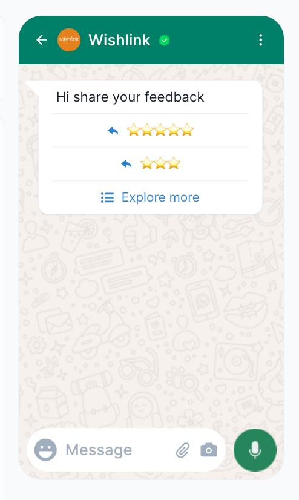

# Ticket Report

## Ticket ID
98595000043669355

## Subject
Feedback And Chatbot

## Description
I want to make a template which collects feedback of 1-5 stars. 2 doubts: 
I want this to exist as a list only - how to do that. 
⁠How to collect this feedback?

As a list only -> I only want explore more to show up not the other options

I want all the options to be only visible when explore more is clicked - similar to how it works in a bot.

How do i track open rate in a bot flow?

Open rate of message that is tracked in a marketing campaign.
if my flow is Send Text -> Resolve -> Send Text, does the second send text work?
If customer interrupts a delay then can I capture the text which is used to interrupt the delay?

Does it get captured as intent.text for the new flow?

## Full Conversation

**From:** Shashank Desai  
**Time:** 2026-04-29T12:28:26.000Z

I want to make a template which collects feedback of 1-5 stars. 2 doubts: 
I want this to exist as a list only - how to do that. 
⁠How to collect this feedback?

As a list only -> I only want explore more to show up not the other options

I want all the options to be only visible when explore more is clicked - similar to how it works in a bot.

How do i track open rate in a bot flow?

Open rate of message that is tracked in a marketing campaign.
if my flow is Send Text -> Resolve -> Send Text, does the second send text work?
If customer interrupts a delay then can I capture the text which is used to interrupt the delay?

Does it get captured as intent.text for the new flow?

---

**From:** Jana Kumar  
**Time:** 2026-04-29T12:37:43.934Z

Hi Team,

Thank you for reaching out.

Please allow us some time to review this.

Let us know if you need any further assistance

Best Regards,
Jana K,
Technical Solutions Specialist.
jana.kumar@gallabox.com || https://gallabox.com || Mobile: +91-8069336425

Gallabox India Private Limited IndiQube - Brigade Vantage, Old Mahabalipuram Road, 
Perungudi, Chennai, Tamilnadu - 600096

    

---- on Wed, 29 Apr 2026 17:58:26 +0530  Shashank Desai<shashank@wishlink.com>  wrote ---- 

 I want to make a template which collects feedback of 1-5 stars. 2 doubts: 
I want this to exist as a list only - how to do that. 
⁠How to collect this feedback?

As a list only -> I only want explore more to show up not the other options

I want all the options to be only visible when explore more is clicked - similar to how it works in a bot.

How do i track open rate in a bot flow?

Open rate of message that is tracked in a marketing campaign.
if my flow is Send Text -> Resolve -> Send Text, does the second send text work?
If customer interrupts a delay then can I capture the text which is used to interrupt the delay?

Does it get captured as intent.text for the new flow?

---

**From:** Jana Kumar  
**Time:** 2026-04-30T07:10:33.733Z

Kindly join the meet now
meeting link:https://meet.google.com/qui-sutu-syn

Best Regards,
Jana K,
Technical Solutions Specialist.
jana.kumar@gallabox.com || https://gallabox.com || Mobile: +91-8069336425

Gallabox India Private Limited IndiQube - Brigade Vantage, Old Mahabalipuram Road, 
Perungudi, Chennai, Tamilnadu - 600096

    

---- on Wed, 29 Apr 2026 18:07:43 +0530  "Gallabox Support"<support@gallabox.com>  wrote ---- 

Hi Team,

Thank you for reaching out.

Please allow us some time to review this.

Let us know if you need any further assistance

Best Regards,
Jana K,
Technical Solutions Specialist.
jana.kumar@gallabox.com || https://gallabox.com || Mobile: +91-8069336425

Gallabox India Private Limited IndiQube - Brigade Vantage, Old Mahabalipuram Road, 
Perungudi, Chennai, Tamilnadu - 600096

    

---- on Wed, 29 Apr 2026 17:58:26 +0530  Shashank Desai<shashank@wishlink.com>  wrote ---- 

 I want to make a template which collects feedback of 1-5 stars. 2 doubts: 
I want this to exist as a list only - how to do that. 
⁠How to collect this feedback?

As a list only -> I only want explore more to show up not the other options

I want all the options to be only visible when explore more is clicked - similar to how it works in a bot.

How do i track open rate in a bot flow?

Open rate of message that is tracked in a marketing campaign.
if my flow is Send Text -> Resolve -> Send Text, does the second send text work?
If customer interrupts a delay then can I capture the text which is used to interrupt the delay?

Does it get captured as intent.text for the new flow?

---

**From:** Shashank Desai  
**Time:** 2026-04-30T08:03:27.000Z

Hi, can you get on a call? Gallabox is already capturing the reply to a delay card - where is that reply going?

On Thu, Apr 30, 2026 at 12:40 PM Gallabox Support <support@gallabox.com> wrote:

Kindly join the meet now
meeting link:https://meet.google.com/qui-sutu-syn

Best Regards,
Jana K,
Technical Solutions Specialist.
jana.kumar@gallabox.com || https://gallabox.com || Mobile: +91-8069336425

Gallabox India Private Limited IndiQube - Brigade Vantage, Old Mahabalipuram Road, 
Perungudi, Chennai, Tamilnadu - 600096

    

---- on Wed, 29 Apr 2026 18:07:43 +0530  "Gallabox Support"<support@gallabox.com>  wrote ---- 

Hi Team,

Thank you for reaching out.

Please allow us some time to review this.

Let us know if you need any further assistance

Best Regards,
Jana K,
Technical Solutions Specialist.
jana.kumar@gallabox.com || https://gallabox.com || Mobile: +91-8069336425

Gallabox India Private Limited IndiQube - Brigade Vantage, Old Mahabalipuram Road, 
Perungudi, Chennai, Tamilnadu - 600096

    

---- on Wed, 29 Apr 2026 17:58:26 +0530  Shashank Desai<shashank@wishlink.com>  wrote ---- 

 I want to make a template which collects feedback of 1-5 stars. 2 doubts: 
I want this to exist as a list only - how to do that. 
⁠How to collect this feedback?

As a list only -> I only want explore more to show up not the other options

I want all the options to be only visible when explore more is clicked - similar to how it works in a bot.

How do i track open rate in a bot flow?

Open rate of message that is tracked in a marketing campaign.
if my flow is Send Text -> Resolve -> Send Text, does the second send text work?
If customer interrupts a delay then can I capture the text which is used to interrupt the delay?

Does it get captured as intent.text for the new flow?

---

**From:** Shashank Desai  
**Time:** 2026-04-30T09:59:31.000Z

On Thu, Apr 30, 2026 at 1:33 PM Shashank Desai <shashank@wishlink.com> wrote:

Hi, can you get on a call? Gallabox is already capturing the reply to a delay card - where is that reply going?

On Thu, Apr 30, 2026 at 12:40 PM Gallabox Support <support@gallabox.com> wrote:

Kindly join the meet now
meeting link:https://meet.google.com/qui-sutu-syn

Best Regards,
Jana K,
Technical Solutions Specialist.
jana.kumar@gallabox.com || https://gallabox.com || Mobile: +91-8069336425

Gallabox India Private Limited IndiQube - Brigade Vantage, Old Mahabalipuram Road, 
Perungudi, Chennai, Tamilnadu - 600096

    

---- on Wed, 29 Apr 2026 18:07:43 +0530  "Gallabox Support"<support@gallabox.com>  wrote ---- 

Hi Team,

Thank you for reaching out.

Please allow us some time to review this.

Let us know if you need any further assistance

Best Regards,
Jana K,
Technical Solutions Specialist.
jana.kumar@gallabox.com || https://gallabox.com || Mobile: +91-8069336425

Gallabox India Private Limited IndiQube - Brigade Vantage, Old Mahabalipuram Road, 
Perungudi, Chennai, Tamilnadu - 600096

    

---- on Wed, 29 Apr 2026 17:58:26 +0530  Shashank Desai<shashank@wishlink.com>  wrote ---- 

 I want to make a template which collects feedback of 1-5 stars. 2 doubts: 
I want this to exist as a list only - how to do that. 
⁠How to collect this feedback?

As a list only -> I only want explore more to show up not the other options

I want all the options to be only visible when explore more is clicked - similar to how it works in a bot.

How do i track open rate in a bot flow?

Open rate of message that is tracked in a marketing campaign.
if my flow is Send Text -> Resolve -> Send Text, does the second send text work?
If customer interrupts a delay then can I capture the text which is used to interrupt the delay?

Does it get captured as intent.text for the new flow?

## Images
No attachment images
