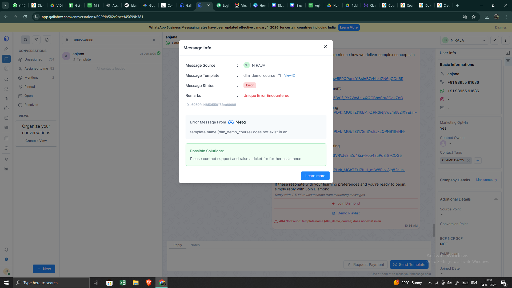

# Ticket Report

## Ticket ID
98595000038051262

## Subject
Urgent: Template Not Found Error in Automation Sequence

## Description
Hi Team,
We have encountered an issue where a “Template not found” error is appearing for a specific template included in an active automation sequence.
Could you please help us understand:
Why this error has occurred?

What is the recommended resolution from your end?

Specifically, we would like clarity on whether:
We should create a new template and manually replace it in the existing sequence, or

Your team can resolve this from the backend.

Our concern is that if we create a new template and replace it within the sequence, it may lead to drop-offs or disruption for users who are already part of the automation.
Given the impact on live automation, we request your urgent assistance in resolving this issue at the earliest.
Looking forward to your prompt support.

## Full Conversation

**From:** N RAJA  
**Time:** 2026-01-04T05:36:03.000Z

Hi Team,
We have encountered an issue where a “Template not found” error is appearing for a specific template included in an active automation sequence.
Could you please help us understand:
Why this error has occurred?

What is the recommended resolution from your end?

Specifically, we would like clarity on whether:
We should create a new template and manually replace it in the existing sequence, or

Your team can resolve this from the backend.

Our concern is that if we create a new template and replace it within the sequence, it may lead to drop-offs or disruption for users who are already part of the automation.
Given the impact on live automation, we request your urgent assistance in resolving this issue at the earliest.
Looking forward to your prompt support.

---

**From:** Yogesh  
**Time:** 2026-01-04T09:32:43.911Z

Hi,

Thank you for reaching out.

Your template is now active and ready to use. 
We resubmitted your template from the backend and it has been approved under the same name.
No action needed on your end – you can continue using your existing sequence without any changes.

Please let us know if you notice any issues or have questions.

This issue was due to our recent account migration to improve marketing deliverability (recommended by Meta), 
We will escalate the same from our side.

Thanks.

Regards,

Gallabox Support.

---- on Sun, 04 Jan 2026 11:06:03 +0530  N RAJA<support@carajaclasses.com>  wrote ---- 

Hi Team,
We have encountered an issue where a “Template not found” error is appearing for a specific template included in an active automation sequence.
Could you please help us understand:
Why this error has occurred?

What is the recommended resolution from your end?

Specifically, we would like clarity on whether:
We should create a new template and manually replace it in the existing sequence, or

Your team can resolve this from the backend.

Our concern is that if we create a new template and replace it within the sequence, it may lead to drop-offs or disruption for users who are already part of the automation.
Given the impact on live automation, we request your urgent assistance in resolving this issue at the earliest.
Looking forward to your prompt support.

## Images
No attachment images
